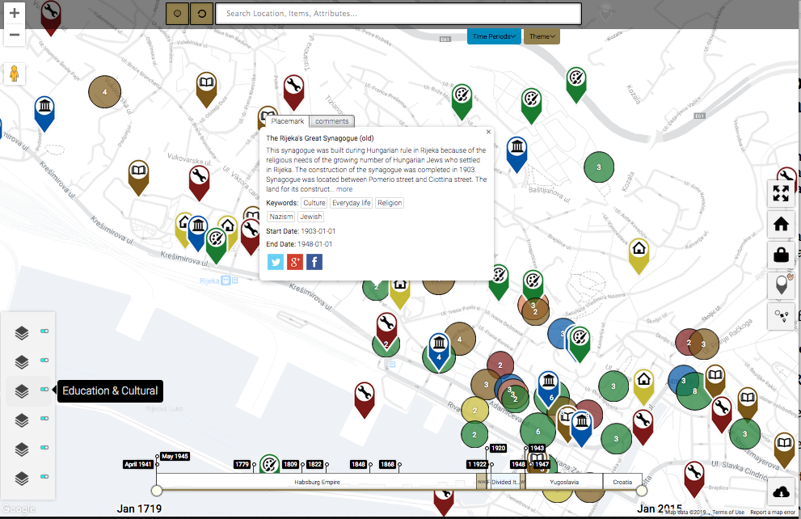
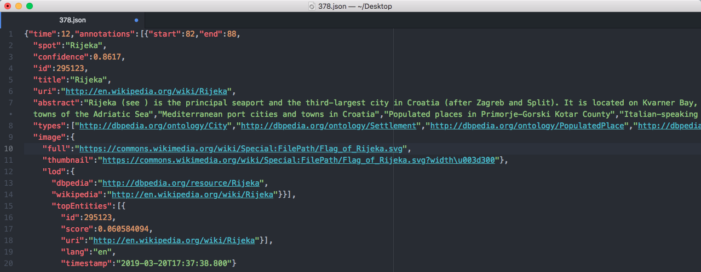

*(A note on authorship[^1])*

## 

We would like to invite you to imagine yourself standing on the Trsat hill in the Croatian coastal town of Rijeka, facing the ocean. There’s a large cemetery to your left, and down the coast to your right is the former site of Rijeka’s Great Synagogue, beyond that the train station, and beyond that the site of a nineteenth-century torpedo manufactory. Rijeka is a very particular city: as European borders were redrawn, political systems changed, and the modern concept of the nation state developed, the city has been variously part of the Habsburg Empire, a free state, divided between Italy and Yugoslavia, part of Yugoslavia alone, and, since 1991, part of Croatia. A political testing ground for years, the city carries in its streets and in its past a rich cultural history (Berrini 2004, Pupinni 2005). The city’s cultural significance has recently been recognized through one of Europe’s highest municipal honours: Rijeka is slated to be the cultural capital of the EU in 2020.

If you cannot picture the train station, synagogue, and cemetery, there is an online map here to help you. A group of researchers on the *Rijeka in Flux* project have created a cultural map offering descriptions of commercial, industrial, cultural, and civic life of the city over a 300-year timespan. Led by Brigitte Le Normand from the University of British Columbia Okanagan, the *Rijeka in Flux* project is committed to creating maps and timelines to represent the region’s layered history. The project’s beta map, which was launched in 2013, is engaging, letting users browse through hundreds of place-based events. At the time of writing, this rich beta map is up online at <https://rijekafiume.geolive.ca/themap>.

We joined the project in March 2018 to augment the map and to enrich the information in the unstructured text that comprises each pop-up place marker on the map (see figure 1). What follows is an outline of our experimental workflow and tool kit, as we develop a framework for next steps to make the most of the connections between entities (people, places, things, events, and concepts) represented in the map. While this piece outlines the pleasures and pitfalls of enriching the *Rijeka in Flux* map, we hope that these tools and processes we discuss below may prove useful to you too—anywhere you have text about people, places, and things about which you, or perhaps an even broader audience if you are making a website, art piece, poster or more, might try in order to create an information-rich interlinked version of any text. There are open tools out there, and most importantly there is open knowledge repository on Wikipedia, that are worth putting to good use.

### Project Contexts

The map prototype was completed in 2014. This new phase of the *Rijeka in Flux* project, which started in the fall of 2018, focuses on 20th century border changes in an area where such changes have been frequent, highly contentious, and consequential for those who lived there. The border-related rupture following World War II was far less complete in Rijeka than elsewhere in Europe, and as such the city is an interesting edge case that may yield greater insights than a study of cities where the border divisions were more permanent and stable.

The project team does not think of borders only as demarcating a rigid dichotomy of absorption into and belonging to a particular state. Instead, building on insights derived from other periods and geographies, the project examines how borders channel flows of people, goods, information, and capital—within the new state borders, but also across those same borders. The new Yugoslav-Italian border simultaneously altered the provenance of people, goods, information and beliefs, and new money flowing into and through Rijeka, and intensified the city’s role in international trade. The project will establish precisely what impact the border change had on these flows, and how those flows in turn transformed Rijeka—for example, through the growth of industrial activities and commercial activities, changes in transportation infrastructure, residential development, and the evolution of the city’s places of leisure and recreation. The team is extending the concept of the deep map, a map that reveals the documentary evidence about a place, in order to better understand the intertwined history of people, places, things, and events of the city over time (Borden 1996, Knowles 2008). Furthermore, and perhaps most germane to the methodology we propose here, “the layers of deep map need not be restricted to a known or discoverable documentary record but could be opened, wiki-like, to anyone with a memory or artifact to contribute” (Bodenhamer 2012, 25). Which wiki should this be? While it is possible, and often desirable, for project to maintain its own wiki-like spaces where the public can contribute, we are also keen to draw on the large existing collective open social knowledge wiki: Wikipedia.

Le Normand and her team are looking to refresh the map, add citizen scholar annotations, and bring it to the streets of Rijeka for the cultural capital celebrations in the summer of 2020. We are working with the team to help expand the map’s content. Our expansion is built on the principles of social knowledge creation and the open methodologies analyzed and pioneered by the Implementing New Knowledge Environments (INKE) partnership. INKE’s focus on collective editing, collaborative work both inside and outside the university, and social knowledge creation provide useful principles for how best to augment, extend, and enrich international understanding of the history of this central city (Arbuckle et al. 2014). The project draws on social knowledge in two ways: first by drawing on the social knowledge created by the Wikipedia community, and second by using the project’s participatory map to collect and combine the research of scholar collaborators working on different facets of Rijeka’s early post-war history, as well as knowledge contributed by citizen scholars. The revised multi-scalar and chronological map will allow users to visualize this research spatially and experientially by moving from the large-scale bird’s eye view to the street-level perspective. In the summer of 2020, the updated map will display place-based findings on the changing use of space in the city, which help document flows through the city and their influence on the built environment.

The project is taking a three-pronged approach to social knowledge creation:

1) Le Normand is leading a team of historians located in Italy, Canada, and Croatia through the process of archival research and of collecting oral testimony,

2) Le Normand is leading a team in Rijeka that will encourage people on the street as well as members of partnering NGOs to contribute place and event descriptions to the map, and

3) a digital humanities team—including Constance Crompton and Tristan Lamonica (University of Ottawa), Jon Corbett (University of British Columbia Okanagan), Benedikt Perak (University of Rijeka), and others—are augmenting the map using the social knowledge created by online communities, like those who contribute to the Wikimedia suite of projects. The digital humanities team is working at the hinge point between unstructured data synthesized by people and the structured data readily processed by computers. Historians on the project comb through documentary evidence and oral testimony to create unstructured text for each marker. The digital humanities team uses an API (application programming interface) for entity extraction, augments the text with information about the extracted entities, and then adds structure by moving all that material into a structured SQL database (which underpins the map—a tool for human readers). Our long-term goal, outlined in the final section below, is to formally model the project data for connection dissemination on the semantic web. Our choice of text cleaning tools (OpenRefine), entity extraction tool (the publicly funded Dandelion API), and knowledge base for new information (Wikipedia and DBpedia) are all shaped by the INKE principles.

### Drawing on the Web’s Social Knowledge

We would like to offer more information about Rijeka than the map currently contains, but without having to draw on the resources needed to gather that information and input it by hand. With that goal in mind, we have been using the Dandelion API, an API created by a European Institute of Innovation and Technology-funded company SpazioDati. We are using their named entity extraction tools to pull out references to people, places, and things that are already in the map markers, about which readers might want to read more. The Dandelion API is a text analysis tool that processes plain text by reading through the text for references to people, places, things, events, and concepts that already exist in Wikipedia (and its sister service, DBpedia, which includes structured data from Wikipedia: abstracts, data from Wikipedia infoboxes, the names of categories that connects articles to one another, and the like). Dandelion reads through a text and returns a vast array of additional data, providing abstracts about and links to the people, places, concepts, and more mentioned in the text, offering feature-rich information. Building upon the already established cultural map outlining the history of Rijeka, Dandelion allows us to extract the name of artifacts, locations, and points of interest in order to find entity information and build the infrastructure for linked data sources. Ultimately, the goal of this undertaking is to help in finding new patterns in the cultural history of Rijeka by using the entities returned by Dandelion as it searches through the Rijeka map marker text.

That said, there is always some pre-processing required when it comes to working with vast amounts of plain text. We knew that we wanted to use Dandelion to get back abstracts about and links to the people, places, and more in the map markers, but how to get at the text? The Rijeka map is backed by an SQL database. A standard format, and one that has been in use since the 1970s, SQL can drive online applications like the map, but can also return tabular or spreadsheet-compatible data. The experiment in entity extraction and linking started with a comma-separated value, or .csv file extracted from the Rijeka database that backs the map. The spreadsheet contained all the map marker text. There was some inconsistency in the spreadsheet data, so we turned to OpenRefine, a text cleaning tool, to remove inconsistencies (including missing spaces, extra columns etc) before using the Dandelion API. OpenRefine started as an open source tool for text cleaning. It was acquired by Google in 2010, but became open source again in 2012, and is to this day an open source and community developed tool.

Text cleaning is the process of splitting up a large quantity of text into separate words in order to perform operations such as the removal of unnecessary spaces, duplicates, punctuation, and the stripping of non-uniform encoding like emoji characters. Text cleaning is much like a universal “find and replace” for large datasets. Starting with the .csv version of the Rijeka map marker text we used OpenRefine to:

1) Combine all columns that included text relevant for API parsing,

2) Associate a unique identifier (in our case a unique number) with each entry, and ensure it corresponds to the original ID used by the map’s SQL database,

3) Prepare additional columns for parsing each entry though the Dandelion API, and

4) Create unique URLs that contain the API call (used to gather data from Dandelion), key (a unique string of characters and numbers provided to us by Dandelion to track our usage), and confidence levels (the degree of certainty we would like Dandelion to return us results). In this case, a higher confidence level meant that the API returned to us fewer results, but the results it did return were deemed higher relevant and of higher quality.

In order to parse each text entry through the Dandelion API while maintaining the uniqueness of every ID, we needed individual API calls for each map marker’s text. The parameters of the API call included the confidence level chosen, the language of the text, the text to be parsed, our Dandelion access key, and the request that the API return the Wikipedia abstract, categories, and images. We decided what we wanted to get back from the Dandelion API in order to create a more information rich map of Rijeka’s history. Here, in plain language, is an example of an Dandelion API call:

>	Language of the text: English

>	Text: Gruppo atletico del Carnaro was an athletic association under the Italian rule in Rijeka. The club was renamed multiple times after 1945 and it is currently named Atletski klub Kvarner-Autotrans. The most famous athletics discipline under the Italian rule were street races

>	Minimum confidence of having found an entity in the text: 85% certain

The following is the specific API call that would gather our desired information from the Dandelion API :

>	https://api.dandelion.eu/datatxt/nex/v1/?lang=en%20&top\_entities=5&text=Gruppo atletico del Carnaro was an athletic association under the Italian rule in Rijeka. The club was renamed multiple times after 1945 and it is currently named Atletski klub Kvarner-Autotrans. The most famous athletics discipline under the Italian rule were street races.&min\_confidence=0.85&include=types%2Cabstract%2Ccategories%2Cimage%2Clod&token=02001296388bdtr24asf43243242423342312da

The API provides a list of entities it found, abstracts about the entities, and links to related pictures and Wikipedia articles in a format called JSON (JavaScript Object Notation).

Since JSON files are an efficient way to format and organize information in both machine- and human-readable formats, it was the logical choice for parsing entity information containing contextual data from Wikipedia.

Setting Dandelion’s confidence level was a challenge. A confidence value is a “numeric estimation of the quality of the annotation, which ranges between 0 and 1” and, as the Dandelion team positivisticaly asserts, “A higher threshold means you will get \[fewer\] but more precise annotations. A lower value means you will get more annotations but also more erroneous ones” (“The Entity Extraction API Reference \| Dandelion API” n.d.). In short, with a low confidence level, the API returns a higher number of false positives, but is less likely to miss an entity in the text. Even though we want to err on the side of content richness, our early experiments with Dandelion’s named entity recognition were returning too many entities. For example, with a .6 confidence level, the text for the map pin about the history of torpedo defense on the Croatian coast:

> > The \[torpedo\] launch station was constructed in 1930s in order to safely test torpedoes without using aircraft or ships or to simulate launching from air and sea. In the interwar period the Silurificio Fiume was still one of the leading torpedo makers, inheriting the legacy of Whitehead-Werft started a century earlier. The torpedo factory and its launch station owe their existence to the ingenious idea of Rijeka's native and naval officer Giovanni Luppis - his new weapon which he named salvacoste, or coast saviour was a radical, if unwieldy game-changing invention. In early 1860s Luppis worked hard to improve his weapon by continuous testing in acceptance trails for naval commission without much needed success. Robert Whitehead, director of the Rijeka's Stabilimento tecnico fiumano, was intrigued by his concept and he decided to alter the design into more effective and deadly naval weapon. The clumsy explosive, remote controlled boat had changed into an all-metal underwater, fish-shaped projectile we now know as torpedo. First prototype was launched in 1866 and just 2 years later Whitehead-Luppis torpedoes started to be purchased by every major navy. The Whitehead-Werft opened in 1875 following the bankruptcy of Stabilimento 2 years earlier, a single day prior to Giovanni's death.

was returning 11 entities:

- Continuous testing
- Explosive
- Giovanni Luppis
- Interwar period
- Inventor
- Prototype
- Rijeka
- Robert Whitehead
- Shell
- Ship
- Torpedo

Turning up the confidence level to .85 shrinks the list down to proper names:

- Giovanni Luppis
- Robert Whitehead
- Rijeka

More user testing needs to be done to find out if the target users will want more information about, for example, the architectural features, languages, concepts (such as Interwar Period), and conceptual places (such as Heaven) that come back with broader named entity recognition, or if the narrower results better meet their expectations.

Since OpenRefine is built to work with multiple different file formats, it was the tool of choice for merging, transforming, and cleaning all individual JSON files downloaded through the API calls. After selecting all the separate JSON files, all the files’ content returned by the API other than that relating to abstracts, images, links, and annotations was removed using OpenRefine. For example, content relating to language and length of text were removed in order to have a database that closely resembles the original Rijeka data that was extracted from the beginning. The goal is to streamline the data processing collection, and to minimize the amount of manual labour involved in parsing individual JSON files, before populating a table in the map’s SQL database with information about the entities in each map marker.

We conclude the process by gathering all of the entities, Wikipedia abstracts, images, and links into a new SQL table for the map database for display at <https://rijekafiume.geolive.ca/themap>. When users click on a map marker, they will get back not only the map marker text, but also new images and each entity’s abstract as a pop-up that links to Wikipedia. Furthermore, the new SQL table can be used to improve navigation within the map. The map markers will be formally linked together so users will have the option of seeing all of the map markers that mention a particular person, place, or other entity type.

### Modelling the Historical Content

The following questions then arise—how might we take the results of these digital methods further and create more complex models of Rijeka’s history to query and consider? How can we connect the *Rijeka in Flux* data to other data sources online? While the project team is pleased with the results of high-level entity recognition, and will use it to offer users of the map more information, we would also like to create a model of the material contained in the map. Modelling is rather popular in the digital humanities, but we have been left with the question of which ontology (a controlled vocabulary for describing the relationships between entities) to map our material on to (Tomasi 2018). The key is to choose an ontology that represents the Rijeka map marker content well. After considering a range of ontologies[^2], we have settled on CIDOC-CRM, which is robust, and which has broad acceptance in the digital humanities and the galleries and museums corner of galleries, libraries, archives, and museum (GLAM) communities.

CIDOC-CRM is a linked data ontology for representing cultural heritage information in a computationally tractable form, that is to say, it describes in a formal language the explicit and implicit concepts and relations relevant to the documentation of cultural heritage and history. CIDOC-CRM-encoded data participates in the vision of the semantic web: data from sites that use the CIDOC-CRM format can be aggregated, remixed, and reused by other projects. We certainly hope that the Rijeka map data can inform other history projects. Happily, the data only has to be entered once and can be reused many times. For example, CIDOC-CRM offers a formal way to tell computers that "this is a person," "this is a date," "this person is this other person's mother," "this person is this other person's father," etc. The data will ideally be used for computational inferencing: queries can be run that comb through CIDOC-CRM-encoded data to bring back, for example, all the people with two or more siblings who were born after 1905 (i.e. people whose parents had more than one child, filtered and limited by birth date, even if that information is stored across a number of projects). CIDOC-CRM lets data creators document a number of complex concepts from the real world, and would let us ask even more complex questions of our data (e.g. bring back a list of all buildings associated with anarchists and destroyed by fire in a particular geographic region during the span of World War I—even if the information about who was an anarchist, which buildings were destroyed by fire, and the dates for World War I are stored by different CIDOC-CRM projects). We would also like to use the CIDOC-CRM model as an exploratory tool for our own purposes. Whether our data gets taken up as truly *linked* data (data pulled together from multiple sources) or not, the CIDOC-CRM worldview, complete with our people, places, and events, will let us navigate Rijeka’s material history in new ways.

This article opened with an invitation to imagine standing on a hill looking out towards the sea, past a synagogue, and out at a torpedo factory. In the coastal town of Rijeka, these entities—the hill, the sea, the synagogue, and the factory—all have histories that have already been described on the web. We can use tools like the Dandelion API and Wikipedia to aggregate information about these places and to display them on a map or model their relationships through an ontology like CIDOC-CRM. In considering how you might gather information about the entities that populate your own projects, we hope that this road map of our own process (speed bumps and all) will prove useful.

### Works Cited

Arbuckle, Alyssa, Nina Belojevic, Matthew Hiebert, and Ray Siemens. 2014. “Social Knowledge Creation: Three Annotated Bibliographies.” In *Scholarly and Research Communication* 5 (2). <https://doi.org/10.22230/src.2014v5n2a150>.

Berrini, Andrea. 2004. Noi siamo la classe operaia: i duemila di Monfalcone. Milano: Baldini Castoldi Dalai.

Bodenhamer, David. 2012. “Beyond GIS: Geospatial Technologies and the Future of History” in Alexander V. Lünen and Charles Travis. History and GIS: Epistemologies, Considerations and Reflections. Springer, Dordrecht.

Borden, Iain; Joe Kerr; Alicia Pivaro, eds. 1996. Strangely Familiar: Narratives of Architecture in the City. London: Routledge.

Knowles, Anne K., and Amy Hillier. 2008. Placing History: How Maps, Spatial Data, and GIS are Changing Historical Scholarship. ESRI Press, Redlands, CA.

“Openrefine.Github.Com.” n.d. Accessed May 30, 2019. <http://openrefine.org/>.

Puppini, Marco. 2005. “Il controesodo monfalconese in Jugoslavia tra Trattato di Pace e Risoluzione del Cominform.” Marco Puppini, ed., Il mosaico giuliano. Società e politica nella Venezia Giulia del secondo dopoguerra (1934-1954), 65-94. Gorizia: CIRDSS “L. Gasperini.

“The Entity Extraction API Reference \| Dandelion API.” n.d. Accessed May 30, 2019. https://dandelion.eu/docs/api/datatxt/nex/v1/.

Tomasi, Francesca. 2018. “Modelling in the Digital Humanities: Conceptual Data Models and Knowledge Organization in the Cultural Heritage Domain.” In Historical Social Research Supplement, no. 31, 170–79. https://doi.org/10.12759/hsr.suppl.31.2018.170-179.

[^1]: With S. Paige Maskell and the Implementing New Knowledge Environments (INKE) research team.

[^2]: Including Friend of a Friend, Schema.org, DOLCE, Dublin Core, and TIME.
