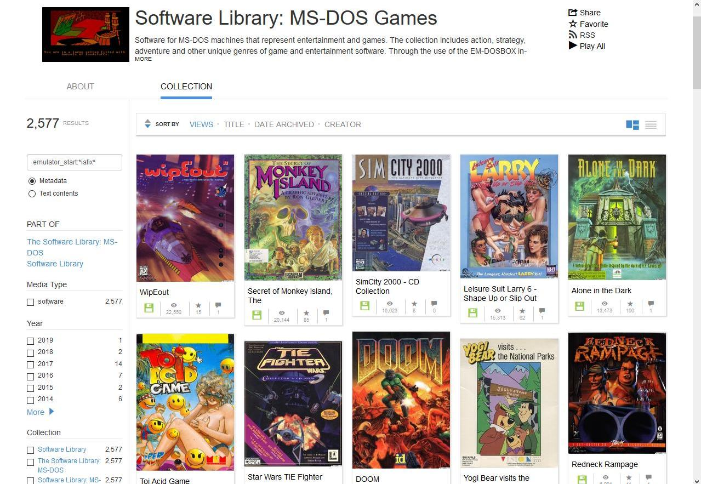
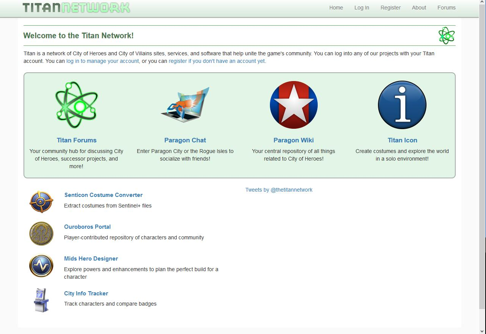
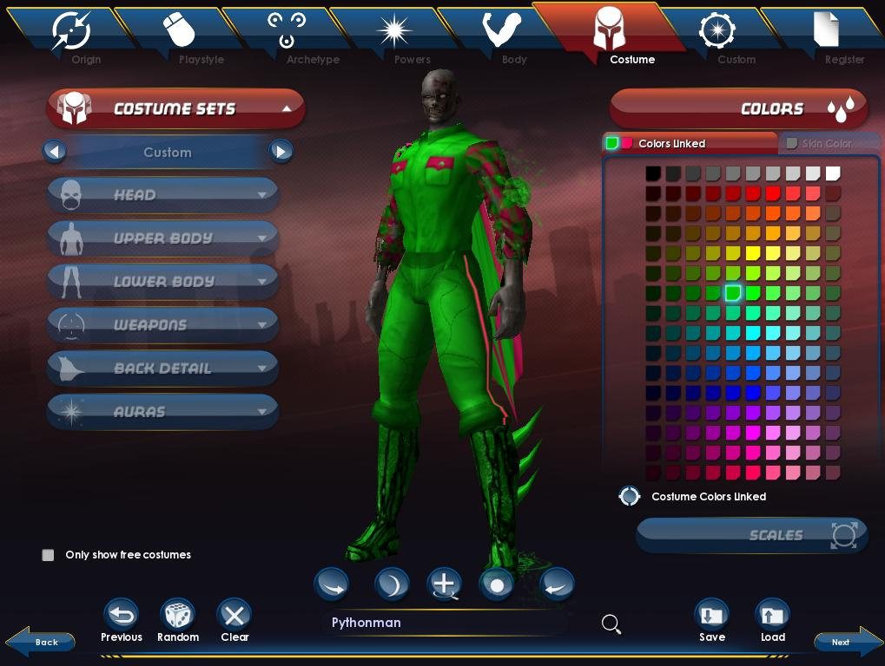

## Introduction: Abandoned Virtual Cities

Imagine returning to a house that you lived in at an earlier time in your life. Wandering through the various rooms and hallways, however much they had been changed, would trigger in you so many personal memories and recollections. Touring such places with others who lived with us would prompt a flood of shared stories and nostalgic recollection. These spaces frame our memories, our stories, and—in many ways—who and what we have become in the years since we inhabited these homes. The same powerful associations apply to our digital homes. We spend so much time in online spaces and in virtual worlds. Even before networked computing brought millions of people together within the island geographies of social media sites, before Facebook’s embedded like button started the trend of bridging such landscapes with a lucrative interplatform trade in metrics, before online digital game worlds hosted millions of years of player time, we’ve occupied and shared imaginary places created by language, image, song, and performance. However, since the first iteration of MUD (multi-user dungeon) in 1980, massively multiplayer online games (MMO) have allowed large groups of players to share and act together within virtual space in real time. Celia Pearce observes that “although the worlds may be virtual, the communities formed within them are as real as any that form in proximal space”.[^1] Such shared dreamscapes, while not physically real, provide lived experiences for individual players and collective communities. Given that the majority of MMO players spend hundreds (if not thousands) of hours in these environments generating memorable and impactive experiences together, these virtual worlds play host to unique and complex long-term community histories. Put another way, the collective play of these users are acts “of cultural production, as players engage in the dynamic creation of entertainment experiences, in addition to the contribution of artifacts to the play environment”.[^2] While such online events and histories are as ephemeral as everyday experience, first person stories and reminiscences are collected and shared by these communities on message boards and other social media platforms. In this way, MMOs generate and host “emergent cultures”[^3] that offer valuable glimpses into our psychological and social behaviour.

Some of these online virtual worlds have sustained their popularity and population over the years. Blizzard Entertainment’s *World of Warcraft*, running since 2004, continues to evolve, retaining and expanding a dedicated community of players who have collectively spent millions of hours (and dollars) inside its virtual geography. Similarly, Linden Lab’s *Second Life*, active since 2003, houses a regular community of users and builders throughout its esoteric landscapes. However, the relative visibility of these more popular and well-known communities eclipses a greater number of virtual worlds that have been cancelled or closed down, removing the virtual space within which emergent cultures have formed.

Hundreds of inactive and closed-down massively multiplayer online role playing games (MMORPGs) have been documented,[^4] but this number does not include a significant number of online arenas for other types of multiplayer games, virtual worlds, communal sites, and message boards accessed through the world wide web. Already, significant efforts such as the *Internet Archive*, the *Wayback Machine*, and multiple initiatives to save *Geocities, are attempting to archive digital cultural resources.* On 8 November 2018, I had the privilege of participating in a 3-hour interview and conversation with Jason Scott, the curator of software collections at *Internet Archive* (and director of *BBS: The Documentary* (2005) and *GET LAMP* interactive fiction documentary (2010)).[^5] A major part of Scott’s work at *Internet Archive* involves curating game software from consoles, early computers, and arcade machines, and making those games playable at the *Internet Archive* site through browser-based emulation. 

However, most online virtual worlds are not included in such initiatives because they require the persistent maintenance of always-online servers to enable and sustain multiplayer experiences.

One such example is *City of Heroes* (*COH*), a superhero/supervillain MMO developed by Cryptic and Paragon studios and published by NCsoft. Its servers were active and populated between 2004 and 2012. During this time, the publishers released 24 free expansion packs (termed “issues” to invoke comic book associations) that enhanced gameplay, evolved the storyline, and offered new maps for players. In addition, two sequels/expansion packs (*City of Villains* and *Going Rogue)* were released in 2005 and 2010 respectively. The game was critically acclaimed and popular during its eight-year run, moving from a subscription model (where players payed a monthly fee to play in the world) to a “free-to-play” model in 2011 (where players can play a basic version of the game for free, but are encouraged to pay for broader access to game content and expansions). Given that the servers that host these types of multiplayer experiences are costly to maintain, monitor, and upgrade, and, in addition to bandwidth costs, such games also require dedicated developer teams and personnel, the ability of the game to generate profit via numbers of players, in-game purchases or subscriptions over and above these costs directly influence a publisher’s desire to keep the world alive and running. However, despite the disappearance of *COH*’s official servers, the fanbase for the *COH* virtual world has not abandoned their love for the game, maintaining an active community of fans and former players through a centralized and well-organized community-run online portal called *Titan Network* which has been active since 2007.

Most MMORPG ghost towns like *COH* are thus no longer accessible online, and their evaporated geographies live on only in the memories and stories posted by displaced, virtually homeless players to archived message forums. But what if these worlds could be booted up once again, not to offer fully-playable experiences for users or a space for expelled communities to return to, but to provide museum-like, virtual archeological sites, places that preserve recollected stories and memories from diasporic communities of players who once inhabited and originally populated these architectures with action, conflict, and cooperation? What if *City of Heroes* players, fans, and curious others could use avatars to virtually walk and fly through curated recreations of the game’s various zones, encountering non-participatory retellings of player experiences and histories of events from the game’s past? The stories that these visitors would encounter would be represented as embedded textual and video narratives geolocated in a re-creation of the computer-generated geographies that they took place in. Visitors to such sites would then experience an asynchronous kind of presence, akin to the experience of guided tours through real life geographical monuments such as the Great Pyramid, the Parthenon, or the Roman Forum. These virtually walkable MMO museums would be populated not with players, but with stories, narrations of the former activities of players embedded in the landscapes and architectures that originally framed such experiences.

## The Problem with Resurrecting Replayability

The MMOmuseum initiative is not concerned with bringing playable versions of games like *City of Heroes* back to life. Existing efforts to preserve playable access to certain defunct MMOs are already in progress, but—aside from a few notable attempts—restoring playability is a less useful endeavour than simply enabling access to these digital spaces and architectures. For example, SWGEmu[^6] is a fan-based effort to restart *Star Wars Galaxies*, an MMO that began in 2003, but was shut down by LucasArts and Sony Online Entertainment on 15 December 2011. The SWGEmu emulation project was started in late 2004 by players who, unhappy with specific upgrades to the game’s combat mechanics during its first year, wanted to recreate an earlier, playable version of the game to exist independently from the upgraded official version. This involved recreating proprietary server code from scratch. Since the official *Star Wars Galaxies* servers were shut down in 2011, the emulator project has kept the game world alive and playable.[^7] A quick check of the SWGEmu server traffic in December 2018 demonstrates its rare success as a replayable resurrection, revealing nearly 1000 players actively creating new experiences and memories across two servers.

Another example of a current MMO resurrection project that better illustrates the pitfalls of developing a playable reboot is *Neohabitat*, an attempt to restart a playable version of LucasArts’ *Habitat* MMORPG (released in 1985 for the Commodore 64 computer). 

This project is spearheaded by Randall Farmer, one of the creators of the original *Habitat* and sponsored by the Museum of Digital Art and Entertainment (based in Oakland California) which is a “nonprofit dedicated to the preservation of video game history, and to educating the public on how video games are created.”[^8] While the description of *Habitat* on the project’s homepage as the “first massively multiplayer online roleplaying game,”[^9] is somewhat inaccurate (given the prior existence of text-based MUDs in the early 1980s), it can rightly claim to be one of the first graphics-based commercial MMORPGs. Although the preservation and resurrection of this pioneering software experience creates a playable, living archive, the return of a 33-year-old online world more effectively reveals limitations rather than inspiring or impressing users. A main reason for this is that *Neohabitat* is mostly devoid of active users. Without interacting players creating emergent stories inside this space, the world of *Neohabitat* appears as a hollow skeleton, a ghost town with no life, a game without a story, an empty ruin that not only reveals the commercial motivations at the heart of its original experience design, but also replicates the constraints imposed on experience by computing and network capabilities at the time. As Richard Cobbett observes in a retrospective article about the original *Habitat* and the *Neohabitat* project, “It’s just a shame how much does get lost forever, from the community to the sense of wonder that could only happen back in the early 80s and 90s when Clarke’s Law was very much in effect, and sufficiently advanced technology really was indistinguishable from magic.”[^10]

The loss of community and wonder also characterize another example of reviving a defunct MMO game: *The Matrix Online Server Emulator* (MXOemu). MXOemu is an attempt by Rajko Stojadinovic (known as Rajko to the online community), a software modder and former *Matrix Online* player, to preserve and extend the playable life of *The Matrix Online*, an MMO originally developed by Monolith Productions and published by Sega and Warner Bros. Interactive Entertainment to coincide with the *Matrix* movie trilogy. *The* *Matrix Online* began in April 2005, but shut down in July 2009 due to low subscription rates. Rajko has worked on the MXOemu project since then with limited emulation success, but hasn’t posted any updates since January 2017 (even though the community forums relating to the project are still periodically frequented by hopeful former players). As of December 2018, it looks as if either the prototype test server is offline, or there is currently no-one playing within the resurrected MXOemu world.[^11] In 2016, Matt Sayer, writing for *Waypoint*, the gaming section of Vice Digital Media, explored one of Rajko’s test servers and reflected on an overall experience of emptiness and loneliness in contrast to the experience of lively players and ongoing storylines that populated the original game for its online duration:

> Emptiness surrounds me. Barren courtyards sigh with the voiceless breeze; hollow buildings pierce the haze of a featureless sky….As I roam the streets, performing bombastic flips over every car I pass, each flashy maneuver only adds to my sense of loneliness. I have no one to share this goofy trick with, no audience to impress.… What good is the ability to dodge bullets when there are no bullets to dodge? Desolate streets stretch out before me, stitching together this dead city with the faintest pulse of life….There is no one to talk to, no quests to take, no enemies to fight….As I wander aimlessly through this forgotten place, I catch echoes of the life that once thrived here. I enter a nightclub sheathed in neon, where a thumping bass line drives away the cemetery silence of the city outside. NPCs mingle by the bar and get groovy on the dance floor, re-enacting memories of a time long past as if to bring it back.[^12]

Even resurrected MMO games can, again, die, or emerge stillborn. Sayer’s experiences prompt him to ask some crucial questions:

How do we preserve for posterity experiences so defined by their time and place? Do we strive to recreate them exactly as they were, hoping to recapture their original spark? Or do we aim instead to fulfil the promises they made so many years ago, smoothing out their rough edges to meet modern expectations? MMOs, after all, are as much about their people as their polygons. Without a thriving community, even a 1:1 recreation won't feel the same. Are these games doomed to obsolescence, their legacies confined to blurry screenshots and a handful of boisterous Let's Plays?

Aside from Rajko’s currently stalled emulation effort, one thing that the developers of *The Matrix Online* MMO had the foresight to compile prior to the closure of the official servers is a downloadable 125-page *Matrix Online Memory Book*, which—through collections of screenshots, textual commentary, and fan art—contains a summary of story events throughout its four-year run, player profiles, documented online anniversary events, written memories of game experiences collected from players and employees prior to the game’s end, a collection of fan-made websites, and a final farewell and credits section.[^13] This memorial effort demonstrates that there are alternative, and perhaps more effective approaches to archiving and memorializing temporally limited digital experiences than these playable resurrection efforts.

## MMOmuseum: A monument of moments

Recognizing that not everything needs to be preserved as a playable experience, and that the presence of and interaction with other players are what make many of these MMOs worth playing, the focus of the MMOmuseum project idea is not to resurrect old games or old online spaces so that communities can rebuild or return to them as players. We’re avoiding a Victor Frankenstein approach. As with anything that’s been lost or left behind, what becomes most important beyond an initial acceptance of the loss is to deal with that loss by somehow collecting, preserving, and sharing memories that work against absence and forgetting. In a way, this initiative functions in the same way as walking simulators, game experiences (such as *Dear Esther*, *Gone Home*, *Everybody’s Gone to the Rapture*, and *What Remains of Edith Finch*, to name a few) that place the player in an abandoned world, piecing together stories of life and loss by examining the artifacts and objects left behind.

The MMOmuseum initiative is very different from “Let’s Play” gameplay videos or the more complex and comprehensive forms of experience documentation involved in Dene Grigar’s and Stuart Moulthrop’s excellent *Pathfinders* initiative, which is meant to combine playthroughs and “director’s commentary” together (along with recordings of the interactions necessary on the original hardware that these Electronic Literature examples were written to run on).[^14] While *Pathfinders’* video and textual documentation efforts become the form and content of its archives, this MMOmuseum proposal embeds those kinds of “relics” (documents) in an experiential virtual geography. In the MMOmuseum, if users watch playthrough videos of particular worlds, they do so from within a recreation of that world. The MMOmuseum idea aims to preserve the architecture of the game world only as an inhabitable host gallery for player recollections and stories. In this spirit, the project builds upon and augments the methods of the *Preserving Virtual Worlds* projects. The first, 2008-2010, was a two year project funded by the National Digital Information Infrastructure Preservation Program (NDIIPP) funded by the U.S. Library of Congress[^15]; the second, *Preserving Virtual Worlds* (PVW), was a quieter extension that remained active until 2013.[^16] The PVW project developed invaluable foundations for comprehensively thinking about the challenges relating to game preservation and access, including: hardware/software obsolescence, proprietary code, authenticity, IP, significant properties of the software/hardware, and historical/cultural contexts[^17].

However, unlike the broader aims of the PVW project, the idea here is to more specifically create archives of storied experience that can be encountered within the virtual geographies of original MMO game spaces. This answers the challenge posed by the following observation:

Imagine stepping into *Second Life*, which doesn’t even have the benefit of plotlines or non-player characters (NPCs), years after the last user signed off. The world would be empty; interactivity limited to the virtual equivalent of archaeology: examining buildings and prims \[primitive building blocks\] in an attempt to build a picture of how *Second Life* was lived.[^18]

Textual stories and anecdotes, along with screenshots and videos—what the PVW report calls “context of gameplay”[^19]—can be associated with particular areas of the virtual landscape, like annotating digital maps, and these memories can be triggered and explored by visitors to an emulated version of the original world. While this approach was already anticipated by the PVW project for some virtual world examples, this proposed project follows through and further develops the speculation that:

Just as we can mash up data by attaching GPS coordinates to real-world maps, photographs, and other media, these virtual world coordinate systems might make it possible to match documentation we have assembled in our virtual world collections not only to locations in virtual worlds, but also to each other.[^20]

However, unlike the original version of the virtual world, this becomes a solitary experience for the contemporary user, akin to a theme park ride that appeals to individual perceivers, despite shared spaces. There are multiple possibilities for organizing such experience:

1\) A virtual tour guide and a series of thematically curated tours that expose visitors to textual and video-based stories via pre-arranged and “on-rails” experiences through the geography of the emulated/simulated world. (Former users and inhabitants of these worlds should be invited to work with the project to create such “paths.”)

2\) A “free-roam” option in which visitors can wander through the world as an avatar and choose which stories, embedded as particular textual or video-based waypoints on the map, to encounter as they traverse the landscape.

## Theory/Approach:

This is less an archival or translational effort than a curational one. The aim of this initiative is to imagine ways that stories can be embedded in virtual landscapes that once facilitated experience (and emergent narrativity), transforming those former game spaces into inhabitable libraries and archives of the documentation of such experience. Originally, these virtual worlds were spaces in which players engaged in memorable social experiences, participated in collective events, and created individual, interpersonal, and communal histories. Instead of rebooting them as playable arenas, they can be re-presented as sites that host embedded stories and histories, as experiential memory books that can be read from within the geographies that framed such content.

Given that these spaces, while virtual, are still temporally and technologically situated in the past, this particular effort towards preservation (like archaeological sites that one can visit in the real world) proposes transforming the geography into a repository for stories that visitors can encounter. However, given that former inhabitants co-created those stories together, it is crucial that player/fan-communities be part of any collaborative memorialization of their former game worlds. Preferably, this would involve crowdsourcing autoethnographic histories from these diasporic populations and asking them to translate their experiences into narratives that will be embedded in a simulated recreation of their abandoned online worlds, in the same way that museums often recreate contextual locales for the exhibition of particular community histories.

More thoughtfully, though, it would be an exercise of best practices to go to these former communities first to see if this kind of project is something they want and, if so, what they would envision their participation looking like. Unlike the abovementioned top-down approach, offering resources to help abandoned MMO communities realize their ideal way of preserving their community would be ideal. Given the complicated nature of larger-scale MMO cultures, as illustrated in the multi-faceted initiatives and numerous message streams that comprise the *City of Heroes*’ community’s online *Titan Network*, it might be useful to prototype this idea with a smaller community group and then show that effort to other community stakeholders and tailor it to their needs so that they have an idea of what the project could offer to them.

## Prototyping Resurrection: *City of Heroes*

As mentioned above, the displaced community of *City of Heroes* players remains active on the *Titan Network* message board. This network serves as a hub for community forums, emulation efforts, fan fiction, wiki knowledge base, and other community-focused sites, software, and services. Three initiatives currently attempt to preserve some of the experiences of the original game: *Titan Icon*, a standalone offline installation, allows individual users to create characters and roam through the unpopulated maps of *COH* and its expansions; [^21]

*Paragon Chat* connects a user’s *COH* client program to a chat server, essentially turning the original *City of Heroes* locations into large, multi-user, online chat rooms;[^22] and SEGS (super entity game server), an in-progress emulation project that aims to restore full playability to the online game (without reproducing any of the original story content because of copyright issues with NCsoft).[^23] Since so much has already been done to expose the code and assets at the heart of the *COH* client software, and since the *Titan Icon* executable allows access to the MMOs maps via an avatar interface, this seemed like a good candidate for testing the intentions of the MMOmuseum initiative.

## Potential Problems and Solutions:

### Copyright

The most difficult problem to overcome regarding digital assets of any kind relates to copyright permission. Even though many MMOs are now defunct, most publishers still own the rights to all intellectual property and server/client code related to their games. However, in October 2017, the U.S. government recommended an exemption for “Video games for which outside server support has been discontinued, to allow individual play by gamers and preservation of games by libraries, archives, and museums” from the Digital Millennium Copyright Act.[^24] While this exemption was subsequently challenged by game publishers in February 2018, the exemption still stands. However, given that the exemption only applies to archival efforts by libraries, archives, and museums, there are still a number of grey areas surrounding this law to contend with. More specifically, though, those working on *Titan Icon, Paragon Chat*, and *SEGS* in relation to *City of Heroes* (while not affiliated with the kinds of institutional repositories specified in the DMCA exemption), are circumventing copyright infringement accusations by pointing out that “The program files and maps of *City of Heroes* were distributed for free to anyone who wished to play for free by NCsoft while the game was in operation”.[^25] Regardless, the persistent issue of copyright emphasizes the importance of working more closely with game/software publishing companies to convince them of the value of preservation, nostalgia, and memorialization efforts relating to now-dead MMOs.[^26] An excellent model for developer and publisher openness can be found at the homepage of now-cancelled MMO *Glitch*, which released all of its art, code assets, and game archives to the public domain after it shut down in 2012.[^27]

### Emulation vs Simulation

A significant choice relating to the reconstruction of an MMO’s virtual geography for MMOmuseum purposes is emulation/virtualization vs. simulation. Emulation is an attempt to run the original source code in virtual software machines that resemble the original hardware the game was optimized for. Simulation involves recreating the experience of the game in new platforms and through newer coding while still attempting to preserve resemblance to the original in appearance and play. Initially, the MMOmuseum initiative leaned towards simulation, or recreating the virtual geographies of these MMO worlds in more contemporary engines (in this case, the Unity and Unreal engines were considered), because the object of this project is not to restart the virtual worlds, but to adaptively re-present them as hosts for repositories of narratives. However, recreating even a small portion of the *COH* landscapes in new game engines is a time-consuming process and requires an intimate knowledge of the maps, textures, and object assets from the original game. Given existing community initiatives to reactivate the original client software for *COH* via both an emulation effort on local machines (*Titan Icon*) and a simulative recreation of server code (*Paragon Chat* and *SEGS*), a more efficient approach in this case involves a combination of simulation and emulation strategies, along with adaptation and customization. The intention to use the original client, but to exclusively tailor the affordances and constraints it offers to players for MMOmuseum purposes, doesn’t compete against or resist more purist approaches to game preservation. It is just another way of preserving the history of abandoned virtual geographies that once hosted robust communities through their stories. In essence, this works towards fulfilling some of the ideas proposed and imagined, but not fully achieved by the PVW project, specifically:

> As artifacts in a digital repository built with virtual world technology, historical maps would not just be artifacts, they might also provide spaces in which to site other objects and documentation—such as models, screenshots, videos, or documentation—that provide information about what took place in these settings.[^28]

In their attempt to explore this potential, the PVW project was working in a preliminary way with *Sirikata*, an open source platform for building virtual worlds.[^29] However, this platform hasn’t been developmentally active since 2012, raising additional concerns about ensuring that any simulation of virtual world architecture for the purposes of preservation resists the obsolescence problems that have affected the original worlds. This remains a universal problem, however, as reconfiguring original code to run on constantly evolving hardware and operating system frameworks is a persistent challenge.

Currently, the *COH* client still works with the newest versions of Windows and MacOS operating systems, but these are changing constantly, and there are many examples of game software that have been rendered unplayable due to OS upgrades. The site *Good Old Games* (*GOG*) is actually dedicated to updating older game software for compatibility with the latest operating systems, sometimes unsuccessfully. A commitment to the MMOmuseum model would—like many digital humanities projects—require a long-term plan to maintain compatibility as hardware and software operating systems evolve. Using cloud-based services to stream emulated access via web-browsers (discussed at more length below) would significantly reduce compatibility and longevity concerns, but introduces other problems in the process.

### Preserving/Recreating Server Architecture

A significant design question has centred around the choice between creating an MMOmuseum space that is shared by multiple simultaneous users, or experienced in solitude. There appears to be no advantage to the current project of allowing for multiple users, as the focus of the planned experience is on embedded stories within the *City of Heroes’s* virtual landscapes. In this case, there would be no need to preserve server architecture. In the same way that visitors to *Wikipedia* can’t see each other in real time, the MMOmuseum experience might be best enjoyed independently. An online message forum for visitors’ reflections and commentary about the MMOmuseum experience could still be linked to the website or software (enabling discussion and conversation beyond the passive reception of historical recollections). Alternatively, comments on such an experience could be linked to the existing *Titan Network* forums.

However, requiring the user to download and install a local copy of the client is problematic in that the *COH* download is quite large (over 4 GB), and browser-based fat client emulation faces the same problem of needing to download the large files to a local computer. Streaming, cloud-based, fat server services would take care of this problem, but they are currently in beta stages of development for high-demand software emulation and too expensive to maintain if making use of commercial web services platforms.

### Versioning Challenges

*City of Heroes*, like most MMOs, experienced a number of upgrades and version updates through its online duration. While MMOs like *World of Warcraft* and *Second Life* are anomalous in that their longevity has led to significant upgrades and iterative evolutions that render earlier versions almost unrecognizable, even short-lived virtual worlds (and software more generally), are updated regularly after release, and this presents a potential problem for the current project. Which version of the game should be used as a model for MMOmuseum re-presentation? Fortunately, version updates for *COH* changed playable parameters and story content for the most part rather than geography or graphical fidelity, so versioning does not present a significant issue in this case. Both the existing *Paragon Chat* and *Titan Icon* preservation projects require the last version of the *COH* client, so the MMOmuseum will likely rely on that as well.

### Involving the Community and Avoiding Uncompensated Labour

The most important issue in relation to this kind of initiative relates to the ways in which the existing community of former players is included in the creation and shaping of such an experiential memorial. As observed above, the player community is what gives life to these MMOs, and interested participants should be included in the planning and development process as well as providing content. Recognizing the importance of asking an already-invested community whether they would be interested in seeing and helping to facilitate an MMOmuseum initiative, I posted the following message on the *Titan Network* forums that identified some of the project plans, but remained open to feedback and criticism:

> I'm thinking of other ways to preserve and memorialize *City of Heroes* (in addition to all of the amazing initiatives already in progress), and came up with the idea where visitors could explore a "Titan Icon"-like *City of Heroes* landscape that was populated by preserved stories and memories provided by original players. Kind of like an interactive museum. Imagine if some of the stories shared on this board could be read or encountered (through maybe bots or plaques) by users as they wandered through server-less *City of Heroes* maps.
>
> I think that Titan Icon might be best suited for something like this… What about a downloadable branch of Titan Icon that featured embedded stories and memories from the community?
>
> I just wanted to throw this out there to see what people thought and what kind of interest the community might have in such a project. I'm open to all forms of suggestions and criticism from this community, as—really—it's the players of *City of Heroes* who own its history. If you think it's a stupid idea (or technically impossible), please let me know!
>
> Any feedback would be great! Thanks!

I received a number of helpful, but polarized responses. One less-than enthusiastic community member replied: “Meh. Another splinter that even less people will use. I'd rather have what little coding effort we do have go into Icon or Paragon Chat.” Another response was more encouraging, but also offered excellent reasons for instead pursuing a multi-user, server-based MMOmuseum version and/or an official lore memorial rather than one populated by community stories:

> Could it be made as some type of mod package that users of Icon or Paragon Chat could simply download and stick in a folder inside one of those programs for it to work? If the answer is yes, then you wouldn't be taking away from an existing project, you'd be adding something to it as optional content. Users of Paragon Chat already enjoy other types of optional content via community mods.
>
> And I'd much rather see something like that go in Paragon Chat, in case users ever wanted to install the mod and go on a history tour together.
>
> And since you're open to suggestions, I'd love to see a version of the mod that only had official location and character histories, timelines, in-game news articles from the old website (Paragon Wiki still has copies) and maybe some developer commentary dug up from the internet; rather than have to enjoy all of that great official lore alongside a bunch of "My SG had so much fun farming here lol" community stuff. Not saying I wouldn't ever want to do the latter, just saying I like options. ;)

Co-operating with the existing fan and former player communities are essential, but how to please all fans? Jason Scott from the *Internet Archive* offered advice on this point, recommending that “You can’t please everyone. Don’t let this stop you.” He continued by suggesting that the MMOmuseum project shouldn’t “get hung up on the details” but also shouldn’t “get so hung up on the goal” that essential process is neglected. More specifically, he advised “not to copy/paste (ie. steal) from fansites,” to “get permissions where necessary, except when it comes to corporate copyright holders and institutions” (see above), and to “focus on getting folks to talk and be willing to listen.”

While this potential difficulty of unifying the fan community is certainly not a reason to exclude community consultation or collaboration, what needs to be avoided at all costs in the creation of such a preservation project is either proceeding without community input or taking advantage of uncompensated labour from the community of former *COH* players and fans. Acknowledging and compensating participants for their story contributions to these virtual museums and allowing them to take ownership of the overall result is necessary to avoid an exploitative relationship.[^30] Is voluntary participation rewarding enough for these contributors (as it was for their original engagement with the game and subsequent efforts to sustain the community after the MMO closed)?

While it’s tempting to proceed on the assumption that voluntary participation is reward enough, such a path is thorny and ignorant, even if the community is passionate about preserving their presence and stories. The broader question that this brings up, though, is the overall purpose of such a project. Who is it for, ultimately? Who does it serve and what are its goals beyond the preservation of particular online cultures and their stories?

In a weird way, this project has the potential to stumble in the same way that scholarship about indigenous histories, stories, and cultures often does: by instrumentalizing or objectifying participants as resources to be mined or clear-cut (rather than seeing them as primary collaborators during the process and co-owners of any and all output). However, it also has the potential to succeed through a thoughtful and inclusive modelling of listening, collaborative co-creation, ownership, and integrative memorialization.

However, specifically in relation to *City of Heroes*, the existing fan community is already doing an incredible job at preserving, strengthening, and extending the collective that this game enabled—and doing so in many different ways. The MMOmuseum effort, while distinct from existing fan-led preservation initiatives, might involve enough redundancy in this case to render it unnecessary.

### How to Render and Deliver this Experience?

My November 2018 conversation with Jason Scott initially focused on the possibilities involved in server-side emulation (and how accessible such technology would be for an initiative like the MMOmuseum), but our conversation quickly expanded to include ideas and issues that I hadn’t initially considered. One of his main points—based on experience with the Internet Archive’s browser-based emulation efforts—was that the “emulation as a service” model works and works well. That is, “the load of configuring the emulators, adding the software, and providing the resulting emulation is taken away from the end user, requiring only a browser…to emulate the given software”.[^31] Users thus gain access to online virtualization platforms via a web browser, and the work of emulation is handled by javascript emulators drawn into the canvas element of a webpage.[^32] While Scott mitigated this claim by also admitting that “99% of people want or need only a let’s play video rather than an opportunity to experience emulated software,” this observation only challenges preservation efforts that aim to recreate the original experience (rather than the MMOmuseum model of embedding community histories in a navigable—not fully playable—version of a game’s original geography).

In regards to emulation-as-service via web-based virtual machines, Scott pointed out that there are two main options: First, most MMOs rely on fat client processes, requiring that the player’s computer download and run the game locally (and handle all of the processing work) while sending small packets to a centralized server, which responds with code that configures the state of the local game software to represent the larger database of multiplayer action (fat client/thin server configuration). While this is the way that the Internet Archive’s *Emularity* project and most online multiplayer game services work, it presents some problems for the MMOmuseum project. Given that the *City of Heroes* standalone client (used to power the *Titan Icon* initiative) is nearly 4 GB in size, to expect interested users to download and install that file when they want to explore *City of Heroes*’s virtual geography archive will inherently reduce the number of people who ultimately make use of the software. As well, any future updates will require redownloading and reinstallation. Most importantly, though, relying on fat client processes means that MMOmuseum software for *City of Heroes* will need to be initially configured and periodically upgraded to work on a broad spectrum of hardware and operating system configurations now and into the future. Obsolescence is a significant possibility.

The alternative to fat client emulation is using cloud gaming services to handle the emulation work. In this model, server computers, responding to small packets of user input, do the processing work and stream the visual and audio results to the user’s computer (fat server/thin client configuration). Fat server processes thus reverse the workload of fat client processes, taking responsibility away from the user, and requiring a device with minimal hardware requirements but also requiring a reliable high-speed internet connection. bwFLA, a collaborative emulation research initiative based at the University of Freiburg, has successfully used cloud-based emulation services (via virtual CPU assignment from Google Computing Services) to allow users to select and play one of three CD-ROMs containing Theresa Duncan’s critically acclaimed games designed for young girls. During the project’s initial release, between 16 and 32 allocated virtual CPUs were necessary to handle the demand, but this number has been reduced since then.[^33] A more recent and ambitious example, Google’s *Project Stream*, was an online experiment that ran between October 2018 and January 2019. It was a prototype test for soon-to-be-launched *Stadia*, Google’s streaming game service announced in March 2019. *Project Stream* allowed users to play 2018’s *Assassin’s Creed: Odyssey* in the Chrome web browser with no graphical degradation and minimal latency between user input and game feedback. [^34] This prototype and details regarding *Stadia* both envision a Netflix-like service for games.

While the development and availability of these kinds of fat server services are in their infancy, much work is being done in relation to cloud gaming and software streaming. Some additional Web services that already exist for remote platform hosting and cloud gaming services are:

Paperspace: <https://www.paperspace.com/gaming>

Amazon Web Services: <https://aws.amazon.com/>

Google cloud platform: <https://cloud.google.com/>

The advantages of fat server emulation services are nearly universal accessibility and an increased immunity from technological obsolescence. However, the high-speed internet connection requirement is a problem for much of the world. As well, what resources could be used to host cultural preservation initiatives like the MMOmuseum (or other browser-based emulation experiences)? Relying on companies like Amazon or Google means that the project would need a constant revenue stream to maintain a subscription, and the data would be hosted on corporate servers. Are there alternatives? For example, could researchers and archivists access *Compute Canada*’s resources to host and stream MMOmuseum or other emulation experiences to browser-based users? Is there room in the definition and capacity of this and other similar organizations to perpetually host and deliver low-latency, streaming, cloud-based interactive software archive experiences? Would the project have to feature Canadian content to be eligible? Could institutional or university library collaborations afford the hardware infrastructure and maintenance necessary to publicly offer cloud and browser-based projects?

## Conclusions and Concerns:

This effort is just beginning to explore possible ways of representing and experiencing abandoned virtual MMO worlds beyond software preservation efforts that involve emulating replayability or efforts towards complete translation. While emulation/virtualization approaches leave these formerly inhabited worlds devoid of the kinds and concentrations of player presence and social interactions that made them popular and memorable in the first place, the intention of the MMOmuseum initiative is to represent a simulated space, akin to a museum recreation, which allows visitors to explore the site while encountering embedded stories and artifacts collected during original player experiences. The MMOmuseum is not intended to be a theme park exclusively for the benefit of nostalgic ex-players; its aim is to construct participatory, interactive museum spaces for all curious visitors and make the *nostalgia of aging players* part of the exhibit. For example, I didn’t play LucasArts’ *Habitat* back in the 1980s, but logged into the *Neohabitat* project in late 2018 and spent 2–3 hours exploring the landscape. In addition to serving public curiosity and nostalgia, such environments would also be valuable to history of gaming and online gaming courses, and the collected qualitative reflections of former players would be incredibly useful to researchers studying the sociological, psychological, and communal aspects of virtual worlds. This would even be useful to researchers who are comparing short-lived to longer-lived communities, diasporic nostalgia experienced by defunct online cultures, and the way that such communities change over time and are affected by the technological affordances and constraints of these artificial territories.

MMOs are sites of player experience. Ideally, mapping the storied history of those experiences onto a simulated virtual geography for users to explore would be a way to expose contemporary visitors to a combination of emergent experience (parallel to the ways that original players encountered that geography) and embedded story (which is the most effective way of preserving past action). In this way, we are extending one particular branch of the now dormant *Preserving Virtual Worlds Project*, to argue that preservation, archiving, and emulation efforts need to find ways to recreate some of the dynamic and emergent aspects of MMO virtual worlds, while also preserving and embedding the stories of the original inhabitants of those virtual social spaces within an experiential frame.

Lastly, and perhaps most importantly, a significant amount of work will be required to adapt, curate, and maintain an MMOmuseum instantiation of *COH*, unless this project can be worked into existing *COH* community initiatives such as the *Titan Network*. This amount of development work is required for each new MMOmuseum project, and would require a co-ordinated effort by, and multiple sources of funding for, a number of integrated research teams. The idea, though, remains sound: Transforming abandoned virtual worlds into tourable museums, sites in which embedded stories from a dead world’s active past can be read or watched within its digital landscape long after the original inhabitants have gone and the environment ceases to function as a playable space.

## Bibliography

bwFLA. “(Re-)publication of Preserved, Interactive Content – Theresa Duncan CD-ROMs: Visionary Videogames for Girls” Accessed 12 May 2019. <http://eaas.uni-freiburg.de/demo-cloud.html>

Cobbett, Richard. “The RPG Scrollbars: Old Habitats Die Hard.” *Rockpapershotgun.com* 20 February 2017. Accessed 10 May 2019. <https://www.rockpapershotgun.com/2017/02/20/habitat-retrospective/>

DMCA. “Frequently Asked Questions About the Section 1201 Rulemaking.” *Copyright.gov* Accessed 12 May 2019. <https://www.copyright.gov/1201/2018/faqs.html>

*Glitch* homepage. Accessed 12 May 2019. [www.glitchthegame.com](http://www.glitchthegame.com)

Grigar, Dene and Stuart Moulthrop. *Pathfinders project*. Accessed 15 May 2019. <http://dtc-wsuv.org/wp/pathfinders/>

Lawrence, Rich. *SEGS v0.6.0 Outbreak Media Release*. 28 October 2018. Accessed 12 May 2019. <https://drive.google.com/file/d/1B3eY-B1oKBMkSh4KaCjq8SPyJdM95_gW/view>

MADE About Page. *The MADE (Museum of Art and Digital Entertainment).* Accessed 12 May 2019. <https://www.themade.org/about/>

McDonough, J., Olendorf, R., Kirschenbaum, M., Kraus, K., Reside, D., Donahue, R., Phelps, A., Egert, C., Lowood, H., & Rojo, S. Preserving Virtual Worlds Final Report. 31 August 2010. <http://hdl.handle.net/2142/17097>

*NeoHabitat* home page. Accessed 12 May 2019. <http://neohabitat.org>

“Paragon Chat.” *Paragon Wiki*. 24 November 2018. Accessed 12 May 2019. <https://paragonwiki.com/wiki/Paragon_Chat>

Pearce, Celia and Artemesia. Communities of Play: Emergent Cultures in Multiplayer Games and Virtual Worlds. Cambridge: MIT Press, 2009.

Sayer, Matt. “The Death and Rebirth of ‘The Matrix Online.’” *Waypoint*. 7 December 2016. Vice.com Accessed 12 May 2019. <https://waypoint.vice.com/en_us/article/53g5dk/the-death-and-rebirth-of-the-matrix-online>

Scimeca, Dennis. “The Rise, Fall, and Return of Star Wars Galaxies.” *The Kernel.* kernelmag.dailydot.com. Published 20 December 2015. Accessed 12 May 2019. <https://kernelmag.dailydot.com/issue-sections/headline-story/15335/star-wars-galaxies-swgemu-project/>

Scott, Jason. Telephone interview. 8 November 2018. 180 minutes.

*Sirikata: a BSD-licensed platform for games and virtual worlds*. Accessed 12 May, 2019. <http://www.sirikata.com/blog/>.

SWGEmu home page. Accessed 12 May 2019. <https://www.swgemu.com/forums/index.php>

Stojadinovic, Rajko. *MXOemu*. <http://mxoemu.info/>. Accessed 12 May 2019.

“Theory of Operation” *Emularity* 13 April 2015. Accessed 12 May 2019. [https://github.com/db48x/emularity/blob/master/THEORY.md Accessed 12 May 2019](https://github.com/db48x/emularity/blob/master/THEORY.md%20Accessed%2010%20December%202018).

“Titan Icon.” *Paragon Wiki*. 23 August 2018. Accessed 12 May 2019. <https://paragonwiki.com/wiki/Titan_Icon>

[^1]: Celia Pearce and Artemesia, Communities of Play: Emergent Cultures in Multiplayer Games and Virtual Worlds (Cambridge: MIT Press, 2009), 17.

[^2]: Pearce, 125.

[^3]: Pearce, 271.

[^4]: Resources relating to abandoned MMORPGs are scattered, but the sites listed below provide a good initial encounter with the extent of such extinctions:

    <https://en.wikipedia.org/wiki/Category:Inactive_massively_multiplayer_online_games>

    <https://www.theverge.com/2012/12/20/3776210/electric-funeral-death-of-mmo>

    <https://kotaku.com/youtubers-journey-into-abandoned-mmo-is-creepypasta-mat-1767500088>

    <https://geekandsundry.com/meet-the-sole-survivor-of-an-abandoned-mmo/>

    <https://www.reddit.com/r/Gaming4Gamers/comments/4cabi3/abandoned_mmos_the_graveyards_that_need_an/#bottom-comments>

    <https://www.reddit.com/r/AbandonedCyberWorlds/>

    <http://www.escapistmagazine.com/forums/read/9.863177-Abandoned-Online-Games?page=1>

    <https://www.atlasobscura.com/articles/exploring-a-decadeold-abandoned-fantasy-game>

    <https://news.ycombinator.com/item?id=9345394><https://www.mmorpg.com/gamelist.cfm/show/dead/Cancelled-MMORPG-Games.html>

[^5]: Jason Scott, Telephone interview, (8 November 2018. 180 minutes).

[^6]: *SWGEmu* home page, (Accessed 12 May 2019, <https://www.swgemu.com/forums/index.php>)

[^7]: Dennis Scimeca, “The Rise, Fall, and Return of Star Wars Galaxies,” *The Kernel,* (kernelmag.dailydot.com, Published 20 December 2015, Accessed 12 May 2019, <https://kernelmag.dailydot.com/issue-sections/headline-story/15335/star-wars-galaxies-swgemu-project/>).

[^8]: MADE About Page, *The MADE (Museum of Art and Digital Entertainment)*, (Accessed 12 May 2019, <https://www.themade.org/about/>).

[^9]: *NeoHabitat* home page. (Accessed 12 May 2019. <http://neohabitat.org>).

[^10]: Richard Cobbett, “The RPG Scrollbars: Old Habitats Die Hard,” (*Rockpapershotgun.com,* posted 20 February 2017, accessed 10 May 2019. <https://www.rockpapershotgun.com/2017/02/20/habitat-retrospective/>)

[^11]: Rajko Stojadinovic, *MXOemu* (<http://mxoemu.info/>. Accessed 12 May 2019).

[^12]: Sayer, Matt. “The Death and Rebirth of ‘The Matrix Online.’” *Waypoint*. (7 December 2016. *Vice.com* Accessed 12 May 2019. <https://waypoint.vice.com/en_us/article/53g5dk/the-death-and-rebirth-of-the-matrix-online>).

[^13]: Although the original download site has since disappeared, a copy of the Memory Book has been archived here: <https://archive.org/details/MatrixOnlineMxOOfficialMemorybookStorybookRedPill>

[^14]: Dene Grigar & Stuart Moulthrop, *Pathfinders project*, (Accessed 12 May 2019, http://dtc-wsuv.org/wp/pathfinders/).

[^15]: <https://web.archive.org/web/20150324010853/http://pvw.illinois.edu/pvw2/> (Web archive of Preserving Virtual Worlds 2 website)

[^16]: <https://www.cni.org/wp-content/uploads/2011/12/cni_tangled_mcdonough.pdf> (Preserving Virtual Worlds 2 project summary)

[^17]: Jerome McDonough & Robert Olendorf, et al, *Preserving Virtual Worlds Final Report*, (31 August 2010. <http://hdl.handle.net/2142/17097>), 14.

[^18]: McDonough, et al, Preserving Virtual Worlds Final Report, 29.

[^19]: McDonough, et al, Preserving Virtual Worlds Final Report, 29.

[^20]: McDonough, et al, Preserving Virtual Worlds Final Report, 43.

[^21]: “Titan Icon,” *Paragon Wiki*, (23 August 2018, Accessed 12 May 2019, <https://paragonwiki.com/wiki/Titan_Icon>).

[^22]: “Paragon Chat,” *Paragon Wiki*, (24 November 2018, Accessed 12 May 2019, <https://paragonwiki.com/wiki/Paragon_Chat>).

[^23]: Rich Lawrence, *SEGS v0.6.0 Outbreak Media Release*, (28 October 2018, Accessed 12 May 2019. <https://drive.google.com/file/d/1B3eY-B1oKBMkSh4KaCjq8SPyJdM95_gW/view>).

[^24]: DMCA, “Frequently Asked Questions About the Section 1201 Rulemaking,” *Copyright.gov* (Accessed 12 May 2019. <https://www.copyright.gov/1201/2018/faqs.html>).

[^25]: “Titan Icon,” *Paragon Wiki*, (23 August 2018, Accessed 12 May 2019, <https://paragonwiki.com/wiki/Titan_Icon>).

[^26]: Jason Scott, curator of the Internet Archive software collection, offered a slightly different and somewhat unconventional approach regarding copyright navigation in a recent interview. Drawing from his own experience, he advised: “Don’t get permission first” from your institution or companies. Instead, recognize the importance of how good online press (Kotaku, Polygon, Gamasutra) is related to company interests and copyright permissions. Companies search for their stuff on the web and become concerned if the first link that’s returned isn’t affiliated with them. As well, (relating to his first-hand experience at the Internet Archive) companies who are still actively producing game software (for example: Blizzard, Atari, Nintendo, and Sega) are the ones who are more likely to issue takedown orders. However, he suggested to continue moving forward, as companies will eventually hit a diminishing returns point of findability, and your initiative, along with the press that it generates, will prove valuable to the copyright owners in the long run.

[^27]: *Glitch* homepage, (Accessed 12 May 2019. [www.glitchthegame.com](http://www.glitchthegame.com)).

[^28]: McDonough, et al, Preserving Virtual Worlds Final Report, 51.

[^29]: *Sirikata: a BSD-licensed platform for games and virtual worlds*, (Accessed 12 May, 2019, <http://www.sirikata.com/blog/>)

[^30]: Thanks to Deanna Fong for raising and advocating for the prioritization of this concern via an email discussion.

[^31]: *Emularity* “Theory of Operation,” (13 April 2015, Accessed 12 May 2019, <https://github.com/db48x/emularity/blob/master/THEORY.md>).

[^32]: More information regarding the *Internet Archive’s* browser emulation architecture can be found at:

    <http://digitize.archiveteam.org/index.php/Internet_Archive_Emulation>

    <https://www.archiveteam.org/index.php?title=Emularity>

    <https://archive.org/details/emularity_engine_v1>

    <https://github.com/db48x/emularity/blob/master/THEORY.md>

    <https://github.com/db48x/emularity/blob/master/TECHNICAL.md>

[^33]: bwFLA, “(Re-)publication of Preserved, Interactive Content – Theresa Duncan CD-ROMs: Visionary Videogames for Girls,” (Accessed 12 May 2019. <http://eaas.uni-freiburg.de/demo-cloud.html>).

[^34]: More details can be found at the following links:

    <https://www.polygon.com/2018/10/1/17924554/google-game-streaming-test-assassins-creed-odyssey>

    <https://www.androidcentral.com/googles-project-stream-so-good-its-scary>

