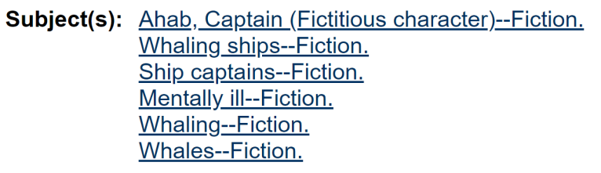
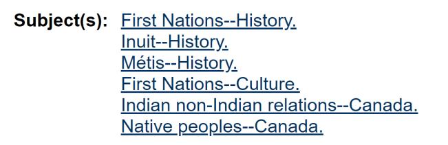

## Introduction

The act of transforming a universe of complexity into a set of labels is integral to how infrastructures from censuses to libraries work. To make a person or an item intelligible to a large system, we have to pick which facets to represent in a recognizable and distinct set of terms. For authors and scholars, sharing our work and finding others’ work is mediated by the subject terms such as in the Library of Congress Subject Headings (LCSH), PubMed’s Medical Subject Headings (MeSH), or the Modern Language Association (MLA) Commons. In addition to facilitating system operations, this act of making our thoughts, our stories, and ourselves, intelligible is also a means of sense-making and mapping out our social and cultural worlds. When we make Canadian scholarship intelligible to education and scholarly communication systems, the terms we apply to our scholarship are largely from the United States in origin and in perspective. If we are to build open systems for scholarly communication, how much of the content and process of existing subject heading systems are appropriate, and how much must be redesigned with openness at the centre?

The group of scholars and practitioners among Implementing New Knowledge Environments (INKE) is poised to open a conversation on how the infrastructure for open initiatives can include thoughtful, responsible, and transparent knowledge organization systems. What is the relationship between the openness of scholarship and the openness of the largely invisible systems (Star and Strauss 1999) that shape our access to and understanding of the scholarship itself? Of particular concern is the nature of subject access and whose perspective is represented. As distinct from proprietary systems—such as those of for-profit journal indexing services or US government-managed library classification systems—how might the systems produced in this open scholarship community represent Canadian concerns such as the recommendations of the *Truth and Reconciliation Commission*? In the following sections, I examine the case of subject description as an example of how the “open” in open knowledge systems is a struggle between universalist values, in which all scholarship might fit into a single descriptive framework, and values of situatedness and accountability, in which our frameworks reflect their communities of authors and subjects. I intend this piece to be a call to investigate the invisible aspects of the infrastructure of open scholarship—those pieces that are typically meant to work quietly, without notice, and can affect characteristics of a system from interoperability and usability to values such as multiculturalism and reconciliation.

## The Infrastructure of Subjects

Determining what something is *about* is a fascinating question with elusive answers. One could spend a career, for example, making a case for the aboutness of *Moby Dick*, where aboutness refers to the subjects inherent to the intellectual and creative work. The idea that subjects are essential to an intellectual and creative work is itself a matter for debate and invites questions about authorial intent and readers’ agency. In information studies, however, the task of determining aboutness is less an invitation to interrogate the nature of metaphor, narrative, or meaning than an ongoing and urgent concern: How can we connect items to subjects, subjects to terminology, and terminology to a community of readers who seek items about, say, mental illness? Subject access—the ability to discover items through the particular property of aboutness—is one of the key ways library services make the library more than just a collection of books or an index more than a list of articles. Ideally, our systems represent the subjects of their collections in such a way that they are authentic to the items themselves, comprehensible to the user, and are consistent with the values of the community (Beghtol 1986). For INKE’s development of open access platforms, it is necessary to examine how this last quality can be enacted with regards to accountability, transparency, and responsiveness to the community.

The study, critique, and improvement of subject access systems are primary concerns for the field of knowledge organization. Knowledge organization is, in general, concerned with how we represent items such as books in systems such as libraries and how features of similarity and difference (e.g., the names of creators, disciplinary context, and aboutness) can facilitate searching, browsing, and selecting items. Traditionally, practitioners and scholars in knowledge organization have created and studied systems of centralized control of subject terminology: controlled vocabularies and classification systems. In controlled vocabularies, such as LCSH in Figure 1, there is a centrally managed approved list of terms, relationships among these terms (e.g., “mentally ill” has the broader term “sick” and the related term “people with mental disabilities”), and rules for how to apply these terms to items. Even with the advent of full-text search capabilities through digital collections, these systems are still vitally relevant to the user’s ability to find and sort a collection. Given the impact of subject access systems on the organization of the collection and the ability to connect users to items, we constantly seek to improve the rigour of the process by which practitioners build, revise, and maintain these systems.

A fundamental shift in contemporary knowledge organization scholarship is the awareness that our systems always have and will always instantiate bias and perpetuate discrimination. No amount of increased technological capacity for complex connections among items and subjects or rigorous procedures for determining subjects will fix this. Instead, the responsible path forward is to reject the appearance of objectivity, be intentional in our choices of the values our systems represent, and be transparent about our processes, biases, and fallibility (Feinberg 2007; Mai 2010). In unpacking the means by which our systems instantiate bias and how these biases are hidden, I turn to infrastructure theory (Star 1999; Star and Ruhleder 1996) and its focus on the invisible systems underlying our daily lives. Like a physical infrastructure, such as the North American electrical grid, subject description is taken for granted until it fails to work. This kind of invisibility means that electrical grids and subject description systems shape the operations on top of them without our being conscious of that shaping. We tend to attribute characteristics of objectivity and inevitability to systems that have “‘sunk’ into, inside of, other structures, social arrangements, and technologies” (Star and Ruhleder 1996, 113) though the circumstances of their creation and the impacts of their design may be all too human and even malicious (Winner 1980). Whereas the work of the knowledge organization field 150 years ago was to align a subject heading system to a real, external order of topics and their relationships, the current approach favours situated understandings of aboutness and local accountability.

Central to my view of such systems through critical theory is the recognition that infrastructural systems such as subject headings are socially constructed. They function as a shared basis of understanding on top of which more visible functions such as knowledge development and sharing exist. When a system such as a list of subject headings matches the expectations of the community of users, the system becomes invisible—we cease to notice its operation and take for granted the role it plays in our research and writing. When a minority of the user community is misrepresented and their views are distorted, they become invisible instead—work by and about that community is harder to find and easier to miss in the glut of information. Within Canadian topics, we know existing terminology marginalizes and contributes to the invisibility of Indigenous people and history. Efforts to include marginalized voices and change the centre of Canadian scholarship include infrastructural projects such as the Brian Deer Classification scheme (Cherry and Mukunda 2015) which organizes, physically and conceptually, a library collection consistent with Indigenous terminology and relations among subjects and ways of knowing.

In the following section, I explore the primary concerns around creating a system responsive to a community with a focus on the Canadian context for INKE’s work.

## Subject Description for Canadian Scholarship

Knowledge organization systems are always already distorted, biased, and benefitting a particular point of view. While that feature of a subject description system is inevitable, how this bears out in the international stage of scholarly communication is an open question. To the extent that we expect Canadian scholarship to be recognizably different than US scholarship—arising from focuses on different locations, ecosystems, cultures, histories, laws, climates, media, languages, institutions, and regulations—building a system of terminology and definitions for one corpus will not entirely serve the other. From the perspective of infrastructure studies (Star 1999) and established critiques in knowledge organization, we would expect therefore to find a distortion of Canadian scholarship and research as it builds itself on top of the existing infrastructure. If there is a misfit between the work done by scholars in a range of disciplines in Canadian institutions and the descriptive systems of the journals, databases, and libraries to which they direct their work, what does it look like? How could we build a system that makes visible its own constructed nature and is radically open to challenge and revision?

I limit my discussion here to subject description, the process of assigning terms indicating the aboutness of a work or item to provide organization and enable access to a collection. Subject description, among other modes of analysis and design in the larger field of knowledge organization, is a particularly difficult and contentious one. Determining what something is about and then assigning a term to that aboutness is so subjective, so culturally specific, so much a matter of evaluation and judgement, that improving this process is as much a focus of my field as every other mode of describing an item combined. Take, for example, the breadth of courses offered within the UBC iSchool (Library, Archival and Information Studies) for addressing how to represent and organize knowledge: of four regularly offered courses, two (Indexing and Taxonomies) cover unique modes of depicting the meaning of an item or collection and a third spends half its time on a third method (the ‘classification’ in Cataloging & Classification). In digital infrastructures for sharing scholarship and primary sources, the metadata around each object may include technical data describing the file itself; descriptive metadata transcribing information like the object’s title, its author, and the language in which it is written; and the subject metadata that gives a sense of the topics or themes with which the object is in dialogue. Changes to digital technologies produce new kinds of technical metadata—data from the object may be more or less accurately transcribed, and expressing the aboutness of the object is a constantly moving target regardless of the technology or platform.

To take the primacy of subject description from another angle, consider the cultural and national phenomena of countries developing their own exhaustive systems naming and organizing the possible topics of library holdings. In the US, three systems serve this purpose: the Dewey Decimal Classification (DDC) organizes public libraries according to the subject of its items, the Library of Congress Classification (LCC) does the same for academic libraries, and the LCSH provides multiple access points for the subject of any item. US librarians developed and implemented these systems in the context of reconstruction following the American Civil War (1876, 1897, and 1898, respectively). Looking at these systems more than 100 years on, we see the work of defining the country’s values, perspective, and privileged classes in these lists of terms. Similarly, the Soviet Union began the development of a Marxist replacement for the DDC in 1918 and South Korean libraries adopted the Korean Decimal Classification (1964) following the Korean War. Within Canada, work towards a national voice in subject description started in 1968. In 1978, the National Library of Canada (now Libraries and Archives Canada) introduced the Canadian Subject Headings (CSH)—an appendix to the LCSH.

Library and Archives Canada (LAC) manages the CSH to represent distinctly Canadian subject terminology such as geographical information, Canadian law, and Canadian history (Library and Archives Canada 2015). Where CSH overwrites rather than extends LCSH, we see how cultural differences bear out in naming and labelling practices:

CSH covers with two different headings the topics for which LCSH would use **Italians—Canada**: (1) **Italian Canadians** for works discussing Canadian citizens of Italian ancestry; and (2) **Italians—Canada** for works on Canadian residents of Italian nationality who are not yet citizens, or who are not permanently domiciled in Canada. (Library and Archives Canada 2015)

This example, indicative of Canada’s approach to multiculturalism, is more subtle than the difference between “First Nations” and “Native Americans” as terms in each system. The relationship between the two systems, with CSH being an appendix to LCSH, means that objects of Canadian scholarship will still carry the subject heading “Indians of North America--Canada” as in this record for the book *Indigenous Writes: A guide to First Nations, Métis & Inuit issues in Canada* (Vowel 2016) in Figure 2.

Alternatively, local and situationally appropriate approaches to subject description can depart from Library of Congress’s universalist approach and adopt terminology that gives the same sense of aboutness while respecting and being more consistent with relevant community values. Figure 3 shows this contrast in the record for the same book, *Indigenous Writes*, as catalogued for the Xwi7xwa Library using the First Nations House of Learning Thesaurus, instead of LCSH.

## Next Steps

I am currently engaged in related research projects which explore the questions above—what does it mean to create subject access systems consistent with multiculturalism, openness, and a decolonizing project? This research has three aims: The first is to determine how research conducted in Canada fits within US-centric systems of subject description and organization. The second is to assess the extent to which contemporary trends in Canadian scholarship, notably decolonizing education and knowledge, are compatible with existing subject description infrastructures. These two aims are interdependent: the locus of control of subject description within US institutions and the overlapping and interdependent nature of infrastructures for scholarly communication means that change comes slowly and change from the margins is particularly difficult. Finally, I am seeking to connect contemporary projects from institutions in Canada to build knowledge organization systems consistent with local values and needs. It is always misleading to say that “no one is doing anything about this” and this domain is no exception; libraries and cultural heritage institutions are creating metadata schemas that serve local needs and that are accountable to the values of their authors and readers.

INKE should be a key vehicle for open and accountable subject description as it features the best practices to represent and facilitate access to scholarship in Canada. I see this potential work around knowledge organization and subject access in particular as being one among many types of infrastructure design this community will consider in creating platforms for open access. For the Humanities Commons, for example, how much of the infrastructure can be imported from other contexts, such as the MLA Commons, and how much can be designed locally? For knowledge organization and for other decisions about the design and construction of such platforms, what are the acceptable trade-offs regarding the intensity of labour in designing and maintaining a system consistent with open values and Canadian scholarship? Where this community is experimenting with new systems, there are chances to get things right from the start—not just in terminology, but also in the design of the system itself.

## References

Beghtol, C. (1986). Semantic validity: Concepts of warrant in bibliographic classification systems. *Library Resources & Technical Services*, *30*(April/June), 109–125.

Cherry, A., & Mukunda, K. (2015). A Case Study in Indigenous Classification: Revisiting and Reviving the Brian Deer Scheme. *Cataloging & Classification Quarterly*, *53*(5–6), 548–567. https://doi.org/10.1080/01639374.2015.1008717

Feinberg, M. (2007). Hidden bias to responsible bias: An approach to information systems based on Haraway’s situated knowledges. *Information Research*, *12*(4). Retrieved from http://informationr.net/ir/12-4/colis07.html

Library and Archives Canada. (2015, October 16). About Canadian Subject Headings (CSH). Retrieved September 13, 2018, from https://www.bac-lac.gc.ca/eng/services/canadian-subject-headings/Pages/about-csh.aspx

Mai, J.E. (2010). Classification in a social world: Bias and trust. *Journal of Documentation*, *66*(5), 627–642. https://doi.org/10.1108/00220411011066763

Star, S. L. (1999). The Ethnography of Infrastructure. *American Behavioral Scientist*, *43*(3), 377–391. https://doi.org/10.1177/00027649921955326

Star, S. L., & Ruhleder, K. (1996). Steps toward an ecology of infrastructure: Design and access for large information spaces. *Information Systems Research*, *7*(1), 111–134.

Star, S. L., & Strauss, A. (1999). Layers of silence, arenas of voice: The ecology of visible and invisible work. *Computer Supported Cooperative Work (CSCW)*, (1995), 9–30.

Vowel, C. (2016). Indigenous writes: A guide to First Nations, Métis & Inuit issues in Canada. Winnipeg, MB: HighWater Press.

Winner, L. (1980). Do artifacts have politics? *Daedalus*, *109*(1), 121–136.
