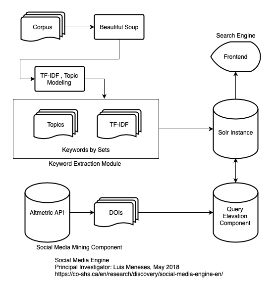
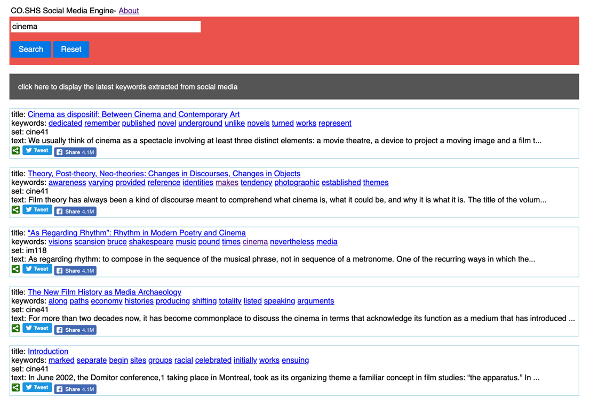

## Introduction

As director of the Office of Scientific Research and Development, Vannevar Bush oversaw the government mobilization of American scientific research during World War II. In his pioneering 1945 essay “As We May Think,” Bush envisions a time in which the world’s knowledge is accessible by machine and in which the connections that describe the higher level relationships among sources are themselves objects of scholarship that can be shared with colleagues (Bush 1945). Considering the potential of social media—as it is used and relied on by nearly everyone—along with the relevance of open infrastructures and the accessibility of open knowledge, we have developed a framework that aims to build on Bush’s vision by extending the functionality of an open access repository (OA) and implementing processes to incorporate the ongoing trends in social media into the context of a digital collection. We refer to these processes collectively as the *Social Media Engine* (Meneses et al. 2017; Meneses, Arbuckle, Lopez, Moa, Furuta, et al. 2018; Meneses, Arbuckle, Lopez, Moa, and Siemens 2018). This engine and its underlying framework—which relies on the affordances present in open access repositories—aims to foster public engagement, open social scholarship, and social knowledge creation by matching readers with publications.

Through our research, we have developed our own methodology to analyze a document collection and identify the important metadata in its documents. In this paper, we will focus on the lessons we have learned during the ongoing development cycle of our framework and elaborate on how our methodology can be extended to different scenarios. The overall purpose of this paper is twofold: first, we will elaborate on challenging some of the preconceived notions in digital libraries by making repositories more dynamic; and second, by challenging this notion we want to promote public engagement and open scholarship. Ultimately, our research aims to build on Bush’s vision and create tools to emphasize the connections between documents that can be treated as objects of study as well.

## Background

The fundamental concepts behind the Social Media Engine can be explained using three points, which are illustrated in Figure 1. First, our framework yields a list of topics related to individual entries and articles in the Érudit.org corpus by applying textual analysis techniques and topic modelling; Érudit.org is a digital repository of social sciences and humanities publications (Érudit Consortium 2017). The documents are diverse in their language: English or French; their content: including scholarly and cultural journals, theses, books, proceedings, and technical reports; and their discipline: including arts, engineering, education, cinema, demography, law, theology, history, sociology, women studies, among others. Our corpus is a snapshot of the entire Érudit corpus containing 174,269 XML documents. Second, our engine connects readers and publications by monitoring social media for trending topics and returning links to OA publications that can be used to feed and enrich the discussion. Finally, our engine identifies trending papers on social media by looking at the number of times that papers on social science topics are shared, saved, liked, or commented on. Figure 2 shows a user scenario that outlines the processes and workflow of the Social Media Engine. In this scenario, search results are reorganized according to their references in social media.

To achieve these three points, our framework employs three main components, which are illustrated in figure 3: first, a keyword extraction module; second, a social media mining component; and third, a search engine. These components and their corresponding interactions are illustrated in Figure 3. The implications and impact of our framework towards the implementation of data mining and discovery tools and will be described in more detail in the following sections.

## The keyword extraction component

The keyword extraction module is based on Apache Spark (Apache Software Foundation 2017a), its implementation of Latent Dirichlet Allocation (LDA) clustering (Blei, Ng, and Jordan 2003), and Term frequency–Inverse document frequency (Tf-Idf) statistics. LDA is the simplest form of topic modeling: a concept that is often used to describe a set of algorithms that are used to describe a large number of documents that often share a common theme. The main idea behind LDA is that the text in documents do not belong to a single topic exclusively, but can belong to multiple topics at the same time instead. Formally, a topic can be defined as a probability distribution over a fixed vocabulary. For example, a topic about English literature has words about literary works with high probability, whereas a topic about computer science has words about engineering with a high probability. On the other hand, Tf-Idf is a numerical statistic that is intended to reflect how important a word is to a document corpus. In this sense, a Tf–Idf value increases proportionally to the number of times a word appears in the document and is offset by the number of documents in the corpus that contain the word, which helps to adjust for the fact that some words appear more frequently in general.

The documents in the corpus were ingested into a Spark Dataframe—which allowed us to use a distributed and clustered computing environment—and preprocessed (tokenization, stop words and name-entity removal) before undergoing the modelling stage. This preprocessing along with multiple iterations per model allowed us to obtain appropriate terms that reference the topics as results. The other components in our framework are based on Python (van Rossum 1995), which is a single threaded programming language. We used Python to calculate the Tf-Idf values for the documents in the collection. In this sense, the use of parallelization to extract keywords brought two advantages: first, the increase in speed is substantial when compared to a single threaded implementation; and second, the codebase is replicable as it is mostly based on Spark’s standard libraries. We must also point out that there are other alternatives to solving this problem—for example, using other libraries and software packages. However, some of these solutions do not scale well and do not allow the use of parallel computing. Considering that we created a computing cluster in Compute Canada’s Westgrid infrastructure (Westgrid 2017), using Spark was the more appropriate solution.

As part of our experiments, we found that the terms obtained with Tf-Idf provided better results in the classification by ranking—quite ironic considering the processing power we required and the difficulties that we faced when modelling our corpus. For example: we had to settle on clustering the documents based on a preexisting division of the corpus. The corpus was already subdivided into sets that could be retrieved using the Open Archives Initiative Protocol for Metadata Harvesting (OAI-PMH) standard. We also had to settle on the number of iterations in the modelling stage: we performed 100 iterations on each set. Clustering the corpus as a whole or with a higher number of iterations would irremediably translate into errors that would stop the clustering process. These errors might be addressed by newer versions of Spark as LDA clustering is still an experimental feature. Nonetheless, we do not discard the validity of the terms obtained with topic modeling. We believe that these terms provide an additional layer of metadata, which introduces the potential for an alternative method for their classification. More importantly, we believe that the combination of the terms obtained using Tf-Idf and topic modelling provides a layer of metadata that is very rich in its entropy—measured in regards to the amount of information that it conveys. As a general recommendation, we found that Tf-Idf is more than suitable for the extraction of keywords.

## The social media mining component

Social media tools offer researchers a different approach to their workflow and introduce platforms for showcasing their research to a greater audience (O’Sullivan, Long, and Mattson 2016). In this sense, social media tools facilitate the dissemination of research and increase the scholar’s visibility. Not only do social media tools help bridge the communication gaps between scholars by facilitating the exchange of ideas and information, but they can also help bridge the gaps between ideas by providing interaction methods that highlight the work from other scholars. As such, social media tools are becoming highly integrated into the research and knowledge-creation processes.

Why is the social media mining component important? Currently, broad public participation in social media is widespread and increasingly prevalent, but the humanities and social sciences have yet to engage with these practices in a deep and sustained manner. Thus, many of the offline discussions about scholarly materials that conventionally take place in conference venues have moved online and occur on social media platforms. This transition makes their quantification extremely difficult as the links between discussions and resources are not standardized yet and are problematic to maintain over time. The social media component allows us to measure and quantify the influence of scholarly interactions that take place outside the boundaries of a digital collection, which we elaborate on below.

First, we argue that integrating social media in the processes and affordances of an open access repository is needed, especially when considering that social media is shaping alternative models of interaction—for example, in the sharing of resources among colleagues as associative trails (Bush 1945), which can make repositories more dynamic. Rowlands et al. show how social media has found applications within the research lifecycle at different stages, from identifying possible research opportunities to disseminating findings (Nicholas and Rowlands 2011). According to this study, the most popular uses for social media tools in an academic setting were to satisfy interactions—perfectly fitting the purposes of our framework.

Second, we acknowledge that social media and online conversations have allowed the users of open access repositories to access documents that they would have difficulty finding otherwise. To illustrate this scenario, Wang et al. compared the differences in the impact between OA and non-OA articles (Wang et al. 2015). This study finds that authors who publish OA have a citation advantage, especially when considering how social media helps increase the number of views of OA articles. Wang et al. also found that OA articles held an advantage not only in total downloads, but also in long-time, sustained downloads compared to their non-OA counterparts. Our work aims to expand on this increased accessibility within the context of the humanities.

Connecting readers with publications and monitoring social media to identify trending topics are fundamental aspects of our framework. However, these two points are complex research problems on their own. To streamline this complicated process and avoid potential pitfalls, we decided to provide our framework with a greater level of abstraction and use Altmetric.com (Altmetric LLP 2017) for our social media mining. Almetric.com is a private company that provides a web service that monitors several social media streams, thereby helping scholars get a better overview of their scholarly content.

The utility of Altmetric data becomes evident within the context of our framework: it can provide advantages to alternative scholars, serve public needs, and reveal scientific contributions long underrepresented in the standard literature (Alperin 2013). However, the use of Altmetric data has some advantages and disadvantages. Altmetric data lets researchers identify the extent to which their research is being shared and discussed by others—facilitating connections with potential collaborators at a global level. On the other hand, Altmetric data can be subject to artificial bias by agents that alter the number of times content is accessed and mentioned by others.

Almetric.com’s API provides some level of granularity in searching, including by date and DOI range. However, using an external web service to harvest mentions and references in social media does have its implications. The level of abstraction that we achieved can be seen as an advantage. On the other hand, we have no control or indication over how Altmetric.com regularly harvests, processes social media content, and produces or excludes some of its results. In this sense, Almetric.com acts a complex system whose internal workings are hidden—in a lot of ways resembling a black box. In our specific case, we found that the advantages outweigh the disadvantages: Altmetric data contributes positively towards the functionality of our framework.

## Search engine component

Search engines provide a mechanism that allows users to find and retrieve documents from a collection or repository. Considering that a user’s information needs change during the iterative process of formulating and carrying out queries, accessible and intuitive workflows are needed to allow users access to information timely and adequately.

We consider the Social Media Engine as a collaborative academic search engine. Similarly, Chen et al. introduce CollabSeer: a search engine for discovering potential collaborators for a given author or researcher (Chen et al. 2011). Their results show that CollabSeer can effectively suggest prospective collaborators by performing an analysis of the network structure. Indeed, the integration of social media interactions with a search engine on an OA corpus lets users add documents back into ongoing discussions. This becomes especially important since it has been proven that social activity can improve the performance of a recommendation system (Konstas, Stathopoulos, and Jose 2009). However, the representation of items and semantics has to be taken into account (Lops, Gemmis, and Semeraro 2011). Our framework is collaborative, but in a different sense.

Our framework affords a multidisciplinary crossover of information through search query results and academic social interaction with scholars from other fields. Taking into account that a user’s research interest can remain unchanged for some time depending on the scope of a given study, this crossover can facilitate users finding publications that they would not be likely to consider otherwise. Our framework is designed to highlight trends that are ongoing on social media in the resulting search patterns in research papers using text mining techniques, which might bring details about related articles by other scholars—for example, overlap between social sciences and the humanities, among other fields. Furthermore, our framework is expected to include the functionality of reinserting relevant articles into the discussion, which brings the multidisciplinary interaction full circle.

We used Apache Solr (Apache Software Foundation 2017b) as the search engine for our framework; Solr is a robust open source enterprise search platform that is based on Apache Lucene (Apache Software Foundation 2011). Ingesting the document corpus into Solr is done through XML files and by defining a schema, which defines the fields and metadata that will be used for searching. Solr has a component that is particularly important to our objectives: the Query Elevation component allowed us to boost specific search results depending on their mentions in social media. In other words, the rankings of the documents are altered and boosted using sets of keywords that match both social media and the documents in our corpus. Figure 4 shows a screenshot of the Social Media Engine user interface for our Solr instance. In this sense, Solr is crucial towards the operation of our framework. Considering the modular nature of our framework, we do not discard the possibility of using a different search engine in future versions of our framework.

## Conclusions

In this paper we have focused on the lessons we have learned during the development cycle of our framework and discussed the details of our methodologies. In turn, this discussion outlines details that can be used to extend out methodology to different scenarios. Our work can be considered as a showcase of the impact that digital technologies can have in terms of accessibility and the creation of services that facilitate new modes of scholarly communication (Alperin 2019). However, using digital technologies for these purposes does carry some implications: for example, our results are very dependent on the use of similarity measures based on probabilistic algorithms and a reliance on external web services. Nevertheless, our work aims to capitalize on the potential of social media, the relevance of open infrastructures, and the accessibility of open knowledge to build on Bush’s vision by creating tools to emphasize the connections between documents that can be treated as objects of study as well. Ultimately, our work takes advantage of the affordances and increased accessibility that open access provides in order to capitalize on the existing relationship between researchers and society at large.

## References

Alperin, Juan Pablo. 2013. “Ask Not What Altmetrics Can Do for You, but What Altmetrics Can Do for Developing Countries.” *Bulletin of the American Society for Information Science and Technology* 39 (4): 18–21. https://doi.org/10.1002/bult.2013.1720390407.

Alperin, Juan Pablo. 2019. “Leveraging Open Altmetrics Data for Greater Engagement with Research.” presented at the INKE Victoria 2019, Victoria, BC, Canada, January 16.Altmetric LLP. 2017. “Altmetric.” October 20, 2017. https://www.altmetric.com/.

Apache Software Foundation. 2011. “Welcome to Apache Lucene.” March 29, 2011. http://lucene.apache.org.

Apache Software Foundation. 2017a. “Apache Spark: Lightning-Fast Cluster Computing.” April 11, 2017. http://spark.apache.org.

Apache Software Foundation. 2017b. “Apache Solr.” October 20, 2017. http://lucene.apache.org/solr/.

Blei, David M, Andrew Y Ng, and Michael I Jordan. 2003. “Latent Dirichlet Allocation.” *The Journal of Machine Learning Research* 3: 993–1022.

Bush, Vannevar. 1945. “As We May Think.” *The Atlantic Monthly*, July 1945.

Chen, Hung-Hsuan, Liang Gou, Xiaolong Zhang, and Clyde Lee Giles. 2011. “CollabSeer: A Search Engine for Collaboration Discovery.” In *Proceedings of the 11th Annual International ACM/IEEE Joint Conference on Digital Libraries*, 231–240. JCDL ’11. New York, NY, USA: ACM. https://doi.org/10.1145/1998076.1998121.

Érudit Consortium. 2017. “Erudit.Org.” April 11, 2017. http://www.erudit.org/en/.

Konstas, Ioannis, Vassilios Stathopoulos, and Joemon M. Jose. 2009. “On Social Networks and Collaborative Recommendation.” In *Proceedings of the 32Nd International ACM SIGIR Conference on Research and Development in Information Retrieval*, 195–202. SIGIR ’09. New York, NY, USA: ACM. https://doi.org/10.1145/1571941.1571977.

Lops, Pasquale, Marco de Gemmis, and Giovanni Semeraro. 2011. “Content-Based Recommender Systems: State of the Art and Trends.” In *Recommender Systems Handbook*, 73–105. Springer, Boston, MA. https://doi.org/10.1007/978-0-387-85820-3\_3.

Meneses, Luis, Alyssa Arbuckle, Hector Lopez, Belaid Moa, Richard Furuta, and Ray Siemens. 2018. “Aligning Social Media Indicators with the Documents in an Open Access Repository.” presented at the INKE Victoria 2018, Victoria, BC, Canada, January 10.

Meneses, Luis, Alyssa Arbuckle, Hector Lopez, Belaid Moa, and Ray Siemens. 2018. “Social Media Engine: Changing User Engagement in Open Access Repositories.” presented at the Joint CSDH/SCHN & ACH Digital Humanities Conference 2018, Regina, Saskatchewan, Canada, May 26.

Meneses, Luis, Alyssa Arbuckle, Belaid Moa, Richard Furuta, and Raymond Siemens. 2017. “Towards a More Context Aware Digital Library: Implications in the Humanities.” presented at the Joint CSDH/SCHN & ACH Digital Humanities Conference 2017, Toronto, Canada, May 29.

Nicholas, David, and Ian Rowlands. 2011. “Social Media Use in the Research Workflow.” *Information Services & Use* 31 (1–2): 61–83. https://doi.org/10.3233/ISU-2011-0623.

O’Sullivan, James, Christopher P Long, and Mark A Mattson. 2016. “Dissemination as Cultivation: Scholarly Communications in a Digital Age.” In *Doing Digital Humanities: Practice, Training, Research*.

Rossum, Guido van. 1995. “Python Tutorial, Technical Report CS-R9526.” Amsterdam: Centrum voor Wikunde en Informatica (CWI). https://ir.cwi.nl/pub/5007/05007D.pdf.

Wang, Xianwen, Chen Liu, Wenli Mao, and Zhichao Fang. 2015. “The Open Access Advantage Considering Citation, Article Usage and Social Media Attention.” *Scientometrics* 103 (2): 555–64. https://doi.org/10.1007/s11192-015-1547-0.

Westgrid. 2017. “WestGrid: Compute Canada Regional Partner.” April 11, 2017. https://www.westgrid.ca.
