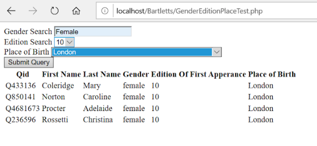

Wikipedia is far from perfect. The same can be said of its sister project, Wikidata. And yet, excluding the World Wide Web itself, Wikipedia and Wikidata together represent the world’s largest structured humanities data source. This methods paper offers an introduction to the value of Wikidata for humanities research and makes the case for humanities researchers’ intervention in its development. It concludes with a short case study to illustrate how Wikidata can support humanities research projects. The case study project, Linked Familiarity, uses Wikidata data about the people quoted in the first ten editions of *Bartlett’s Familiar Quotations* to look for patterns in the people *Bartlett’s Familiar* editorial team thought readers find quotable from 1855 and 1910. These patterns will, we hope, clarify a corner of the zeitgeist: *Bartlett’s Familiar Quotations* readers voted with their purchases—the book’s popularity suggests the quotes the volume’s editorial team compiled really did meet a public desire, or even need. The Linked Familiarity’s team is using Wikidata data to find out about the people worth quoting in this 55-year stretch, to examine the characteristics that unite them, and to uncover the outliers.

## Introducing Wikidata

Wikidata is a social scholarship project *par excellence*. It consists of crowdsourced human- and machine-readable structured assertions about real-world people, places, concepts, and things. Initially funded by the Allen Institute for Artificial Intelligence, the Gordon and Betty Moore Foundation, and Google in 2012, Wikidata is the first new Wikimedia project since 2006 (Yu 2015). While Wikimedia projects are technically Web 2.0 projects in that they rely on user-generated content, they differ from other 2.0 platforms, such as Tumblr, Tinder, and Facebook in that they preserve provenancial data for public use. Wikimedia’s financial model differs from other Web 2.0 platforms too. While Wikimedia does have mechanisms for contributors to make money and for third-party companies to buy data, Wikipedia’s articles and Wikidata’s structured dataset of assertions is free to use.

Wikidata is ready for uptake in humanities research circles, not least of all because its data structure encourages citation. Wikidata foregrounds the sources of its assertions. While not all assertions have citations, and perhaps not all assertions come from sources scholars are ready to trust, the Wikidata platform, Wikibase, is designed to cite the sources of assertions in a way that supports trustworthiness. It has also been championed by trusted authorities, including library associations and national archives (Association of Research Libraries 2019; Allison-Cassin and Scott 2018; Ferriter 2019; Lemus-Rojas and Odell 2018). As of July 2020 it contained 88,000 entity records (records about people, places, concepts, things) curated by 25,000 active users (“Wikidata:Statistics - Wikidata” 2020).

Wikidata contains information about entities, connected to one another through the Wikidata ontology (a set of rules about the relationships between entity types, e.g. a person may have a *born_in* relationship to a place, but a place cannot have a *born_in* relationship to other entities). This structure, one where two entities are connected by a relationship, is called a *triple*. Wikidata, unlike many other data sources that use a triple structure, adds a fourth item, turning each triple into a *quad*. This fourth item is a citation, to make clear where the information in the triple comes from, for example:

    (George Sand)—date_of_birth—>(1804-07-01)—stated_in—>
      (Bibliothèque nationale de France authorities)

This chain of (entities) and the —relationships—\> between them offers not only the fact that novelist George Sand was born on July 1st 1804, but that that biographical assertion came from the Bibliothèque nationale de France. Wikidata lists four birth dates for George Sand: the July 1st 1804 date has seven citations, and the other three only have one citation each. Wikidata’s ability to record multiple facets for any one fact may seem like a bug, since, for example, George Sand can really only have had one birth date. Wikidata’s ability to record multiple assertions about a single datapoint is not a bug but rather is a feature. Most triple-backed resources do not cite their sources and do not permit multiple values for relationships that should, logically, have a single value. Wikidata, however, allows for well-cited ambiguity and disagreement. This suits Wikidata for recording data in a humanistic way, since humanities scholarship requires a way to trace ambiguity, disagreement, uncertainty, and nuance. While scholars might agree that a person should have only one date of birth, in general humanities scholars also recognize that there may be disagreement about when that date was. For humanities research, Wikidata’s ability to record disagreement and the evolution of assertions of fact over time may prove quite useful, particularly because Wikidata lets researchers see the provenance of assertions themselves. Prosopography, or collective biography, is one humanities methodology that could make good use of this type of provenencial data. For example, as definitions of sex and gender change, prosopographers might find cited and timestamped assertions about those definitions in Wikidata’s biographic entries quite useful, as they allow researchers to study the changes in the concept of sex and gender itself.

This is not to say that Wikidata users should have to download a jumble of, for example, birth dates for any one person in order to use aggregate biographical data. When using Wikidata’s faceted query service (https://query.wikidata.org/) researchers can add qualifiers or provisions to their search. For example, researchers can limit their results to assertions with citations, assertions with the most citations, or assertions with citations from a researcher-defined set of trusted sources such as the Bibliothèque nationale de France.

## Contributing to Wikidata, Contributing to the Web

Wikidata, is, at its heart, a metadata project. Wikidata lives up to Jeffrey Pomerantz’s pronouncement, that when it comes to publishing metadata in triples or quads to share as linked data on the semantic web, as Wikidata does, “a rising tide lifts all boats” (Pomerantz 2015, 178). But, even though Wikidata permits nuanced and conflicting assertions and sophisticated search, it shares shortcomings with other Wikimedia projects. Wikidata’s coverage is uneven and biased in favour of entities that are of interest to editors or entity types for which there are automatic ingestion tools. Wikidata, which was first seeded by the content from English Wikipedia infoboxes, is also biased in favour of the type of content that is already in English Wikipedia, which itself is skewed towards the typical or traditional interests of white, university educated, straight, middle class men (Lam et al. 2011). That said, Wikidata does not have to retain the content bias of English Wikipedia: it has since pulled in data from other sources and even permits editing by hand and by bot—work that humanities researchers, with their particular expertise, could take up to help shape the semantic web. Contributions to Wikidata not only help the Wikimedia suite of projects (Wikidata’s data populates infoboxes across the Wikipedias in all languages), but also shapes projects that draw on Wikidata data, from small ones, like Linked Familiarity, to large ones like the Google Knowledge Graph, which shapes search results, and through those results, what people can know by using Google Search. Wikidata is the perfect place for scholars interested in open social scholarship to enter well-cited information to intervene in research undertaken by Google Search users.

Wikidata, with its mix of by-hand and automated contribution and data retrieval methods, may, with broad enough adoption, turn out to be the best place to not only draw from, but also craft, metadata about books, people, places, organizations, and other entities in an open computationally tractable way. Of course, the ontology and the entities always need refining and further nuance. That said, with its ability to draw on and easily link to other authorities (for example, the Virtual International Authority File, the Oxford Dictionary of National Biography, and the Getty Union Catalogue), Wikidata could represent the best realization of the vision of automated harmonization of metadata (Lahti et al. 2019). Pomerantz offers indirect guidance that pushes librarians and researchers towards Wikidata: "do not reinvent the wheel: almost guaranteed, a wheel has already been developed that will suit your needs" (Pomerantz 2015, 186). Wikidata is a wheel that is already rolling. More importantly, perhaps, is not the scheme that researchers develop for the online representation of people, places, and things, but that researchers develop it in a social, flexible, and responsible way, indeed, “the more records about more entities that can be connected together, the richer the knowledge represented online can be" for researchers within and outside of academia (Pomerantz 2015, 173).

Wikidata needs humanities scholars to contribute not only to its entity records but to its ontology: not all data on the web is comprehensible to computers—the keys to making linked data comprehensible to machines are ontologies (Yu). As discussed above, ontologies describe the relationships between entities—people, places, concepts, things. Humanities scholars have rich domain knowledge about present and historical relationship types, ways of living, and the relationships between people, places, and ideas. Wikidata’s list of entities is impressive, but in addition to needing humanities expertise to add data to each entity record, Wikidata needs our ontological help. Humanities researchers could usefully help refine Wikidata’s ontology. Its data could then be used by projects big and small informed by humanities insights about the historical relationships between people, places, concepts, and things.

## *Bartlett's Familiar Quotations’* History

The Linked Familiarity project consists of biographical data about the 961 people quoted in the first 10 editions of *Bartlett's Familiar Quotations.*[^1] In the late nineteenth century, *Bartlett's Familiar* was the go-to reference work for quotations. The *familiar* in the volume’s title—which is most conciliatory: *we know that you know this material*—eventually became almost ridiculous: *Bartlett's Familiar* expanded to 1057 pages by the 10th edition, containing more material than any one reader could actually be familiar with.

The Linked Familiarity team plans to use Wikidata-backed biographical information to reveal changes in what the literate Americans wanted to have to hand in the late nineteenth-century, and to show the changing contours of who and what mattered in the small section of the culture represented by *Bartlett's Familiar Quotations*. Finding and entering the birth dates, death places, and related details of the people quoted in *Bartlett's Familiar* by hand would have taken the three-person Linked Familiarity team months and months, leaving us to wait years to analyze the results of the data. Open social scholarship, and the trust, citation, and authority mechanisms built into Wikidata have made this prosopographical part of the project possible. The sections that follow introduce *Bartlett's Familiar Quotations* and outline our process, a process we hope will be of use to anyone interested in gathering similar biographic data.

The first edition of *Bartlett’s Familiar* was simply John Bartlett’s self-published commonplace book entitled *Familiar Quotations: A Collection of Passages, Phrases and Proverbs Traced to Their Sources in Ancient and Modern Literature* (1855). This first edition was intended for circulation among friends, but it ran, over a few print runs, to an impressive 1000 copies, which demonstrated to Bartlett the potential popularity of an expanded new edition. Originally a rather slim volume, primarily filled with memorable passages by Shakespeare and from the Bible, Bartlett reworked and expanded *Bartlett's Familiar Quotations* with each subsequent edition. Bartlett, who only had formal education until he was 16, was, at the time, proprietor of the University Book Store in Cambridge (Beck 1981, 95). He self-published four more editions of *Bartlett's Familiar Quotations* himself, before joining Little, Brown, and Company as an editor. Bartlett eventually became a senior partner in the firm, and continued to edit *Bartlett's Familiar Quotations* until his death in 1905. After 1905 the volume was edited by a team at Little, Brown, and Company (Lynch 2016).[^2]

From the 10th edition of *Bartlett's Familiar Quotations* (1914) on, editors, backed by dedicated Little, Brown, and Company staff, were left with the task of weeding the text. *Bartlett's Familiar* had grown exponentially, and apparently no quotation added in the first 10 editions had ever been removed before the 1914 edition (Beck 1981) (The Linked Familiarities team has found some exceptions to this assertion. Francis Quarles, for example, is quoted in the first four editions, but is dropped in the fifth). Even with careful pruning, removing quotations that were “no longer in currency” (quoted in Yue 2002, 26), *Bartlett’s Familiar* continued to be an enormous tome. While some quotations in *Bartlett's Familiar Quotations* have been removed in the years since pruning began in earnest in 1914, the content has also been expanded: the current, eighteenth, edition runs to 1504 quarto-sized onion-skin pages.

## Using Wikidata to Understand Who is in *Bartlett's Familiar Quotations*

Wikidata is a key data source for the Linked Familiarities project, but there were several data processing steps that the team undertook before being able to query Wikidata for the birth dates, death dates, birth and death locations, sex, domains of expertise, and occupations of the people quoted in *Bartlett’s Familiar Quotations*. At the heart of the project are optical character recognized (OCRed) copies of the author indices of the first 10 editions of *Bartlett’s Familiar Quotations*. We processed PDF copies of the indices using Adobe, ABBYY FineReader, and Google Docs to produce OCRed plain text. We expected access to the indices alone would be a challenge, since not all editions are available online and many that are are of uncertain provenance: some editions of *Bartlett’s Familiar* were still being reprinted even after the next edition had come out. We were very glad of the help of the University of Ottawa’s interlibrary loan team in tracking down the indices for each specific edition.

There was much in the indices that confounded the OCR software (rendering, for example, Samuel Garth as *(i art hr, Samuel* or Phaedrus as *PhavDRUS*. The OCR errors were, happily, generally regular ones (rendering *(i* consistently for G, for example), which made automated clean up easier than it might have been if the errors were irregular. Once the text had been corrected, in part by python scripts and in part by hand, we used a python script to iterate through every line in the indices to remove both punctuation and page numbers from the author index texts and to put every name in the multi-column indices into a different line in a text file. This resulted in cleaner files to process.

")

The next step was to use the names to extract biographical data from Wikidata. Even once the OCR was cleaned up, the variance between author names in *Bartlett’s Familiar Quotations* and Wikidata was a surprise to the team. To pull in *Bartlett’s Familiar Quotations* authors’ birth and death dates, birth and death places, gender, and other salient features from Wikidata involved a good deal of disambiguation. While tools like OpenRefine[^3] will let users refine a Wikidata search based on facets of the data (searching, for example, for a fuzzy match on both a name and a birth date), we only had enough data to search on one facet: the author’s name. The name or names we had for each person sometimes varied quite a bit from the name of that person in Wikidata. Indeed, in some cases, *Bartlett’s Familiar* used spellings that were no longer standard. For example, when nineteenth-century author, Dinah Craik (1826–1887), appears for the first time in the seventh edition of *Bartlett’s Familiar* it is as Dinah Craix. In other cases, the names for a single person varied across editions. For example, Johann Ludwig Uhland (1787–1862), is listed, variously, as Uhland J Louis, Uhland Johann L, Uhland John Louis (this last is a particularly egregious anglicization of his name).

The next step was to extract each new name as it appeared in an edition and to compile an accurate list of when authors were added to *Bartlett’s Familiar Quotations*. The team took the 10th edition author index as a guide and used a python script to compare that index to the indices from editions one through nine, saving the edition number of each author’s first appearance in the index. This last step gave us the list of names and edition of first inclusion formed the first table in the Linked Familiarity database (figure 1). The work of moving from a series of PDF indices to a working database took the team, which consists of a PI and two undergraduate researchers, 10 months. Wikidata saved us years of work—now we only have to proofread the data that we have pulled in rather than having to enter the biographical details of each contributor to *Bartlett’s Familiar Quotations* by hand. To our surprise, of the 961 people listed in *Bartlett’s Familiar Quotations* 14 are not listed in Wikidata. [^4] They are, should anyone be inspired by this short article to contribute to Wikidata, well worth adding by someone with domain expertise. Certainly anyone notable enough to have said something thought familiar, and worth having to hand for quick reference, is someone who will pass the Wikimedia definition of notable and therefore is worth including in Wikidata.

It is challenging working with data curated through open social scholarship and collective good will, as Wikidata data is, rather than with data curated by a strong editorial hand. We do not expect that the first iteration of the Linked Familiarity Wikidata-fed database to be without errors. Wikidata is not perfect, but then *Bartlett’s Familiar Quotations* is not perfect either. The *Bartlett’s Familiar Quotations* editorial team made corrections from edition to edition.[^5] We too will continue to correct our database, and to correct Wikidata, as we continue our research. Happily, when we find errors in the Linked Familiarity database, we can correct them not only in the database, but also Wikidata, and through Wikidata all the Wikipedias that draw on Wikidata. We can draw on Wikidata and contribute to it, and above all, through careful citation, we can show the provenience of our work. For those of us engaged in open social scholarship in this era of increased monopoly and commercialization of data, Wikidata can help fuel our projects, and we, in turn can contribute our knowledge to Wikidata.

## Works Cited

Allison-Cassin, Stacy, and Dan Scott. 2018. “Wikidata: A Platform for Your Library’s Linked Open Data.” *The Code4Lib Journal*, no. 40 (May). [https://journal.code4lib.org/articles/13424](https://journal.code4lib.org/articles/13424).

Association of Research Libraries. 2019. “ARL White Paper on Wikidata.” *Association of Research Libraries*, April. [https://www.arl.org/resources/arl-whitepaper-on-wikidata/](https://www.arl.org/resources/arl-whitepaper-on-wikidata/).

Beck, Emily Morison. 1981. “Getting Familiar with Bartlett’s ‘Familiar Quotations.’” *Proceedings of the Massachusetts Historical Society* 93: 95–108.

Ferriter, Meghan. 2019. “Integrating Wikidata at the Library of Congress.” Webpage. May 22, 2019. [https://blogs.loc.gov/thesignal/2019/05/integrating-wikidata-at-the-library-of-congress/](https://blogs.loc.gov/thesignal/2019/05/integrating-wikidata-at-the-library-of-congress/).

Lahti, Leo, Jani Marjanen, Hege Roivainen, and Mikko Tolonen. 2019. “Bibliographic Data Science and the History of the Book (c. 1500–1800).” *Cataloging & Classification Quarterly* 57 (1): 5–23. [https://doi.org/10.1080/01639374.2018.1543747](https://doi.org/10.1080/01639374.2018.1543747).

Lam, Shyong, Anuradha Uduwage, Zhenhua Dong, Shilad Sen, David Musicant, Loren Terveen, and John Riedl. 2011. “WP:Clubhouse? An Exploration of Wikipedia’s Gender Imbalance.” Presented at the WikiSym 2011, October. [https://doi.org/10.1145/2038558.2038560](https://doi.org/10.1145/2038558.2038560).

Lemus-Rojas, Mairelys, and Jere Odell. 2018. “Creating Structured Linked Data to Generate Scholarly Profiles: A Pilot Project Using Wikidata and Scholia.” *Journal of Librarianship and Scholarly Communication* 6 (1): eP2272. [https://doi.org/10.7710/2162-3309.2272](https://doi.org/10.7710/2162-3309.2272).

Lynch, Jack. 2016. *You Could Look It Up: The Reference Shelf From Ancient Babylon to Wikipedia*. Bloomsbury.

Pomerantz, Jeffrey. 2015. *Metadata*. MIT Press Essential Knowledge Series. Cambridge: MIT.

“Wikidata:Statistics - Wikidata.” n.d. Accessed July 16, 2020. [https://www.wikidata.org/wiki/Wikidata:Statistics](https://www.wikidata.org/wiki/Wikidata:Statistics).

Yu, Liyang. 2015. *A Developer’s Guide to the Semantic Web*. 2nd ed. 2014. Corr. 3rd printing 2015 edition. New York: Springer.

Yue, Joseph. 2002. “How Familiar Is It Any More? Bartlett’s Familiar Quotations Goes Digital.” *Reference & User Services Quarterly* 42 (1): 26–29.

[^1]: While not all people quoted in *Bartlett’s Familiar Quotations* are authors, they are arranged in an *Author’s Index* in each edition. We will call them authors in what follows, knowing that many of them were not authors, and indeed some are included for *beaux mots* said aloud, rather than anything set to paper.

[^2]: *Bartlett's Familiar Quotations* was published in 1855, 1856, 1858, 1863, 1868, 1875, 1882, 1891, 1903, and 1910. Bartlett himself retained the copyright for all the editions before his death in 1905.

[^3]: The Linked Familiarities team used a combination of python scripts and a Google Sheets plugin to pull data from the Wikidata uri. The data-cleaning software OpenRefine (openrefine.org) integrated calls to the Wikidata API after the Linked Familiarity team took this step, so we will not outline our process in any great detail; we recommend that anyone who wants an ready-out-of-the-box production-grade tool for calling the Wikidata API use OpenRefine.

[^4]: G. W. Bellamy, Lewis Duncombe, Kate Franklin, James B. Kenyon, G. W. Langford, William Mee, Lord Nancy, Mrs. David Porter, Amelia B. Richards, Selvaggi, Miss Fanny Steers, William V. Wells, Rezin A. Wight, and Miss Wrother are quoted in *Bartlett* not listed in Wikidata. We have found some of them listed in VIAF and other authorities.

[^5]: The Linked Familiarity team has found a few misattributions. For example, for a few editions of *Bartlett’s Familiar* a quote by George Sandys (1578-1644) was attributed to Sir Edwin Sandys (1561–1629) before the mistake was caught and fixed.
