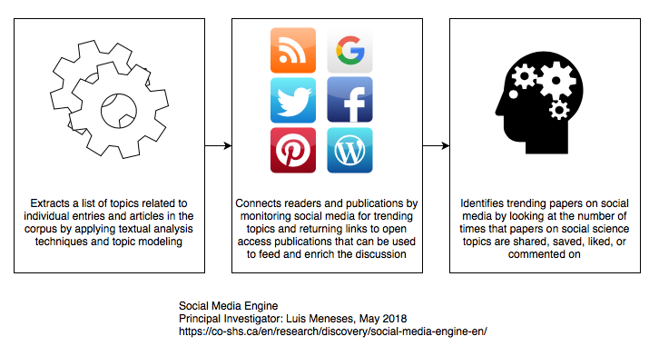
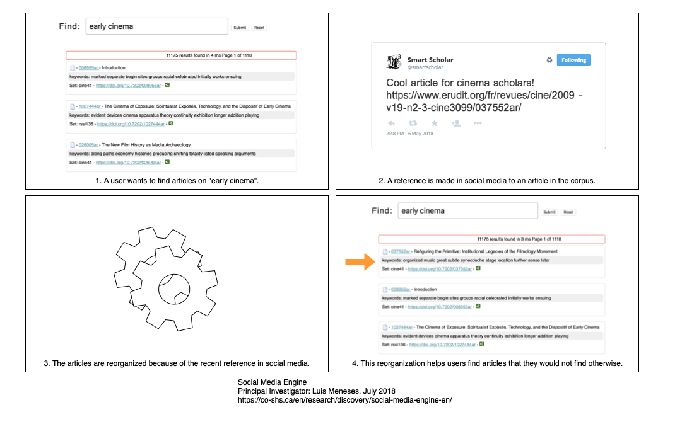
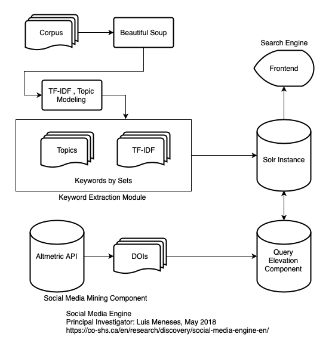

## Introduction

Social media facilitates the creation and sharing of information, ideas, career interests, and other forms of expression via virtual communities and networks (Kietzmann et al. 2011). As such, social media is used and relied on by nearly everyone. Taking into account the relevance of open infrastructures and the accessibility of open access (OA)—through which research outputs are distributed online, free of cost or other access barriers (Swan and Unesco 2012)—I have developed a framework that aims to build on the ideas behind Bush’s Memex (Bush 1945). Bush, who directed the U.S. Office of Scientific Research and Development during World War II, envisioned the Memex as a device for individuals that could store all of their books, records, and communications so that they may be consulted with exceeding speed and flexibility. Similarly, the framework I developed emphasizes the connections between documents, while extending the functionality of an open access repository and implementing processes to incorporate the ongoing trends in social media into the context of a digital collection.

I refer to these processes collectively as the Social Media Engine (Meneses et al. 2019). This engine and its underlying framework—which relies on interactive computer-mediated technologies and the increased impact, readership, and alt-metrics present in open access repositories—aims to foster public engagement, open social scholarship, and social knowledge creation by matching readers with publications.

The Social Media Engine relies on methods that analyze a document collection to identify the important metadata in its documents. This methodology was realized in software that has been released under an open license—allowing its reuse in other scenarios. In this paper I will focus on a discussion that explores the possibilities of integrating a search engine that ranks its results according to trends in social media with large-scale open access repositories—such as the upcoming Canadian Humanities and Social Sciences Commons. Ultimately, my research aims to build on Bush’s vision and create tools to emphasize the connections between documents that can be treated as objects of study as well.

## Background

Peter Burke argues in *A Social History of Knowledge* that knowledge creation and dissemination has always been a social endeavour (Burke 2000). However, broad public participation in social media is widespread and increasingly prevalent, but the humanities and social sciences have yet to engage with these practices in a deep and sustained manner. Thus, many of the offline discussions about scholarly materials that conventionally take place in conference venues have moved online and occur on social media platforms.

This move to online social platforms has become even more prevalent because of the recent restrictions on interactions and travel due to the COVID-19 pandemic. Most in-person conferences have moved online in 2020, which favours the inclusion of social media components and interactions at their core. Two specific examples of this move include: the New Technologies and Renaissance Studies representative for Digital Humanities (NTRS-DH) at the Renaissance Society of America (RSA) conference (University of Newcastle 2020), and the partnered events of the Digital Humanities Summer Institute in 2020—which were both moved online. Both events featured online discussions that took place in social media platforms—leaving a trail of scholarly interactions that should be analyzed and taken into account due to their links and mentions of current research artifacts (Electronic Textual Cultures Lab 2020). This is a scenario that the Social Media Engine was designed for, as it can highlight documents and trends in real time that are relevant to interactions in social media.

The fundamental concepts behind the Social Media Engine can be explained using three points, which are illustrated in Figure 1. First, the framework yields a list of topics related to individual entries and articles in a document corpus by applying textual analysis techniques and topic modelling. Second, the engine connects readers and publications by monitoring social media for trending topics and returning links to OA publications that can be used to feed and enrich the discussion. And third, the engine identifies trending papers on social media by looking at the number of times that papers on social science topics are shared, saved, liked, or commented on. Figure 2 shows a user scenario that outlines the processes and workflow of the Social Media Engine. In this scenario, search results are reorganized according to their references in social media.

To achieve these three points, the framework employs three main components, which are illustrated in figure 3: first, a keyword extraction module; second, a social media mining component; and third, a search engine. These components and their corresponding interactions are illustrated in Figure 3. I will not go into great detail to explain the inner workings of each component since that is not the focus of this paper. The components of the Social Media Engine are mentioned as they provide context for the later sections of this paper.

## The keyword extraction module

The keyword extraction module is based on Apache Spark (Apache Software Foundation 2017), its implementation of Latent Dirichlet Allocation (LDA) clustering (Blei, Ng, and Jordan 2003), and term frequency–inverse document frequency (Tf-Idf) statistics. LDA is the simplest form of topic modeling: a concept that is often used to represent a set of algorithms that are used to describe a large number of documents that often share a common theme. On the other hand, Tf-Idf is a numerical statistic that is intended to reflect how important a word is to a document corpus. In this sense, a Tf–Idf value increases proportionally to the number of times a word appears in the document and is offset by the number of documents in the corpus that contain the word, which helps to adjust for the fact that some words appear more frequently in general.

## The Social Media Mining Component

The social media mining component uses altmetrics to extract relevant references from social media. Altmetrics are web-based statistical methods proposed as an alternative or to complement more traditional citation impact metrics. Specifically, altmetrics take into account that social media platforms such as scholarly blogs, Twitter, and Facebook are now being used to communicate and discuss research (Chavda and Patel 2016). It is often the case that new articles are not yet referenced in traditional printed journals are widely mentioned in social media. This transition makes quantifying impact difficult as the links between discussions and resources are not standardized yet and are problematic to maintain over time. In the context of the Social Media Engine, the social media component measures and quantifies the influence of scholarly interactions that take place outside the boundaries of a digital collection—using altmetrics as a research filter and for re-ranking articles in the scope of an academic search engine.

## The Search Engine Component

A search engine is an information retrieval system designed to find information on a computer system. More specifically, search engines provide a mechanism that allows users to find and retrieve documents from a collection or repository. Considering that a user’s information needs change during the iterative process of formulating and carrying out queries, accessible and intuitive workflows are needed to allow users access to information timely and adequately. In this sense, the Social Media Engine as a framework affords a multidisciplinary crossover of information through search query results and academic social interaction with scholars from other fields.

This crossover can facilitate users finding publications that they would not be likely to consider otherwise. The framework is designed to highlight trends that are ongoing on social media in the resulting search patterns in research papers using text mining techniques, which might bring details about related articles by other scholars—for example, overlap between social sciences and the humanities, among other fields. Furthermore, the framework is expected to include the functionality of reinserting relevant articles into the discussion, which brings the multidisciplinary interaction full circle.

## Discussion

First, I argue that integrating social media into the workflow of an open access repository is timely and necessary especially when considering that social media has shaped new models of interaction and knowledge distribution. Rowlands et al. show how social media has found applications within the research life cycle at different stages, from identifying possible research opportunities to disseminating findings (Nicholas and Rowlands 2011). According to this study, the most popular uses for social media tools in an academic setting were to satisfy interactions—perfectly fitting the purposes of the framework.

Second, I acknowledge that social media and online conversations have allowed the users of OA repositories to access documents they would otherwise have difficulty finding. To illustrate this scenario, Wang et al. compared the differences in the impact between OA and non-OA articles (Wang et al. 2015). This study finds that authors who publish OA have a citation advantage, especially when considering how social media helps increase the number of views of OA articles. Wang et al. also found that OA articles held an advantage not only in total downloads, but also in long-term, sustained downloads, compared to their non-OA counterparts. My work aims to expand on this increased accessibility within the context of the humanities.

Third, the Social Media Engine can be perceived as a collaborative academic search engine. Similarly, Chen et al. have introduced CollabSeer, a search engine for discovering potential collaborators for a given author or researcher (Chen et al. 2011). Their results show that CollabSeer can effectively suggest prospective collaborators by performing an analysis of the network structure. Indeed, the merging of social media interaction with a search engine on an OA corpus lets users add documents back into ongoing discussions. This becomes especially important since it has been proven that social activity can improve the performance of a recommendation system (Konstas, Stathopoulos, and Jose 2009). However, the representation of items and semantics has to be taken into account (Lops, Gemmis, and Semeraro 2011). The Social Media Engine is a collaborative framework, but in a different sense.

Fourth, the framework affords a multidisciplinary crossover through search query results and academic social interaction with scholars from other fields. Taking into account that a user’s research interest can remain unchanged for some time depending on the scope of a given study, this crossover can help users find publications that they would not normally consider otherwise. The framework is designed to highlight ongoing social media trends in the resulting search patterns in research papers, which might bring details about related articles by other scholars—for example, overlaps between social sciences and the humanities, among other fields. Furthermore, the Social Media Engine facilitates the reinsertion of relevant articles into the discussion, which brings the multidisciplinary interaction to a full circle.

Fifth, the framework can lead to improvements in the delivery of direct and indirect scholarly communications. A study by Letierce et al. (Letierce et al. 2010) showed that Twitter conference streams provided the context to identify trending topics by combining the number of tweets posted with the conference hashtags and URLs, along with other hashtags and retweets. This study also focused on understanding the tagging habits of academics on Twitter, revealing that tagging content leads mainly to messages and collaboration between peer researchers. This last point directly affects the interaction of users of the framework, as it directly influences how search results are ranked and displayed, increasing the visibility of academic articles and motivating researchers to distribute their work via OA repositories (Lovett et al. 2017). Additionally, the framework has the potential to promote content diversification and improve the classification methods in a corpus to allow curators to get a better sense of their collection.

Finally, I considered using a different strategy involving caching query results to improve query effectiveness (Fagni et al. 2006). I discarded this strategy, since these manipulations could complicate the use of the framework with other document collections. Along these lines, I plan to integrate the Public Knowledge Project (PKP) into the workflow of the framework in the near future. PKP presents a challenge because the document corpus is stored throughout different repositories rather than in a central location. However, integration of PKP would benefit from further study and attention, especially when taking into account the characteristics of different publishing venues (Kenner 2014).

## Future Possibilites

The points from the discussion section lead me to elaborate on the possibilities of integrating the Social Media Engine with open access platforms that store and serve different sets of documents. As a framework, the Social Media Engine has the advantage of working quite well with multi-lingual sets of documents—which was demonstrated when it was used on the Érudit corpus (Consortium 2017). Érudit.org is a digital repository of social sciences and humanities publications. The documents are diverse in their language: English or French; their content: including scholarly and cultural journals, theses, books, proceedings, and technical reports; and their discipline: including arts, engineering, education, cinema, demography, law, theology, history, sociology, women studies, among others. As a consequence of the data mining techniques at its core, the Social Media Engine was envisioned to work with document collections and platforms at a large scale.

My research group has been developing projects focused on open social scholarship for some time now. Examples of this trend in development include the framework that I have described in this paper, and the Canadian Humanities and Social Sciences (HSS) Commons. The Canadian HSS Commons is a national-scale online research platform currently under development as an Implementing New Knowledge Environments (INKE) Partnership initiative, in partnership with:

-   Canadian Social Knowledge Institute
-   CANARIE
-   Compute Canada
-   Electronic Textual Cultures Lab
-   Federation for the Humanities and Social Sciences
-   Modern Language Association
-   Canadian Research Knowledge Network
-   Digital Humanities Summer Institute
-   Edith Cowan University
-   Érudit
-   Iter: Gateway to the Renaissance
-   Public Knowledge Project
-   University of Victoria Libraries

The Canadian HSS Commons will foster a bilingual environment for Canadian HSS researchers to share, access, re-purpose, and develop scholarly projects, publications, educational resources, data, and tools—partially following the model of the Humanities Commons (Humanities Commons 2019). This platform seeks to serve the 90,000 HSS practitioners in Canada and will include:

-   a subject repository for open access publications that assigns digital object identifiers (DOIs) upon upload and follows FAIR (Findable, Accessible, Interactive, Reusable) guidelines for data management

-   a project development environment that can integrate with Google Drive, Dropbox, or GitHub

-   individual user profiles, with federated login/identity authorization, including with ORCID

-   blogging capabilities

-   subject interest groups; and

-   member interactions.

I can envision three benefits for integrating the Social Media Engine with the Canadian HSS Commons. First, it will increase the understanding of the utility of integrating different platforms for networking, research and development, and coordinating access to data. Second, this integration can foster a diverse network for creating and engaging with digital scholarship. This will increase social engagement and access to research materials, tools, and technologies for all HSS researchers, as well as for members of industry, government, and the general public. And third, through reflecting on our experiences with research platforms, we will contribute to initiatives by those who are invested in digital scholarship and have a stake in the future of long-term repositories for digital objects.

On the other hand, what are the foreseeable difficulties of this integration? One of the main problems with exploring a corpus from a user perspective is that it can be daunting. The main disadvantage of this integration is that the algorithms for the re-indexing and displaying results are complex and difficult to understand for the average user. Thus, the system can be perceived as a “black box” by many users. In this sense, how the results are presented will play a crucial role in terms of its adoption.

Extracting metadata from different document formats can be prone to errors. In this sense, the variety of the document formats that will be uploaded to the HSS Commons can present an interesting challenge when extracting their embedded metadata to facilitate the process of automatic metadata generation. While it is true that toolkits do exist to extract text and metadata from different file types (for example, Apache Tika), carrying this process automatically can be problematic causing the results to lack focus. Additionally, common errors in parsing include extracting the wrong content, no content extracted, content incorrectly detected—which could be very dependent to not identifying the file’s Mime Type correctly.

I must also point out that some documents won’t contain any metadata that is useful for indexing purposes. For example, image formats contain EXIF data that does not provide any semantic context for the images. These are cases where the automatic metadata generation can be problematic. This gets even more complicated when considering the incompatibilities over different document types that belong to same format (for example HTML and TEI files belonging to SGML). In this last case, an automatic parser would ignore the semantic annotations that are possible in TEI.

Finally, keyword extraction can be intensive, time consuming, and prone to errors with a large corpus. In my experience, extracting topic models on a corpus of approximately 200K documents can take over a day—although simpler methods for keyword extraction are known to be less resource and time intensive. Given the document corpus will change on a daily basis (documents will be uploaded, edited, and deleted) it is clear that this process will have to be done periodically.

## Conclusions

In this paper I have focused on outlining a discussion on the possibilities of integrating a framework that identifies trends in social media with large-scale open access repositories—using the components of the Social Media Engine to ground my arguments. In this sense, this discussion is a showcase of the impact that digital technologies can have in terms of accessibility and the creation of tools that facilitate new modes of scholarly communication (Alperin 2019). This adaptability aims to capitalize on the potential of social media, the relevance of open infrastructures, and the accessibility of open knowledge to build on Bush’s vision by creating tools to emphasize the connections between documents that can be treated as objects of study as well. Ultimately, my work takes advantage of the affordances and increased accessibility that open access provides in order to capitalize on the existing relationship between researchers and society at large.

## Bibliography

Alperin, Juan Pablo. 2019. “Leveraging Open Altmetrics Data for Greater Engagement with Research.” presented at the INKE Victoria 2019, Victoria, BC, Canada, January 16. 

Apache Software Foundation. 2017. “Apache Spark: Lightning-Fast Cluster Computing.” [http://spark.apache.org](http://spark.apache.org).

Blei, David M, Andrew Y Ng, and Michael I Jordan. 2003. “Latent Dirichlet Allocation.” *The Journal of Machine Learning Research* 3: 993–1022.

Burke, Peter. 2000. *A Social History of Knowledge: From Gutenberg to Diderot, Based on the First Series of Vonhoff Lectures Given at the University of Groningen (Netherlands)*. Cambridge, UK : Malden, Mass: Polity Press; Blackwell Publishers.

Bush, Vannevar. 1945. “As We May Think.” *The Atlantic Monthly*, no. 176 (July): 641–49.

Chavda, Janica, and Anika Patel. 2016. “Measuring Research Impact: Bibliometrics, Social Media, Altmetrics, and the *Bjgp*.” *British Journal of General Practice* 66 (642): e59–e61. [https://doi.org/10.3399/bjgp16X683353](https://doi.org/10.3399/bjgp16X683353)

Chen, Hung-Hsuan, Liang Gou, Xiaolong Zhang, and Clyde Lee Giles. 2011. “CollabSeer: A Search Engine for Collaboration Discovery.” In *Proceedings of the 11th Annual International ACM/IEEE Joint Conference on Digital Libraries*, 231–40. JCDL ’11. New York, NY, USA: ACM. [https://doi.org/10.1145/1998076.1998121](https://doi.org/10.1145/1998076.1998121)

Érudit. 2017. “Erudit.org.”  [http://www.erudit.org/en/](http://www.erudit.org/en/)

Electronic Textual Cultures Lab. 2020. “Collection / Twitter: NTRS-Dh@RSA, April 2020.” [https://www.twitter.com/ETCLatUVic/timelines/1246146723178639360](https://www.twitter.com/ETCLatUVic/timelines/1246146723178639360)

Fagni, Tiziano, Raffaele Perego, Fabrizio Silvestri, and Salvatore Orlando. 2006. “Boosting the Performance of Web Search Engines: Caching and Prefetching Query Results by Exploiting Historical Usage Data.” *ACM Trans. Inf. Syst.* 24 (1): 51–78. [https://doi.org/10.1145/1125857.1125859](https://doi.org/10.1145/1125857.1125859)

Humanities Commons. 2019. “Open Access, Open Source, Open to All.” [ https://hcommons.org/](https://hcommons.org/)

Kenner, Ali. 2014. “Designing Digital Infrastructure: Four Considerations for Scholarly Publishing Projects.” *Cultural Anthropology* 29 (2): 264–87. [https://doi.org/10.14506/ca29.2.05](https://doi.org/10.14506/ca29.2.05)

Kietzmann, Jan H., Kristopher Hermkens, Ian P. McCarthy, and Bruno S. Silvestre. 2011. “Social Media? Get Serious! Understanding the Functional Building Blocks of Social Media.” *Business Horizons* 54 (3): 241–51. [https://doi.org/10.1016/j.bushor.2011.01.005](https://doi.org/10.1016/j.bushor.2011.01.005)

Konstas, Ioannis, Vassilios Stathopoulos, and Joemon M. Jose. 2009. “On Social Networks and Collaborative Recommendation.” In *Proceedings of the 32Nd International ACM SIGIR Conference on Research and Development in Information Retrieval*, 195–202. SIGIR ’09. New York, NY, USA: ACM. [https://doi.org/10.1145/1571941.1571977](https://doi.org/10.1145/1571941.1571977)

Letierce, Julie, Alexandre Passant, John Breslin, and Stefan Decker. 2010. “Understanding How Twitter Is Used to Widely Spread Scientific Messages.” In *Proceedings of WebSci10: Extending the Frontiers of Society on-Line*.

Lops, Pasquale, Marco de Gemmis, and Giovanni Semeraro. 2011. “Content-Based Recommender Systems: State of the Art and Trends.” In *Recommender Systems Handbook*, 73–105. Springer, Boston, MA. [https://doi.org/10.1007/978-0-387-85820-3_3](https://doi.org/10.1007/978-0-387-85820-3_3)

Lovett, Julia, Andrée Rathemacher, Divana Boukari, and Corey Lang. 2017. “Institutional Repositories and Academic Social Networks: Competition or Complement? A Study of Open Access Policy Compliance Vs. ResearchGate Participation.” *Journal of Librarianship and Scholarly Communication* 5 (1). [https://doi.org/10.7710/2162-3309.2183](https://doi.org/10.7710/2162-3309.2183)

Meneses, Luis, Alyssa Arbuckle, Hector Lopez, Belaid Moa, Richard Furuta, and Ray Siemens. 2019. “Aligning Social Media Indicators with the Documents in an Open Access Repository.” *KULA: Knowledge Creation, Dissemination, and Preservation Studies* 3 (1): 19. [https://doi.org/10.5334/kula.44](https://doi.org/10.5334/kula.44)

Nicholas, David, and Ian Rowlands. 2011. “Social Media Use in the Research Workflow.” *Information Services & Use* 31 (1): 61–83. [https://doi.org/10.3233/ISU-2011-0623](https://doi.org/10.3233/ISU-2011-0623)

Swan, Alma, and Unesco. 2012. *Policy Guidelines for the Development and Promotion of Open Access*. Paris: United Nations Educational, Scientific,; Cultural Organization.

University of Newcastle. 2020. “Cancelled Digital Humanities Conference Goes Online to Great Success.” [https://www.newcastle.edu.au/newsroom/faculty-of-education-and-arts/cancelled-digital-humanities-conference-goes-online-to-great-success](https://www.newcastle.edu.au/newsroom/faculty-of-education-and-arts/cancelled-digital-humanities-conference-goes-online-to-great-success)

Wang, Xianwen, Chen Liu, Wenli Mao, and Zhichao Fang. 2015. “The Open Access Advantage Considering Citation, Article Usage and Social Media Attention.” *Scientometrics* 103 (2): 555–64. [https://doi.org/10.1007/s11192-015-1547-0](https://doi.org/10.1007/s11192-015-1547-0)

