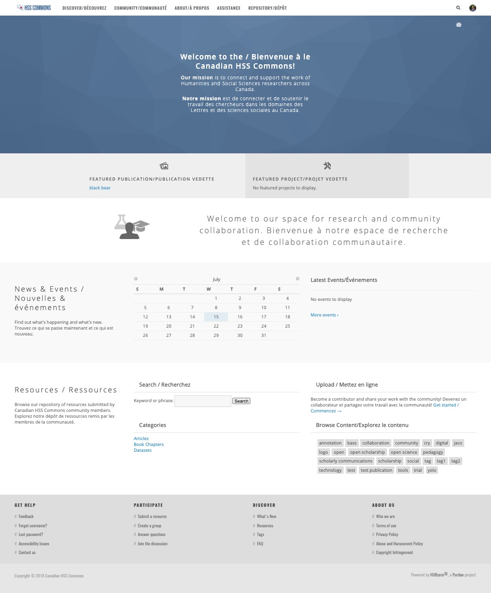
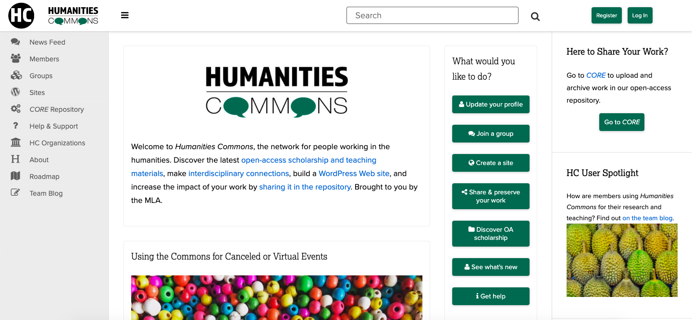
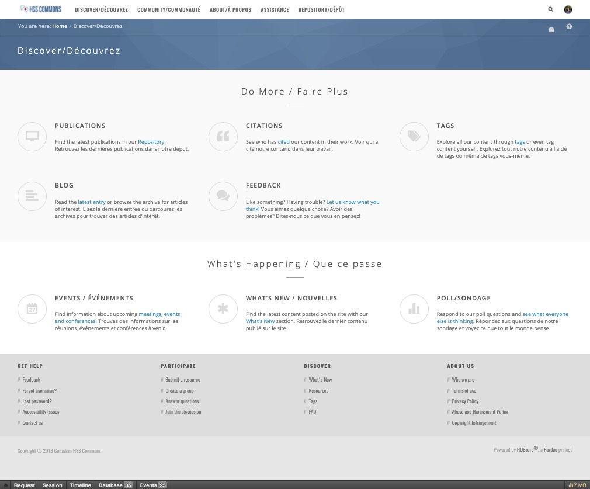
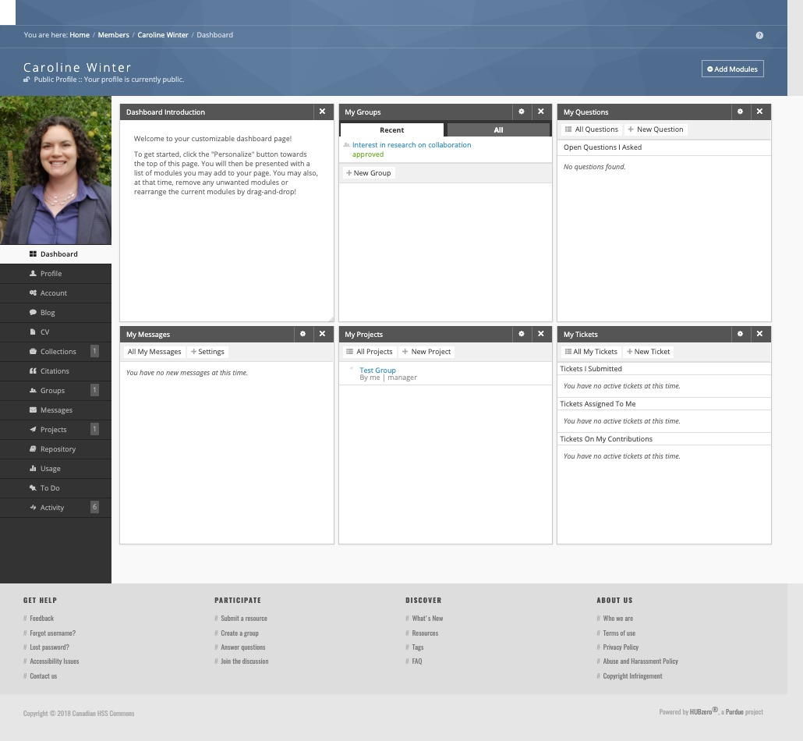

In her book *Generous Thinking*, Kathleen Fitzpatrick calls for university communities—including faculty, staff, administrators, students, and other stakeholders—to “develop more responsive, more open, more positive relationships that reach across the borders of our campuses” (2019, 3). Implicit in Fitzpatrick’s call to action is the idea that campuses are bordered or fenced off from each other and from the communities they serve and belong to. Spatial and geographical metaphors such as Fitzpatrick’s are common in discussions of scholarly communication: we *survey* the scholarly *landscape*, for instance, imagine knowledge as *fields* and *domains*, and *map* critical debates in those intellectual *spaces*. Digital spaces are—problematically—often described as frontiers or a *terra nullius* using colonial metaphors of “exploring” and “discovering” (Gaertner 2017).

One of these metaphors with close ties to geographical space is that of the research commons: a shared knowledge resource that may comprise physical, digital, theoretical, and intellectual space (see Hess and Ostrom 2006, 3). The research commons has historical roots in the medieval English tradition of designating certain lands for common use, which became enclosed for private use over time. Political philosophers and critics have since struggled with the concept of a commons: historically, in terms of land, labour, and materials, and at other times in terms of public access to knowledge. Drawing on this intellectual and material history, this paper introduces the Canadian Humanities and Social Sciences (HSS) Commons, an open online space where Canadian HSS researchers and stakeholders can gather to share information and resources, make connections, and build community. Situated at the intersection of the fields of digital scholarship, open access, digital humanities, and social knowledge creation (see El Khatib et al. 2019), the Canadian HSS Commons is being developed as part of a research program investigating how a not-for-profit, community-run research commons could benefit the HSS community in Canada. This paper is the first on this topic to date, providing a foundation for conceptualizing the commons, its potential benefits, and its role in the Canadian scholarly publishing ecosystem. By situating the Canadian HSS Commons within the intellectual history of the commons and within the Canadian research ecosystem, this paper explores how this open, community-based platform complements existing research infrastructure serving the Canadian HSS research community. First, it introduces the Canadian HSS Commons and the community it is designed to serve. Next, it discusses its historical and intellectual context, discussing the transition from “grassy commons” (Boyle 2003, 41) to digital commons. After outlining types of digital knowledge commons and how they are being enclosed, it concludes by looking to the future of the Canadian HSS Commons within the digital research landscape.

## The Canadian HSS Commons

The Canadian HSS Commons will complement existing research infrastructure in Canada by providing a bilingual, national-scale online research space in which researchers can share, access, re-purpose, and develop scholarly projects, publications, educational resources, data, and tools.

The development and implementation of the Canadian HSS Commons is a deeply collaborative project: it is an initiative of the Implementing New Knowledge Environments (INKE) Partnership, coordinated by the Canadian Social Knowledge Institute (C-SKI), which is based in the Electronic Textual Cultures Lab (ETCL). It is being developed in collaboration with CANARIE, Compute Canada, the Federation for the Humanities and Social Sciences, and the Modern Language Association (MLA). Also connected to the project through the INKE Partnership are the Canadian Research Knowledge Network (CRKN–RCDR), the Digital Humanities Summer Institute (DHSI), Edith Cowan University, Érudit, Iter: Gateway to the Renaissance, the Public Knowledge Project (PKP), and the University of Victoria (UVic) Libraries.

The HSS Commons’ primary user base will include those who are social media-active in the 90,000+ social sciences and humanities researcher community served by the Federation (Federation for the Humanities and Social Sciences 2017). In supporting researchers across these two disciplines, the Canadian HSS Commons reflects Canada’s existing institutional structures, including that of the Federation and of the Tri-Agency through the Social Sciences and Humanities Research Council (SSHRC), and facilitates cross-disciplinary collaboration and communication. In order to engage effectively with the community served by the Federation, the Commons will engage its members as users, and the development team will collaborate with the Federation to offer training sessions on using the Commons at the Congress of the Humanities and Social Sciences, the largest interdisciplinary meeting of scholars in Canada (Federation for the Humanities and Social Sciences 2014). Just as Congress brings the Canadian research community together annually in a shared physical space, the Canadian HSS Commons offers a virtual space that facilitates connection and collaboration across the country and throughout the year.

## Intellectual Roots: From the Grassy Commons to the Digital Commons

The idea of the digital research commons has analogic historical roots in the English medieval practice of designating land—usually privately owned land—as available for common use. These commons were openly accessible to local residents—commoners—who depended on these lands and the resources they provided for farming and grazing livestock, as well as for transportation and for community (Boyle 2003; Rosenman 2012). Beginning around 1750, these common lands began to be enclosed—fenced off—so that they and their resources were accessible to private landowners only, and by the 1840s, there were few commons left (Neeson 1996; Rosenman 2012). While historians disagree about the extent to which enclosure affected the economy overall, it undoubtedly consolidated wealth in the hands of landowners, advancing the complex forces of urbanization and industrial capitalism (Rosenman 2012). Moreover, enclosure altered a way of life that had persisted for centuries: families who had been stewards of the commons for generations were reduced to tenant farmers, whose labour enriched private landowners. Enclosure thus changed the relationship between people and their labour, the land, and the nation (Rosenman 2012). Enclosure was vehemently opposed, not only by the commoners who were directly affected by the fencing of the land, but also by those who viewed it as a violation of natural rights and an alarming instance of what we now call privatization.

Eighteenth-century agricultural history seems far removed from discussions of twenty-first century scholarly communication practices, but it provides a useful context for thinking through the affordances and challenges of the shared virtual spaces made possible by digital technologies. Although the commons is a useful analogy, as Charlotte Hess and Elinor Ostrom point out, early frameworks for studying commons were rooted in economics and based on two principles: exclusion, the ability to exclude some people from the commons, and subtractability, the principle that one person’s use of a commons resource reduces the amount available for other users (2006). These two principles create conditions of scarcity, leading to challenges such as users competing for access, taking more than their share of the resource, and free riding: using the resource without contributing to it (Hess and Ostrom 2006). Well-known models for these types of commons include the Tragedy of the Commons, which uses the metaphor of over-grazing to explain how self-interested behaviour can cause a commons to collapse, and the Prisoner’s Dilemma, which imagines resource use as a zero-sum game, both of which model problems of scarcity (Hess and Ostrom 2006). For the past few decades, though, frameworks for studying commons have acknowledged that, since knowledge is a different type of resource, one that grows additively and cumulatively, such scarcity-based models do not necessarily apply (Boyle 2003; Hess and Ostrom 2006).

The primary challenge facing knowledge commons in this digital age is not scarcity, but exclusion. As Hess and Ostrom note, scholarly interest in the notion of “the commons” accelerated in the mid-1990s when internet users began thinking of the new, virtual spaces they were encountering as part of a digital commons (2006). The internet itself is a knowledge commons on a global scale but, unlike many physical or resource-based commons, is distributed rather than centralized, since neither its infrastructure nor its users are rooted in a particular geographic space. Although the digital commons of the “world wide web” had—and still has—the potential to be a universal knowledge commons, openly accessible to all people, this ideal faces barriers related to technology and infrastructure: not everyone has access to a computer and the internet. It also faces barriers related to exclusion that control access to knowledge, including legal fences such as intellectual and copyright regulations and digital fences such as paywalls. James Boyle, one of the co-founders of Creative Commons, has argued that we are in the midst of “a second enclosure movement” in which what is at stake is “the intangible commons of the mind” (2003, 37). Boyle refers to the intellectual and imaginative space of the public domain, “the commons of facts and ideas” (2003, 39). Just as eighteenth-century private landowners fenced off land in order to control its resources, he argues, the public domain is being fenced off by increasingly restrictive intellectual property and copyright law. Whereas those laws are intended to grant creators control over creative expressions, Boyle argues that we are seeing the laws creep ever closer to privatizing not just the expression of a fact or idea, but the underlying facts and ideas themselves (2003). Boyle links this challenge of ever-encroaching intellectual property rights to rapid shifts in information technology, noting that whereas it used to be difficult to reproduce and share copyrighted material, now, “\[i\]n a networked society, copying is not only easy, it is a *sine qua non* of transmission, storage, caching, and, some would claim, even reading” (2003, 40). Although Boyle’s concerns focus on the realm of intellectual property, he notes that scholars have cause to be alarmed at the encroachment of property rights “into the data layer” (2003, 50). In this way, Boyle’s concerns align closely with those of open scholarship advocates, who often view scholarship as a common resource and a public good, and resist the privatization of knowledge. Although the goal of the open scholarship movement is, as SPARC puts it, “making Open the default for research and education” (SPARC n.d.), making knowledge open in a responsible way includes considering what information is *not* a common resource, such as an individual’s private information or cultural histories and stories.

## The Evolving Landscape of the Knowledge Commons: Social and Institutional Contexts

As a platform for collecting, sharing, and creating HSS scholarship, the Canadian HSS Commons is an example of the type of knowledge commons that Hess and Ostrom discuss. As they note, the scale of the digital knowledge commons made possible by the world wide web changed how many users thought about knowledge, prompting us to understand it as a shared resource, and the world wide web as a digital commons space (Hess and Ostrom 2006). As Peter Burke argues, however, knowledge creation and dissemination has always been a social endeavour (2000; 2012). Over time, the landscape of the knowledge commons has transformed in response to technological innovations, cultural shifts, and intellectual movements. The emergence of printing technologies supported the spread of humanistic knowledge by making books, flyers, broadsheets, and other printed material less expensive and thus available to a much wider public than ever before. Before print, though, knowledge commons thrived in the form of oral storytelling, scribal transmission, and epistolary networks. Considering the social nature of these forms of knowledge commons helps make the social nature of the modern research commons more visible.

Although the printing press enabled knowledge to be circulated and shared widely in printed form, knowledge creation and dissemination was a collaborative and social endeavour long before the age of print (El Khatib et al. 2019). In the 6th and 7th centuries, for example, monastic communities such as the monastery at Lindisfarne produced religious texts that communicated knowledge through innovative illuminations as well as through scribally copied text (Drucker n.d.). As cultural exchange increased over the centuries, scribal manuscripts gained importance as vehicles for secular as well as sacred knowledge, and engaged wider communities, including the emerging institution of the university (Drucker n.d.). The “textual community” of a given Early Middle English text, Elizabeth Bryan argues, included not only its authors but also its “scribes, patrons, and various kinds of users, even users who cannot read the book but can only hold it” (1999, 3). Such texts, she argues, “create, and are created by, *communities* of readers” (Bryan 1999, 4). Focusing on the “relation between print and knowledge,” and pushing back against Elizabeth Eisenstein’s influential schema of print culture v. scribal culture (1980), Adrian Johns notes that community remained an essential factor in the generation and circulation of knowledge into the print culture of early modern England, since epistemological authority rested not in the fact of knowledge being communicated in printed form, but in the credibility of people who wrote, printed, and sold them (Johns 1998, 6). For these reasons, knowledge generation and dissemination within early modern print culture was an inherently social endeavour, and places like universities, courts, museums, booksellers’ shops, and coffeehouses were sites of social knowledge creation and circulation, “distinct social spaces generating different practices fertile of new knowledge” (Johns 1998, 41). Although the openness of these spaces varied—a court is not a commons in the same way a coffeehouse is—these local spaces were essential for creating and sharing knowledge that met the needs of that knowledge community (Johns 1998). Whether in a scribal monastic community or a nation united in imagination through the affordances of industrial print, as described by Benedict Anderson (2006), knowledge has been created and shared communally and socially for many centuries.

Knowledge is not only a social creation, Burke argues, but also one that is closely tied to its “institutional context” (2000, 32). Burke traces the history of Western institutions of knowledge as a cycle of social and intellectual groups—often, but not always formed in opposition to the conservatism of universities—being integrated and absorbed into those institutions. Some forms of institutions of knowledge include the Renaissance academies—social groups of humanists that sought to revive the classical forms of knowledge creation—as well as the numerous intellectual movements that emerged during the seventeenth-century scientific revolution, as classical and medieval traditions were pushed aside in favour of empirical ways of knowing (Burke 2000). In eighteenth-century Europe, the international intellectual community known as the Republic of Letters circulated knowledge through personal correspondence. As Paul Sivitz notes, the epistolary exchanges among “practitioners of science” comprised a networked dialogue of “‘open’ letters” intended to be shared among the scientific community and the wider community as well (2017, 130). This epistolary knowledge commons emerged from a community intent on advancing knowledge collaboratively for the benefit of all and, Sivitz argues, revolutionized scholarly communication through the development of what he calls the “scientific public sphere,” a knowledge community founded on this network of letters as well as in-person interactions (2017, 132). Burke refers to the “geography” of the Republic of Letters (2000, 57), and indeed, the word “republic” suggests a geographical and political space as well as a form of sociopolitical organization. In this sense, we can understand the Republic of Letters as an intellectual commons generated through its community’s social exchanges of knowledge. The eighteenth century Enlightenment, Burke notes, witnessed the emergence of “research” as an intellectual pursuit distinct from curiosity and the founding of numerous formal and informal knowledge organizations, from the Royal Society to academies to salons and coffeehouse communities, in addition to reading communities founded on the periodical press, all of which contributed to the formation of the Republic of Letters (2012). Although the relationship between universities and other knowledge groups cannot be reduced to a simple conflict between conservative institutions and innovative outsiders, Burke does identify a pattern in which radical intellectual groups become accepted and institutionalized over a few generations, which he calls “cycles of creativity and routinization” (2000, 49). As Burke puts it, the social history of knowledge is “a history of the interaction between outsiders and establishments, between amateurs and professionals, intellectual entrepreneurs and intellectual rentiers” (2000, 51). Burke’s notion of an “intellectual rentier” analogous with the landed gentry brings us back to the idea of a commons and the enclosure of knowledge. It must be remembered, too, that although these intellectual groups Burke describes are outsiders in relation to universities, membership was limited. The Republic of Letters was international, but women, the poor, and racial minorities were largely excluded from this community of knowledge. Burke’s history of knowledge is important for discussion of the current scholarly landscape since, as Hess and Ostrom point out, commons are not simply resources—they are resources shared by groups of people, and are therefore inherently social (2006). It is therefore vital to recognize the closely entwined histories of institutions and public communities of knowledge, and how they affected and influenced each other.

The commons model has been adapted for academic purposes in various ways over the past few decades in response to changes in the scholarly landscape, particularly the digital turn in research and teaching. Information commons emerged in the 1990s: physical spaces within institutional libraries that provide undergraduate students with access to technology, workspace, and librarians’ expertise (Dowson 2016). Out of these emerged learning commons, similar spaces focused on supporting undergraduates as they develop essential academic skills (Dowson 2016). Rebecca Dowson presents the Research Commons at Simon Fraser University as an example of another type of commons, there called Scholars’ Commons: a shared, collaborative, open physical space with technological and human resources designed primarily to meet the research and professionalization needs of graduate researchers, but serving faculty as well (2016). Dowson points out that, although Research Commons are not necessarily sites of digital scholarship, “the two concepts share a number of core values, including an ethos of openness, interdisciplinarity, collaboration, and focus on knowledge creation and new modes of production” (2016, 3). Digital Scholarship Commons (DSCs), sometimes called digital scholarship labs or centres, are another adaptation of the commons model explicitly focused on supporting digital scholarship and scholarly communication. DSCs take different forms at different institutions, but, generally speaking, are hubs for digital scholarship that facilitate and provide space for collaboration, access to tools and resources, and services for researchers. Most DSCs are located in institutional libraries, and are distinguished from research labs, makerspaces, and other similar sites in that they are open to the entire institutional community (Goldenberg-Hart 2016; Lewis et al. 2015). As Verletta Kern and Madeline Mundt discuss in their paper in this volume, these digital commons spaces help bridge the university and the broader community by supporting and facilitating open scholarship and open education (Kern and Mundt 2020).

The commons described above are physical spaces, but digital commons have become an important part of the scholarly landscape as well, particularly for open social scholarship. Digital knowledge commons—online spaces for sharing and accessing information—have become important resources for scholars and the broader community alike. One example is Wikipedia,[^1] an online space for sharing knowledge developed and maintained by a community of editors. Wikimedia Commons,[^2] also an initiative of the Wikimedia Foundation, is an online space for sharing media resources. Although the scholarly community was at first skeptical about the reliability of these community-created knowledge commons, Wikipedia is increasingly being embraced as part of the “knowledge ecosystem” and as a platform for open, social knowledge creation and dissemination (Vandendorpe 2015, 1). The Internet Archive[^3] is a different type of digital knowledge commons: an open, digital library holding a variety of media, including websites. Creative Commons[^4] is an example of a digital commons that is distributed rather than centralized: the resources of the commons are not found at a specific web address but are rather distributed across other online spaces. Drawing on the tradition of the grassy commons and the variations of the academic commons and digital knowledge commons described above, digital research commons reimagine the commons as an online social space where researchers can share their work and collaborate towards knowledge production. In this way, as John Willinsky suggests, the new digital research commons is a contemporary reimagining of the ideal of the universal library, embodied in the Library of Alexandria, the library at the Sankore Mosque, British Enlightenment-era legal deposit libraries and national libraries, and the public libraries that began to emerge in Europe and North America in the early nineteenth century (2006; Besser 2004; Harris 1999; Hamlyn 1946).

Peter Suber describes another form of knowledge commons closely related to the digital research commons: the open access (OA) commons, comprising the body of scholarly research that is available openly online. Like the other critics discussed here, Suber distinguishes the OA commons and knowledge commons more generally from resource-based commons and the models traditionally used to study them, emphasizing that the particularities of the scholarly journal publishing system—in which research content is royalty-free and effectively donated to publishers—involves different advantages and challenges. Suber emphasizes the challenge of stalemates, in which multiple stakeholders want to see OA enacted, but none wants to take the first step (2006). He offers several solutions to this problem, noting that “One solution to any tragic stalemate is an external force nudging all the stalled and stymied actors into action at the same time” (Suber 2006, 187), such as funding agencies or national policies. Other solutions involve making OA easy for authors, including by providing help from librarians, minimizing disincentives and maximizing incentives (Suber 2006). The Canadian HSS Commons works to alleviate some of these challenges by making OA easier, including providing built-in or integrated CC licencing as well as a community of support and practice.

## Challenges, Enclosing the Digital Research Commons

Although, historically, the grassy commons has been largely unsuccessful in remaining common, the affordances of the digital promise a different outcome for digital research commons. In the 1990s, an idealized vision of cyberspace as a digital commons that would enable universal access emerged, driven by the “rallying cry” that “\[i\]nformation wants to be free” (Borgman 2007, 4). As Christine Borgman and others have noted, though, the same digital technologies that make open dissemination of information possible also have the ability to limit access to it (2007; Hess and Ostrom 2006; Kranich 2006). This ideal of the internet as a knowledge commons remains in tension with another vision of cyberspace as an untapped resource. In a discussion of Indigenous literature and digital humanities, and drawing on studies that approach new media from Indigenous perspectives, David Gaertner notes that “Since its inception, authors, scholars, and engineers have mobilized metaphors of colonialization and terra nullius to conceptualize cyberspace” (2017). Gaertner points to examples of book titles that use metaphors like “homesteading” and “nautical iconography” suggestive of exploration and discovery that reinforce the role of colonial and imperialist values in “founding metaphors” on which the idea of digital space is constructed (2017). Indeed, in the last few decades cyberspace has been colonized by commercial interests that, particularly since the emergence of user-created content and Web 2.0 technologies, have discovered a new and valuable resource in the form of digital data. This understanding of cyberspace as land to be colonized—a field to be fenced and resources to be taken—is foundational in the widespread debate within the scholarly community about the role of commercial research commons versus non-profit ones.

Currently, the two most widely used digital research commons are commercial platforms that attract a broad, interdisciplinary community: Academia and ResearchGate.[^5] Although Academia and ResearchGate enable users to share their work, they are primarily social networking platforms, similar to Twitter and Facebook in their features and business models. As the reach of these sites has grown, numerous members of the scholarly community have spoken out against them, perhaps most notably in a collection edited by Janneka Adema and Gary Hall entitled *Really, We’re Helping to Build This … Business: The Academia.edu Files* (2016). The primary issue relates to business models. By their nature, commercial models exist for the purpose of making a profit: the sharing of knowledge is secondary to gathering (and potentially selling) user data, selling paid services, and other profit-generating activities. Institutional repositories and nonprofit subject repositories, on the other hand, exist for the purpose of sharing and preserving knowledge, and through their institutional or community affiliation are engaged in a public service mission rather than a profit-seeking one (Fortney and Gonder 2015). Academia in particular raises concerns about how the platform monetizes scholarly impact. In 2016, a feature inviting users to submit materials to an editorial board for (paid) endorsement prompted calls for scholars to delete their accounts (Ruff 2016). The introduction later that year of Academia Premium, a fee-based service that provides users with analytics about their uploaded work, provoked Sarah Bond to publish an article in *Forbes* titled “Dear Scholars, Delete Your Account at Academia.edu” (2017). Bond refers to an earlier argument by Fitzpatrick that Academia’s .edu domain is potentially misleading—it was registered before the 2001 legislation that limited .edu addresses to educational institutions, and so seems to be institutionally affiliated but is not (2017; Fitzpatrick 2015). Moreover, this assumption leads some users to believe that these sites are equivalent to or, at least, a suitable substitute for open access institutional repositories or non-profit subject repositories (Adema and Hall 2016; Fortney and Gonder 2015). Katie Fortney and Justin Gonder note that these platforms do not offer the stability, long-term preservation, interoperability, or archiving features of institutionally affiliated repositories, and are liable to disappear—along with all the research shared on them—if they are not profitable (2015). Many publishers have policies related to self-archiving, many accessible through the aggregator site SHERPA/RoMEO.[^6] Commercial platforms are primarily networking sites, though, and tend not to pay adequate attention to copyright considerations; they facilitate—and even encourage—authors to post their already published work, potentially causing them to break intellectual property agreements with the articles’ original publishers (Tennant 2017). Adema and Hall note that, in addition, these platforms’ user terms of use leave users liable for copyright infringement and limit the ability to reuse this shared data (2016). Jon Tennant argues that this “dark sharing” benefits the sites by generating traffic and user data, but the sites deflect culpability for copyright violations—and any legal action that results—to users, citing 2,800 takedown notices that Elsevier issued to authors who had illegally posted their articles on Academia.edu (2017). Critics concur that, while commercial sites appear to promote open access, in reality they destabilize it by undermining intellectual property, profiting from users’ work, and monetizing citation and other scholarly communication practices without providing a stable or reliable archive of the shared research (Adema and Hall 2016; Fitzpatrick 2015; Tennant 2017). Community-led sites such as institutional and subject repositories, Humanities Commons, and the Canadian HSS Commons provide alternative platforms that encourage researchers to share their work while attending to legal and ethical issues.

In spite of the limitations and criticisms of commercial research commons, the sites remain massively popular. As of mid 2020, Academia boasted over 131 million users and ResearchGate over 17 million (Academia 2020; ResearchGate 2020). The sheer number of users on these sites indicates that openness and collaboration are important to the scholarly community. Indeed, in reference to Bond’s article, Tennant argues that Academia and ResearchGate are logical extensions of the existing commercial scholarly publishing system; they are simply continuing the decades-long practices of commercial publishers, except that they are also providing users with valuable statistics and networking opportunities (2017). As Nancy Kranich argues, though, commercial platforms can co-exist with collaborative, community-led knowledge commons just as various models of scholarly publishing coexist (2006). Because commercial platforms are already embedded within the scholarly communications ecosystem, new non-commercial alternatives need to be as well, and they also need to have sustainable financial models to be attractive for institutions and users (Kranich 2006). Finally, Kranich argues, they must offer a persuasive argument, a “new narrative” for adopting the new model instead of the deeply entrenched one (2006, 109). Taken together, these perspectives emphasize the need for a non-commercial, community-driven platform guided by openness and share-alike values.

## Towards Solutions, Futures of the Digital Research Commons

The past several years have witnessed rapid developments in community-driven digital research commons. In 2013, the Modern Language Association (MLA) launched MLA Commons, a digital research commons that combines social networking features with CORE, a “library quality” repository built in collaboration with Columbia University Library (Bobley 2017). MLA Commons was initially open to members of the MLA only, but in 2016 it expanded into the Humanities Commons Network, in partnership with the Association for Jewish Studies (AJS); the Association for Slavic, Eastern European, and Euroasian Studies (ASEEES); and the College Art Association (CAA). Humanities Commons[^7] is a non-commercial, publicly funded digital research commons designed for the humanities community, but open to anyone with an interest in humanities research.

Humanities Commons (HC) has experienced steady growth over the last three years. At launch, HC had 6,000 members (migrated from MLA Commons), and as of December 2019 had just over 19,000 (Knappe 2019). In a panel talk in July 2020, Fitzpatrick—in her role as Project Director of Humanities Commons—put that number at over 22,500 (Fitzpatrick et al. 2020). In his analysis of HC members’ demographics, Eric Knappe notes that, although members come from about 6,000 institutions, nearly a third are affiliated with just 100 institutions; of these institutions, most are in the US, with a few in the UK and eight in Canada (2019). HC has also seen steady growth in its CORE repository. At launch, CORE had 500 deposits; as of the end of December 2019, it had just over 9,000 (Knappe 2019). Articles remain the most common type of item deposited (41.7%), followed by book chapters (12.2%), white papers (5.3%), conference papers (5.0%), and book reviews (4.2%) (Knappe 2019). In terms of subject interests, digital humanities is by far the most common interest, followed by religious studies, cultural studies, feminist humanities, archives, and education and pedagogy (Knappe 2019). Like the popularity of commercial research commons, the growth of HC indicates that it is responding well to the needs of the humanities research community. However, although HC is a much-needed alternative to commercial sites, the opportunity remains to build a digital research commons designed to meet the specific needs of Canadian researchers, reflecting the unique properties of the Canadian research environment and political, economic, linguistic, and cultural contexts in which we work. The Canadian HSS Commons is being developed in collaboration with the MLA to complement, rather than compete with, Humanities Commons, and serving the Federation’s community as HC served first the MLA’s community, and now the Humanities Commons Network’s community of users.

As discussed above, the Canadian HSS Commons is part of a national research infrastructure, and it is intended to complement and extend the resources available to the Canadian research community. Canadian researchers work within a specific legal framework defined by the *Canadian Copyright Act* and the *Freedom of Information and Protection of Privacy Act (FIPPA)*, among others. This legal framework is complex and the subject of ongoing debate, including debates about the appropriate applications of fair dealing provisions in the context of digital learning and scholarship (Coombe et al. 2014). The Canadian HSS Commons’ terms of service require users to comply with the *Canadian Copyright Act*, *FIPPA*, and related policies of Commons’ host institution—the University of Victoria—as well as to protect the private and confidential information as required by Canadian privacy laws.

In addition to this legal framework, the Canadian research context includes national and provincial policies related to access. Depositing research publications, data, and other materials in the Commons’ repository, for example, is one way that researchers can comply with open access guidelines associated with Tri-Agency and other funding, particularly if they do not have access to an institutional repository. Institutional repositories also provide this infrastructure, but at the moment these repositories are siloed within their institutions. We are working with our library partners to explore the possibility that the Commons could function as a portal for all institutional repositories in Canada, providing one-stop access and greater discoverability to Canadian research.

ORCID integration is another way that the Commons can connect and integrate with existing research infrastructures. ORCID is a global, non-profit organization that provides persistent digital identifiers called ORCID iDs that researchers can use to identify themselves and their work. Because ORCID iDs disambiguate researchers with similar names and are persistent across numerous platforms, they are an essential component of Canada’s digital research infrastructure. ORCID-CA, the Canadian ORCID consortium, is embedded in Canada’s research ecosystem through its 37 institutional members across the country and a working group comprising members of 16 Canadian research institutions and organizations, including the INKE partners CARL–ABRC, CRKN–RCDR, CANARIE, Compute Canada, and PKP (ORCID-CA n.d.). ORCID-CA is working towards widespread adoption of ORCID iDs among Canadian researchers, institutions, publishers, and funding agencies, including the Tri-Agency (ORCID-CA n.d.). At this prototype stage, ORCID iDs are integrated into the Canadian HSS Commons as login credentials, and more robust integration is planned for future iterations in order to strengthen the Commons’ role as a hub in the Canadian research infrastructure ecosystem.

In terms of features and functionality, the Canadian HSS Commons follows and builds upon the model of HC, but with the Canadian context in mind. Like HC, the Commons will offer blogging capabilities and social networking features such as subject interest groups and interactions between members in both French and English, all accessible through a user’s dashboard.

In addition, it will include a project development environment that can integrate with Google Drive, Dropbox, or GitHub. This integration with widely used tools enables collaboration as well as communication, and will help prevent platform fatigue by allowing users to continue using tools they are familiar with. Research about best practices for developing DSCs indicates that fostering collaboration and community are key to the success of these spaces, and that researchers value space for working together and an environment that actively fosters collaboration even over access to facilities and technology (Bergstrom 2016; Goldenberg-Hart 2016; Hurrell 2017; Lewis et al. 2015). Extrapolating these findings from physical research commons to digital ones indicates that providing means for geographically dispersed colleagues to work together remotely—using tools that they may already be using—is an important addition to existing digital research commons models.

In addition to these communication and collaboration features, and following the model of HC CORE, the Canadian HSS Commons will include an open access repository. The repository has historically played an important role in knowledge creation and dissemination. Institutional repositories—archives maintained by an institution that allow affiliated authors to deposit their work, whether published or unpublished—are crucial elements of the scholarly communication infrastructure. Repositories not only enable green open access—in which a researcher makes their work open by contributing it in a repository or other open platform—but also highlight the importance of collaboration between academic libraries and the broader research community. Fitzpatrick notes, however, that as vital as these repositories are, their institutional focus may limit discoverability (2015). She offers arXiv,[^8] an open repository for STEM research, as an example of a disciplinary repository with a broad reach. Although arXiv is invaluable as an institutionally affiliated, open repository for scientific work, it is moderated and accepts articles only, excluding other formats such as presentations, reviews, or datasets (arXiv 2019). In his discussion of the significance of repositories for the open access movement, Willinsky points to PubMedCentral (PMC),[^9] an open repository of life sciences and biomedical research founded by the US National Institutes of Health in 2000 (2006). Like arXiv, PMC takes articles only, and author submissions are only accepted when based on funded research and as required by funder policy (National Center for Biotechnology 2019). The Canadian HSS Commons repository will accept text and multimedia files, and welcomes submissions in French, English, and all other languages in which the HSS community works.

Although academic networking sites such as Academia and ResearchGate allow researchers to share other kinds of work, including pedagogical materials and datasets, they do not have the same preservation mandate and capabilities as institutional or disciplinary repositories, which benefit from institutional infrastructures and librarian expertise while encouraging openness, interoperability, and reuse of the repository’s content and metadata (Fortney and Gonder 2015). Like CORE, the Canadian HSS Commons repository will assign digital object identifiers (DOIs) to all deposits upon upload and follow FAIR (Findable, Accessible, Interactive, Reusable) guidelines for data management. All materials and resources contributed to the Commons, including the repository, must have clearly defined rights and privileges related to licensing and reuse. The recommended license for contributed material is the Creative Commons Attribution-NonCommercial-ShareAlike 3.0 Unported license (CC BY-NC-SA 3.0), which allows users to share and adapt resources as long as they give proper attribution, do not use it for commercial purposes, and apply the same license to any adaptations (Creative Commons n.d.).

Another need that the Canadian HSS Commons endeavours to meet is for infrastructure, tools, and expertise to support research data management (RDM). RDM is an emerging issue in scholarly communication, particularly in the humanities, where researchers are often not accustomed to thinking of their research as data (Booth and Posner 2020; Posner 2015; Schöch 2013). It is an emerging issue in national policy as well: in 2018 the Government of Canada released the Draft Tri-Agency Research Data Management Policy for Consultation, a policy that recognizes the importance of RDM and data stewardship to the advancement of research and of data as a significant research output (Innovation, Science and Economic Development Canada 2018). In 2019, with funding announced in the 2018 federal budget, a national organization was established—NDRIO (New Digital Research Infrastructure Organization)—to oversee digital research infrastructure in Canada, including, eventually, RDM. Through its collaboration tools and repository, the Canadian HSS Commons will support researchers in creating openly accessible research data.

The Canadian HSS Commons is built on HUBzero, an open source software platform designed to support scientific research, collaboration, data publication, community building, and resource sharing (HUBzero n.d.). Launched in 2002 to support nanoHUB, a resource for the computational nanotechnology research community, HUBzero is most often used in the sciences. HUBzero is well established and flexible in order to support diverse research communities with a variety of needs and preferences, and the Canadian HSS Commons will be the first “hub” with an explicit emphasis on the humanities and social sciences. At its core, the recommended platform for HUBzero consists of a Linux operating system with an Apache web server, a MySQL database, and PHP web scripting. In many ways, the HUBzero setup functions similarly to that of Humanities Commons, which is an iteration of CUNY’s Commons in a Box built on WordPress with a BuddyPress plugin powering its repository (Knappe 2017). In the Canadian HSS Commons, users can create and upload resources to the repository, which are organized by resource type, and user-provided descriptive metadata enables searching and browsing. Users can tag, rank, discuss, and annotate resources and share them on social media, and receive usage and citation statistics about their own contributions. Users can also share their work on blogs, wikis, and live web applications. Thanks to HUBzero’s functionalities, users can create groups for collaboration and projects for development, organize projects with calendars, and collaborate with Google Drive, Dropbox, and GitHub integration, as noted above.

## The Canadian HSS Commons: A Space for Enacting Open Scholarship

As Willinsky notes, scholarly research is well aligned with the commons model because, like the grassy commons, knowledge is a public good, something that benefits everybody and that does not lose value as it is used (2006). A lighthouse, he notes, is a well-known example of a public good because it provides light for all ships seeking anchor, and its light is not diminished by each ship it guides (Willinsky 2006). Knowledge is unique, perhaps, as a public good whose value is not merely undiminished but augmented by use: the more scholarship is read and engaged with, the more our collective knowledge grows. Although Fitzpatrick does not discuss the research commons specifically in *Generous Thinking* (2019), the commons is one way to enact some of her ideas and, crucially, to practice scholarship with a more generous mindset. Just as the grassy commons enabled travellers to visit and communicate with people in other communities, digital research commons are spaces for building bridges and creating networks among disciplines, institutions, and individual researchers. As an idea, the commons resists the logic of privatization, and is instead founded upon values of sharing and collaboration. The digital research commons is a space for enacting open scholarship: for sharing knowledge and resources, building community, and finding collaborators within and beyond the scholarly community.

So far, work on the Canadian HSS Commons indicates that a not-for-profit, open access, durable, and Canada-specific option is possible for a digital research commons. Instead of a for-profit platform that does not feed data or resources back into the scholarly ecosystem, the HSS Commons will integrate with existing research infrastructure to become an important hub in Canada’s knowledge ecosystem. By providing efficient access to research materials, the Commons facilitates knowledge transfer benefits for academics, industry, government, and members of the general public alike. The affiliation with major Canadian and international research institutions and organizations through the INKE Partnership ensures the Canadian HSS Commons’ sustainability and responsiveness to the community. A prototype of the Canadian HSS Commons is currently in development and is in user testing mode, as the development team focuses on optimizing access, discoverability, information management, and community-building in collaboration with our partners. The research foundation behind this Commons project and the knowledge gained through the process of prototyping it will add to our knowledge and understanding of the research ecosystem in Canada and provide a foundation for other researchers, librarians, and administrators to develop innovative and efficient scholarly communication practices in Canada as well. By increasing connection among research specialists, and between specialists and partners, stakeholders, and the engaged public, this work will increase and enhance the ability of those in the HSS to understand and respond to complex individual, social, cultural, and economic issues, and for all to realize the benefits of HSS community’s work more readily. In brief, it will allow the HSS to better inform and enrich the lives of Canadians.

## References

Academia. 2020. “About.” Academia. 2020. [https://www.academia.edu/about](https://www.academia.edu/about).

Adema, Janneke, and Gary Hall, eds. 2016. *Really, We’re Helping to Build This ... Business: The Academia.Edu Files*. Culture Machine 9. Liquid Books. [http://liquidbooks.pbworks.com/w/page/106236504/The%20Academia_edu%20Files](http://liquidbooks.pbworks.com/w/page/106236504/The%20Academia_edu%20Files).

arXiv. 2019. “ArXiv Moderation.” ArXiv. May 24, 2019. [https://arxiv.org/help/moderation](https://arxiv.org/help/moderation).

Bergstrom, Tracy. 2016. “Digital Scholarship Centres: Converging Space and Expertise.” In *Developing Digital Scholarship: Emerging Practices in Academic Libraries*, edited by Alison Mackenzie and Lindsey Martin. London: Facet Publishing. [https://doi.org/10.29085/9781783301799](https://doi.org/10.29085/9781783301799).

Besser, Howard. 2004. “The Past, Present, and Future of Digital Libraries.” In *A Companion to Digital Humanities*, edited by Susan Schreibman, Ray Siemens, and John Unsworth, 557–75. Blackwell. [https://doi.org/10.1002/9780470999875.ch36](https://doi.org/10.1002/9780470999875.ch36).

Bobley, Brett. 2017. “Happy Birthday Humanities Commons.” *Platypus: The Blog of the Humanities Commons Team* (blog). December 4, 2017. [https://team.hcommons.org/2017/12/04/happy-birthday-humanities-commons/](https://team.hcommons.org/2017/12/04/happy-birthday-humanities-commons/).

Bond, Sarah. 2017. “Dear Scholars, Delete Your Account at Academia.Edu.” *Forbes*, January 23, 2017. [https://www.forbes.com/sites/drsarahbond/2017/01/23/dear-scholars-delete-your-account-at-academia-edu/\#3ead127d2d62](https://www.forbes.com/sites/drsarahbond/2017/01/23/dear-scholars-delete-your-account-at-academia-edu/\#3ead127d2d62).

Booth, Alison, and Miriam Posner. 2020. “Introduction—The Materials at Hand.” *PMLA* 135 (1): 9–22. [https://doi.org/10.1632/pmla.2020.135.1.9](https://doi.org/10.1632/pmla.2020.135.1.9).

Borgman, Christine L. 2007. *Scholarship in the Digital Age: Information, Infrastructure, and the Internet*. Cambridge, USA: MIT Press. Ebook Central.

Boyle, James. 2003. “The Second Enclosure Movement and the Construction of the Public Domain.” *Law and Contemporary Problems* 66 (3): 33–74. [https://scholarship.law.duke.edu/lcp/vol66/iss1/2](https://scholarship.law.duke.edu/lcp/vol66/iss1/2).

Bryan, Elizabeth J. 1999. *Collaborative Meaning in Medieval Scribal Culture: The Otho Layamon*. Ann Arbor: University of Michigan Press. [http://hdl.handle.net/2027/mdp.39015050154825](http://hdl.handle.net/2027/mdp.39015050154825).

Burke, Peter. 2000. *A Social History of Knowledge: From Gutenberg to Diderot*. Cambridge, UK: Polity Press. [http://archive.org/details/socialhistoryofk0000burk](http://archive.org/details/socialhistoryofk0000burk).

———. 2012. *A Social History of Knowledge II: From the* Encyclopédie *to Wikipedia*. Cambridge, UK: Polity Press. [http://archive.org/details/socialhistoryofk00pete](http://archive.org/details/socialhistoryofk00pete).

Coombe, Rosemary J., Wershler-Henry, Darren S., and Martin Zeilinger, eds. 2014. “Introducing Dynamic Fair Dealing: Creating Canadian Digital Culture.” In *Dynamic Fair Dealing: Creating Canadian Culture Online*, 3–40. Toronto: University of Toronto Press. EBSCOhost.

Creative Commons. n.d. “Attribution-NonCommercial-ShareAlike 3.0 Unported — CC BY-NC-SA 3.0.” Creative Commons. Accessed September 18, 2020. [https://creativecommons.org/licenses/by-nc-sa/3.0/](https://creativecommons.org/licenses/by-nc-sa/3.0/).

Dowson, Rebecca. 2016. “Research Commons: Site of Innovation, Experimentation, and Collaboration in Academic Libraries.” *Scholarly and Research Communication* 7 (2/3). [https://doi.org/10.22230/src.2016v7n2/3a259](https://doi.org/10.22230/src.2016v7n2/3a259).

Drucker, Joanna. n.d. “The Middle Ages in the West and East: Monasteries, Courts, Manuscripts, Publishing.” In *History of the Book*. UCLA. [https://hob.gseis.ucla.edu/HoBCoursebook_Landing_Page.html](https://hob.gseis.ucla.edu/HoBCoursebook_Landing_Page.html).

Eisenstein, Elizabeth L. 1980. *The Printing Press as an Agent of Change*. Cambridge: Cambridge University Press. [https://doi.org/10.1017/CBO9781107049963](https://doi.org/10.1017/CBO9781107049963).

El Khatib, Randa, Lindsey Seatter, Tracey El Hajj, Conrad Leibel, Alyssa Arbuckle, Ray Siemens, Caroline Winter, and the ETCL and INKE Research Groups. 2019. “Open Social Scholarship Annotated Bibliography.” *KULA: Knowledge Creation, Dissemination, and Preservation Studies* 3 (1). [https://doi.org/10.5334/kula.58](https://doi.org/10.5334/kula.58).

Federation for the Humanities and Social Sciences. 2014. “Congress of the Humanities and Social Sciences.” Federation for the Humanities and Social Sciences. January 8, 2014. [https://www.ideas-idees.ca/events/congress](https://www.ideas-idees.ca/events/congress).

———. 2017. “Approaches to Assessing Impacts in the Humanities and Social Sciences.” [http://www.ideas-idees.ca/sites/default/files/impact_report_en_final.pdf](http://www.ideas-idees.ca/sites/default/files/impact_report_en_final.pdf).

Fitzpatrick, Kathleen. 2015. “Academia, Not Edu.” *Kathleen Fitzpatrick* (blog). October 26, 2015. [https://kfitz.info/academia-not-edu/](https://kfitz.info/academia-not-edu/).

Fitzpatrick, Kathleen. 2019. *Generous Thinking: A Radical Approach to Saving the University*. JHU Press.

Fitzpatrick, Kathleen, Gabriel Miller, Susan Haigh, Clare Appavoo, Chad Gaffield, Ray Siemens, and Alyssa Arbuckle. 2020. “Open, Digital Scholarship: Issues, Initiatives, and Research Commons in the Humanities and Social Sciences.” Conference panel presented at DH2020, July 20. 

Fortney, Katie, and Justin Gonder. 2015. “A Social Networking Site Is Not an Open Access Repository.” *University of California Office of Scholarly Communication* (blog). December 1, 2015. [https://osc.universityofcalifornia.edu/2015/12/a-social-networking-site-is-not-an-open-access-repository/](https://osc.universityofcalifornia.edu/2015/12/a-social-networking-site-is-not-an-open-access-repository/).

Gaertner, David. 2017. “Why We Need to Talk about Indigenous Literature and the Digital Humanities.” *Novel Alliances: Allied Perspectives on Literature, Art, and New Media* (blog). January 26, 2017. [https://novelalliances.com/2017/01/26/indigenous-literature-and-the-digital-humanities/](https://novelalliances.com/2017/01/26/indigenous-literature-and-the-digital-humanities/).

Goldenberg-Hart, Diane. 2016. *Report of a CNI-ARL Workshop: Planning a Digital Scholarship Center*. Washington, DC: Coalition for Networked Information (CNI). [https://www.cni.org/wp-content/uploads/2016/08/report-DSCW16.pdf](https://www.cni.org/wp-content/uploads/2016/08/report-DSCW16.pdf).

Hamlyn, Hilda H. 1946. “Eighteenth-Century Circulating Libraries in England.” *The Library* s5-1 (3–4): 197–222. [https://doi.org/10.1093/library/s5-I.3-4.197](https://doi.org/10.1093/library/s5-I.3-4.197).

Harris, Michael H. 1999. *History of Libraries in the Western World*. Lanham, MD; London: Scarecrow Press.

Hess, Charlotte, and Elinor Ostrom. 2006. “Introduction: An Overview of the Knowledge Commons.” In *Understanding Knowledge As a Commons: From Theory to Practice*, edited by Charlotte Hess and Elinor Ostrom, 3–26. Cambridge, MA: MIT Press. Ebook Central.

HUBzero. n.d. “About Us.” HUBzero. Accessed September 18, 2020. https://hubzero.org/about.

Hurrell, Christie. 2017. “Aligning the Stars: Understanding Digital Scholarship Needs to Support the Evolving Nature of Academic Research” (research poster). *Association of College and Research Libraries*, April. [http://dx.doi.org/10.11575/PRISM/34732](http://dx.doi.org/10.11575/PRISM/34732).

Innovation, Science and Economic Development Canada. 2018. “Draft Tri-Agency Research Data Management Policy For Consultation.” Government of Canada. Innovation, Science and Economic Development Canada. May 25, 2018. [http://www.science.gc.ca/eic/site/063.nsf/eng/h_97610.html](http://www.science.gc.ca/eic/site/063.nsf/eng/h_97610.html).

Johns, Adrian. 1998. *The Nature of the Book: Print and Knowledge in the Making*. Chicago, USA: University of Chicago Press. ACLS Humanities E-Book.

Kern, Verletta and Madeline Mundt. 2020. “The Open Scholarship Commons: Advancing Research for the Public Good.” *POP! Public. Open. Participatory.* Issue 02. [https://popjournal.ca/issue02/kern_mundt](https://popjournal.ca/issue02/kern_mundt)

Knappe, Eric. 2017. *Humanities Commons Technical Overview 2017*. Modern Language Association. [https://aseees.hcommons.org/deposits/item/hc:15963/](https://aseees.hcommons.org/deposits/item/hc:15963/).

———. 2019. “By the Numbers” *Platypus: The Blog of the Humanities Commons Team* (blog). December 3, 2019. [https://team.hcommons.org/2019/12/03/by-the-numbers/](https://team.hcommons.org/2019/12/03/by-the-numbers/).

Kranich, Nancy. 2006. “Countering Enclosure: Reclaiming the Knowledge Commons.” In *Understanding Knowledge As a Commons: From Theory to Practice*, edited by Charlotte Hess and Elinor Ostrom, 85–122. Cambridge, MA: MIT Press. Ebook Central.

Lewis, Vivian, Lisa Spiro, Xuemao Wang, and Jon E. Cawthorne. 2015. *Building Expertise to Support Digital Scholarship: A Global Perspective*. Council on Library and Information Resources (CLIR). [https://www.clir.org/pubs/reports/pub168/](https://www.clir.org/pubs/reports/pub168/).

National Center for Biotechnology. 2019. “PMC Overview.” PubMed Central. May 10, 2019. [https://www.ncbi.nlm.nih.gov/pmc/about/intro/](https://www.ncbi.nlm.nih.gov/pmc/about/intro/).

Neeson, J.M. 1996. *Commoners: Common Right, Enclosure, and Social Change in England, 1700–1820*. Cambridge: Cambridge University Press.

ORCID-CA. n.d. “About ORCID-CA.” ORCID-CA Consortium. Accessed September 18, 2020. [https://orcid-ca.org/about](https://orcid-ca.org/about).

Posner, Miriam. 2015. “Humanities Data: A Necessary Contradiction.” *Miriam Posner’s Blog* (blog). June 25, 2015. [http://miriamposner.com/blog/humanities-data-a-necessary-contradiction/](http://miriamposner.com/blog/humanities-data-a-necessary-contradiction/).

ResearchGate. 2020. “About.” ResearchGate. 2020. [https://www.researchgate.net/about](https://www.researchgate.net/about).

Rosenman, Ellen. 2012. “On Enclosure Acts and the Commons.” In *BRANCH: Britain, Representation and Nineteenth-Century History*, edited by Dino Franco Felluga. [http://www.branchcollective.org/?ps_articles=ellen-rosenman-on-enclosure-acts-and-the-commons](http://www.branchcollective.org/?ps_articles=ellen-rosenman-on-enclosure-acts-and-the-commons).

Ruff, Corinne. 2016. “Scholars Criticize Academia.Edu Proposal to Charge Authors for Recommendations.” *The Chronicle of Higher Education*, January 29, 2016. [https://www.chronicle.com/article/Scholars-Criticize/235102](https://www.chronicle.com/article/Scholars-Criticize/235102).

Schöch, Christof. 2013. “Big? Smart? Clean? Messy? Data in the Humanities.” *Journal of Digital Humanities* 2 (3). [http://journalofdigitalhumanities.org/2-3/big-smart-clean-messy-data-in-the-humanities/](http://journalofdigitalhumanities.org/2-3/big-smart-clean-messy-data-in-the-humanities/).

Sivitz, Paul. 2017. “Letter-Writing and the Eighteenth-Century Scientific Community: Constructing Narratives and Identity.” In *Narrative, Identity, and Academic Community in Higher Education*, edited by Brian Attebery, John Gribas, Mark K. McBeth, Paul Sivitz, and Kandi Turley-Ames. New York: Routledge. https://doi.org/10.4324/9781315627090.

SPARC. n.d. “SPARC.” Accessed September 18, 2020. [https://sparcopen.org/](https://sparcopen.org/).

Suber, Peter. 2006. “Creating an Intellectual Commons through Open Access.” In *Understanding Knowledge As a Commons: From Theory to Practice*, edited by Charlotte Hess and Elinor Ostrom, 171–208. Cambridge, MA: MIT Press. Ebook Central.

Tennant, Jon. 2017. “Who Isn’t Profiting off the Backs of Researchers?” *Discover*, February 1, 2017. [https://www.discovermagazine.com/technology/who-isnt-profiting-off-the-backs-of-researchers](https://www.discovermagazine.com/technology/who-isnt-profiting-off-the-backs-of-researchers).

Vandendorpe, Christian. 2015. “Wikipedia and the Ecosystem of Knowledge.” *Scholarly and Research Communication* 6 (3): 1–10. [https://doi.org/10.22230/src.2015v6n3a201](https://doi.org/10.22230/src.2015v6n3a201).

Willinsky, John. 2006. *The Access Principle: The Case for Open Access to Research and Scholarship*. Digital Libraries and Electronic Publishing. MIT Press. [https://mitpress-request.mit.edu/sites/default/files/titles/content/9780262512664_Download_the_full_text.pdf](https://mitpress-request.mit.edu/sites/default/files/titles/content/9780262512664_Download_the_full_text.pdf).

[^1]: www.wikipedia.org

[^2]: www.commons.wikimedia.org

[^3]: https://archive.org/ 

[^4]: https://creativecommons.org/

[^5]: www.academia.edu; www.researchgate.net

[^6]: http://sherpa.ac.uk/romeo/index.php

[^7]: https://hcommons.org/

[^8]: www.arxiv.org

[^9]: www.ncbi.nlm.nih.gov/pmc/

