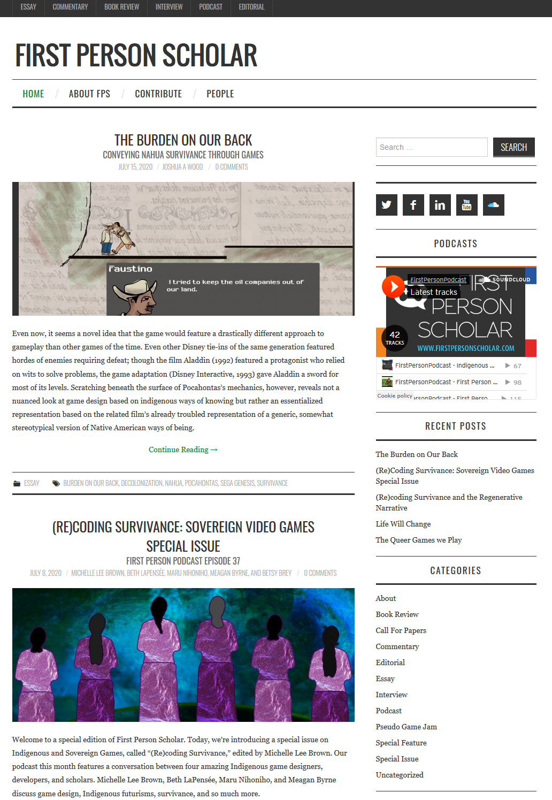
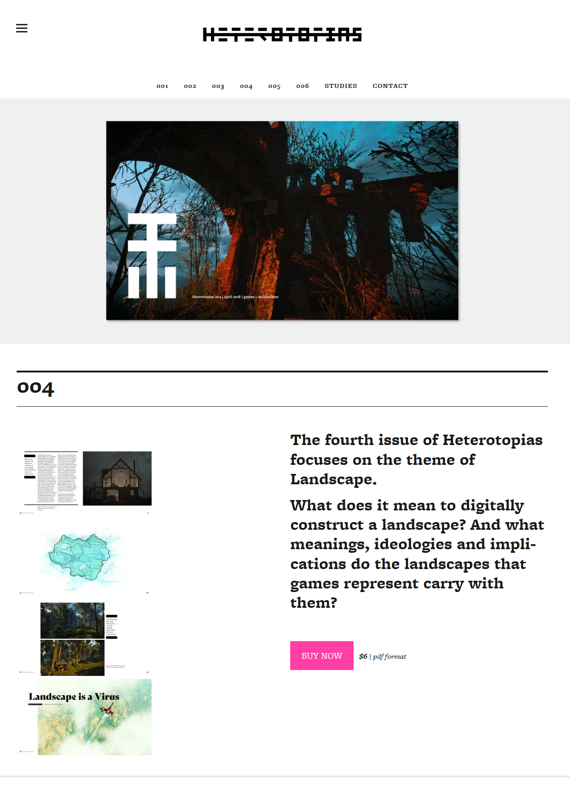

## Introduction

Despite the potential variances of method and mediation introduced to publishing via digital platforms, scholarly print publishing in established humanities disciplines continues to rely on a number of longstanding traditions and habits of practice. These habits still privilege academic journals and scholarly monographs or co-edited collections, many of which remain largely inaccessible for purchase to all but well-funded academic libraries. To encourage a broader distribution, exposure, and uptake of our work to expanded audiences, there is a pressing need to diversify publishing opportunities, to circumvent some of the less-accessible venues of scholarly communication, and to overcome restrictive barriers to augmenting and enriching textual content in scholarly work via the inclusion of visual and auditory material (especially when exploring multi-media and multi-modal forms of cultural expression). One potential alternative can be found in the emergent field of digital game scholarship and criticism, which has developed along unique communicative and community lines and which offers unconventional models and diversified potentials for scholarly communication.

## Persistent problems with conventional publishing models

Before exploring and assessing some of the alternative routes and methods that scholarship on digital games has taken, it will be useful to offer a revealing and all-too common example of the ways in which traditional print publication processes and methods in humanities scholarship contribute to less than open practices. Recently, two colleagues and I co-edited a book-length collection of essays that explored various ways of thinking about the intersections of feminist values and digital game-based representations of war. We were determined to include and promote a variety of approaches and voices, including emerging scholars, established voices, and non-academics. This book was published by Routledge in December 2019. While we are extremely happy that this collection of provocative scholarship has been shared with the world and is (hopefully) helping the careers of our contributors while also furthering serious critical engagement with digital games, we encountered three instances during the publication process that interrupted our optimism regarding this way of sharing the collection.

First, and despite many exchanges and counter-proposals, we were unable to negotiate a reasonable form of open access with the publisher that didn’t involve a substantial upfront cost to ourselves and contributors.[^1] The *only* conciliation offered by the publisher was the following clause in our editorial and contributor contracts:

> Immediately upon acceptance, the Contributor may deposit a copy of their final, revised contribution (prior to any copyediting or typesetting) for use in an institutional repository, but only if said contribution is embargoed for a minimum of 18 months after publication.

The publisher’s efforts to protect the profitability of their investment strips contributors of the rights to their own work and affects even the ability of institutions to efficiently archive the final scholarly output of their faculty in a timely manner. While it’s understandable that publishers need to maximize the value of their titles at a time when the future of traditional scholarly publishing models is uncertain, the fact that such practices affect basic archival efforts reveals the inhibitive illogic behind restrictive publication practices.

Such restrictiveness extends to the accessibility of the published volume due to its pricing. Our book was assigned a list price by the publisher (without editorial or contributor input) of $140 (USD). The Routledge eBook version (accessible through a proprietary reader and locked with DRM security features) and Amazon Kindle version cost $50 (USD). While we understand the need for the publishers to cover production costs[^2] with such pricing models, this high price point ensures fewer overall sales and—ultimately—limits the circulation of and exposure to the work of this diverse collection of scholars. Curiously, another academic publisher—Palgrave MacMillan—held a “Black Friday” sale between November 21 and December 3, 2019, listing most of its hardcover print and eBook titles for $10 (USD), shipping included. This raises interesting questions regarding the markup for these books beyond print-on-demand production and distribution costs, especially given that the royalty payments to authors and editors on such titles are both small and relative to the selling price (in our particular case, 4% of the actual amounts received by the publishers on all copies sold).

Beyond excessive retail costs, unremunerated authorial and editorial labour, and restrictive circulation clauses, we experienced significant problems and hurdles related to the inclusion of images in the publication (which is unfortunate, given the highly visual nature of game-based experiences). Despite fair-use laws that would seem to allow for the use of a single screenshot from a game’s overall flow, and despite our finding and forwarding a document produced for DiGRA in 2014 to answer questions relating to such permissions,[^3] the publisher confirmed that each author was responsible for securing direct permission from digital game publishers for *each* screenshot that they wanted to use in their chapters. To be fair, Routledge operates under British law, which may have different regulations for fair use. However, given the time and effort that securing such permissions required, most of our authors opted not to include any images as part of their contributions. The one author who chose to include images from her own game was also disappointed that the only option offered by our editor as per the publisher’s common practices was to print her images in greyscale. This practice regarding the inclusion and formatting of visual content seems outdated and restrictive, contributing another potential reason as to why the circulation and uptake of print-based academic work beyond a limited audience remains difficult.

## Turning to unconventional alternatives via digital game studies

Given the challenges that dominant forms of academic print-based scholarship introduce to open-access intentions, it is useful to look for other models of community-building, sharing, and knowledge-production which might be better suited to interdisciplinary, multi-media, multi-modal, open-access explorations of cultural expression, while still allowing for scholarly rigour, peer evaluation, and debate. I’m particularly interested in the way that scholarly critical work on digital games is not just limited to print-based output but has evolved along with the emergence of the internet and social media platforms. Exploring this evolution as well as some of the more successful experiments therein offers a unique perspective on the possibility of alternative, open scholarly communication strategies for scholars who are concerned with the restrictive aspects of traditional scholarly publishing models.

## In the beginning: A brief history of digital game journalism

Writing about digital games[^4]  (including simple media coverage and consumer reviews as well as critical scholarship) is a relatively new endeavour, given that such games have been available for broad cultural consumption for less than 50 years. As home and arcade experiences became more popular, writing about games initially took the form of print-based journalism and reviews, and while much of this coverage catered to consumer interests and desires rather than critical scholarly reflection, many of the magazines that contained game-related writing often included public domain game programs that a user could type into their home computers.[^5] The early 1980’s saw the emergence of periodical publications entirely focused on digital game-related content, but critical engagement with commercial game software in such magazines was limited to reviews that measured the potential for consumer satisfaction. The ecosystem for games-related writing was as dynamic and precarious as the technologies that they commented on, as the online journalism sites that first appeared in the mid-1990s quickly usurped the dominance of print-based games writing, causing the demise of a number of periodical publications. The internet’s initial openness to anyone becoming a web content provider also gave rise to independent and self-published game-related writing, offering dispersed alternatives to commercially sponsored coverage and opinions, but this writing didn’t resemble our current critical engagement with game experiences, likely because most games, inhibited by technological and imaginative limits, had not matured to the point where deeper critical engagement would prove fruitful. Users interested in curating the growing amount of game-related writing from multiple sources initially collected web, blog, and RSS feeds into news aggregators, essentially creating their own topically relevant magazines with constantly updated content. As the inconstant tides of content providers continued to ebb and flow (and grow), and as digital game creations and stories matured into something worth criticizing in more depth, this diversity and unpredictability gave rise to media start-ups in the mid-2000s such as *Kotaku*[^6] , *Polygon*[^7], and the more esoteric *Rock Paper Shotgun*[^8] that acted as moderated aggregator sites and content producers and which offered the convenience of content curation as a service while uniquely braiding consumer-targeted previews, coverage, and reviews with editorial reflections and freelance opinions, exposing many independent voices to much larger audiences. Supported by advertising, these sites—similar to rival newspapers—still continue to compete for the attention of as many readers as possible by investing a significant amount of time and money into better writing and exclusive features. However, over a fairly short period of time, many of these sites have also succumbed to a clickbait aesthetic, highlighting shorter pieces with less substantial content via hyperbolic headlines that promise more than they deliver. Perhaps ironically, content from these aggregator sites is now being syndicated into another, broader layer of feed aggregation platforms such as *Pocket* and *Flipboard*, and even social media platforms like Facebook. As this scaling up of accumulation continues via the aggregation of earlier aggregators, and as algorithms increasingly automate the selection and delivery of content to users, the individual voices and longer-form critical reflections that were once supported by these platforms are now eclipsed by the more dominant, commercially aligned freelancers and writer-bots in arenas defined by profit-driven attention economies.

## Beyond game journalism: “Indie scholarship”

While this brief summary of the rise and fall of digital game journalism chronicles the promise and peril of open online opportunities that have been ultimately and in a very short time co-opted by profit-driven intentions, this isn’t the only venue for game-related writing. Parallel intellectual efforts have emerged alongside industry-driven content in the same way that indie artists and record labels surfaced to challenge the dominance of radio-friendly pop music in the early 90s. And while game-related scholarship has gradually been included in print-based academic journals and book series, much of the writing cited in current academic work comes from online sources via a number of more accessible initiatives.

## Indie alternative \#1: Middle-state publication

One such site, *First Person Scholar* (FPS) ([http://www.firstpersonscholar.com](http://www.firstpersonscholar.com/)), is a self-described middle-state publication[^9] run by volunteers that “publishes with purpose,” (Vossen 2016) combining “the timeliness and succinctness of a blog, while retaining the rigor and context of a conventional journal article” (Hawreliak 2013) to produce content that is “timely, rigorous, and accessible” (*First Person Scholar*, About page). Further, and most importantly, FPS encourages

> players—be them developers, scholars, critics, or enthusiasts—to consider alternatives to popular interpretations of games, game play, and games culture.…\[by\] looking for unique and diverse perspectives that may be underrepresented in games writing, as well as those that exist between the more industry-driven journalistic view and the more traditional academic position. This means that we are especially interested in submissions from people of color, queer folks, women, and non-binary individuals. (About)

Housed at the University of Waterloo, *First Person Scholar* is a joint initiative of *The Games Institute* ([https://uwaterloo.ca/games-institute/](https://uwaterloo.ca/games-institute/), a self-described hub for games-related research in Canada) and *IMMERSe* ([https://uwaterloo.ca/games-institute/interactive-and-multi-modal-experience-research-syndicate](https://uwaterloo.ca/games-institute/interactive-and-multi-modal-experience-research-syndicate), a SSHRC-funded digital game research partnership between six academic institutions and six industry partners), both under the directorship of Neil Randall. *FPS’s* position as a site of thoughtful, studious, and accessible counternarratives and imaginative critical repositioning (largely by graduate students and emerging scholars) in reaction to the normative and commercialized digital game writing and coverage discussed above, makes it an essential venue for the diversification and enrichment of accessible scholarship on digital games.

Uniquely, while it grew out of academic-related initiatives, *FPS* continually resists traditional academic publication practices, offering open access to its contents (including essays, commentaries, book reviews, interviews, podcasts, and editorials) while still validating this content’s quality prior to publication through a process of peer review. Additionally, it encourages the inclusion of embedded hyperlinks, experimental discussion, videos, sound files, and images in its published contents.

## Indie alternative \#2: Digital scholarship zine

Another counterpoint and antidote to the endless flood of shallow content feeds that followed the demise of many print magazine publications relating to digital games comes in the form of independently published digital zines that focus on niche topics. *Heterotopias* ([http://www.heterotopiaszine.com/](http://www.heterotopiaszine.com/)), a highly polished and beautifully curated publication created and edited by Gareth Damian Martin and Associate Editor Chris Priestman, is an excellent example of this online indie publication renaissance. Defining itself as simultaneously a digital zine and a website, *Heterotopias* “is a project focusing on the spaces and architecture of virtual worlds” via essays illustrated with aesthetically engaging screenshots and visual “photo” essays that chronicle particular game architectures, including perspectives and sights that players often miss as they move quickly through meticulously constructed virtual spaces. Six issues have been published over the past three years, and DRM-free .pdf files of each issue are for sale on the itch.io content distribution platform for between three and six dollars per issue.  

Money made from the sales of these digital publications is fed back into the continuing production of future issues. Alongside the paid content, additional “studies” consisting of excerpts or full essay contributions from previous issues are posted at no charge on the *Heterotopias* website. They function as both free samples and as a confirmation of the quality of writing and editing that is featured in each issue. While the sustainability and longevity of such a niche project is uncertain (an associated crowdfunded book project to further promote a focus on game architecture has recently been cancelled, and the most recent issue of *Heterotopias* launched at the end of February 2019), initiatives such as this one suggest that the production of independent, affordable, and desirable publications that expose scholars and casual gamers alike to focused, in-depth explorations and critical analyses of specific aspects of digital games is not only possible, but is a welcome bridge between exclusive, quality academic writing and accessible multimedia citizen-scholar approaches.

## Indie alternative \#3: Scholarly content aggregator

As content proliferated from this new “indie” movement of in-depth but accessible and thought-provoking critical scholarship, it was only a matter of time before an aggregator site emerged for this kind of work. However, unlike existing commercially driven sites like *Kotaku*, *Critical Distance* (currently a Patreon-funded archive site that uses “roundups, roundtables, podcasts, and critical compilations” to encourage dialogue between “developers, critics, educators and enthusiasts”)[^10] functions more like a weekly college-radio station playlist for new, challenging, and informed perspectives. (See Figure 3)

Curiously, though, its position is all-inclusive rather than oppositional, and the curated weekly anthologies of “good writing about games” includes hand-picked original and thought-provoking content from the larger mainstream sites in addition to also privileging “as many different perspectives and unique voices as \[they\] can,” as they “believe those outside the main body of the conversation can have as much if not more to contribute as an established critic.” *Critical Distance* thus archives quality writing about games, curating with the intent of “offer\[ing\] an alternative to the canon already being promoted by hegemonic power structures: popular websites, mainstream developers, \[and\] well-financed institutions” (Ligman 2014). However, Kris Ligman, former Senior Curator of the site and currently member of the Advisory Board, presenting at the Critical Proximity conference in 2014, asserted that she refused “to treat *Critical Distance* as a creator of canon, but rather as a custodian of dialogue.” (Ligman 2014). Their archive dates back to April 2009, and snapshots of links that are now lost or broken have been preserved with the help of the Internet Archive’s *Wayback Machine* web archive project. Using the crowdfunding site Patreon, *Critical Distance* is supported by 168 patrons who collectively donate $962 (USD)/month to support the continuing operation of the site. This alternative model of financing moves beyond the issues of unpaid labour that haunt *First Person Scholar* and provides a more predictable level of income than *Heterotopias’* dependency on individual sales of its issues. Importantly, *Critical Distance* makes it clear that “We do not give preferential treatment in our features based on patronage” (Support Us page), escaping the pressures of sponsorship that affect sites like *Kotaku* and *Polygon*.

## Indie alternative \#4: Longform videoblog criticism

Finally, (though this small set of examples only scratches the surface of the innovative types of alternative game-based critical communications that are emerging online), quality video bloggers such as Noah Caldwell-Gervais and short-form documentary creators such as *Gvmers* offer dynamic and appealing video content (usually consisting of footage from the particular games being discussed) to engage viewers as they listen to spoken histories, retrospectives, reflections, comparisons, critiques, and analyses. Noah Caldwell-Gervais is a fascinating content creator, having posted over 90 videos since 2013, with over 40 of his critical retrospectives clocking in at between one and three hours in length (See Figure 4).

His video on the evolution of the western genre in digital games is just over four hours in length and the script for that video is over 46,000 words. Given that these videos are not prefaced by advertisements, it’s unlikely that Caldwell-Gervais makes money from *YouTube* for his content. Instead, he is funded on *Patreon* by over 900 patrons who collectively donate just over US$5,100 per month to enable him to continue creating his video scholarship and criticism. This is worth emphasizing: 900 people are donating an average of $5.66 per month to this young man who used to be a line cook at a Seattle pizzeria until income from his channel allowed him to focus on making videos full-time. His least popular game critique video post has 44,000 views, his most popular video (a nearly 2-hour retrospective on the *Baldur’s Gate* franchise) has over half a million views, and his YouTube channel has 130,000 subscribers. When compared to the number of reads and citations that most of our academic scholarship receives, these numbers (indicating his impact and outreach) are staggering. As well, these numbers suggest that Caldwell-Gervais is subjected to a great deal of ongoing peer review and evaluation.

While he certainly would not be considered a popular “YouTuber” compared to other content creators, he is a digital game scholar who has no tenure-track academic position and who reaches more viewers with one long-form scholarship video than I’ll reach with all of the research and teaching output that I produce during my entire career. Caldwell-Gervais is thus practicing a significant form of open social scholarship, producing videos that are instantly accessible at no cost to a worldwide audience. Crucially, he engages in dialogue with thousands of his viewers in the comment section of his YouTube videos and via Twitter. This dialogue, commentary, and feedback is also something that print-based scholarship doesn’t effectively enable—but it must be noted that such dialogue is also not always scholarly or respectful. When one’s work is shared with a broader and more diverse audience, the intellectual engagement modelled by such work isn’t always part of the response that one receives. Possibly due to the distance between people established by social media platforms, and possibly due to the often-toxic nature of digital game cultures and communities, Caldwell-Gervais’ successful and broad communication of scholarly ideas has resulted in some malicious commentary. For example, on a 2017 forum thread on the site RPGcodex.net that discusses his videos, a user named pippin commented, “Regardless of his politics, he's still a tryhard hipster faggot.” When some people in the forum community responded to pippin in an effort to defend Caldwell-Gervais’s intelligent approach to digital game criticism, a user named JBro briefly interrupts the debate about critical rigour with the statement: “I bet he's a rapist or a pedophile just like every other anti-Gamergate weirdo.” Perhaps this kind of harmful trolling is an inevitable result of opening scholarship and scholarly communication to a broader dialogue with larger audiences. Anita Sarkeesian’s horrifying experience with rape and death threats, identity theft, harassment, and doxing during her work on the crowdfunded YouTube series *Feminist Frequency*[^11] which directed a focused and much-overdue feminist critique toward the ubiquitous misogyny and hypermasculinity in digital games and game culture)[^12] highlights not only the unacceptable inequities between the ways that men and women are responded to when they choose to communicate cultural criticism in public forums, but also the risks of sharing one’s work in unmoderated and unsafe social spaces. However, alternative models and methods are available: *Critical Distance* has established its own platform, moderated forum, and rules for respectful communication on its site. While it might receive less traffic than Caldwell-Gervais’s YouTube channel, it is a much more preferable environment which encourages constructive civil exchanges, dialogue, and debate around the material it gathers.

## Conclusion: Unlearning traditions through the unique diversity of digital game scholarship

These heterogeneous alternatives to traditional print forms of scholarly work collectively model a publishing plasticity and overall adaptiveness in digital game studies that have established a culture of open social scholarship practices, inclusive and diverse voices, and a rapid deployment of ideas and perspectives. While it could be suggested that such opportunities for openness and accessibility have also facilitated toxic voices, unrestrained and disrespectful discourse, and the defensive assertion of perspectives that define misogynist “gamer” culture, the emergent models of scholarly communication explored via the abovementioned alternative game studies initiatives are motivated by the generation of new kinds of supportive, thoughtful communities, whose broad membership is constituted by a shared desire to understand the unique, affective experiences provided by games. These critical experiments, when collectively considered, offer some possible ways to include but also to moderate social media’s reactive and potentially toxic energies. Overall, as we collectively look for ways to continue to diversify our scholarly communication opportunities in the service of open scholarship, the recent evolution and experimental branches of digital game criticism provide numerous models, strategies, and entry points for continuing dialogue, reflections, and community-building scholarly efforts.

## Works Cited

Caldwell-Gervais, Noah. Youtube channel. Accessed July 17, 2020. [https://www.youtube.com/channel/UC5CYeHPLer3lbEhgonvbbAA](https://www.youtube.com/channel/UC5CYeHPLer3lbEhgonvbbAA)

*Critical Distance*: “Where is all the good writing about games?" About page. Accessed July 17, 2020. [https://critical-distance.com/about](https://critical-distance.com/about)

*Critical Distance*: “Where is all the good writing about games?" Support Us page. Accessed July 17, 2020. [https://critical-distance.com/about](https://critical-distance.com/about)

*First Person Scholar*. “About.” Accessed July 17, 2020. [http://www.firstpersonscholar.com/about/](http://www.firstpersonscholar.com/about/)

*Gvmers*. Youtube channel. Accessed July 17, 2020. [https://www.youtube.com/channel/UCSuhUzpdXg9jme6eN6HA_IA](https://www.youtube.com/channel/UCSuhUzpdXg9jme6eN6HA_IA)

Hawreliak, Jason. “Hybrid Publishing: The Case for the Middle-State.” *First Person Scholar*. July 31, 2013. Accessed July 17, 2020. [http://www.firstpersonscholar.com/the-case-for-the-middle-state/](http://www.firstpersonscholar.com/the-case-for-the-middle-state/)

*Heterotopias*. Digital Zine and Website. Accessed July 17, 2020. [http://www.heterotopiaszine.com/](http://www.heterotopiaszine.com/)

Ligman, Kris. “Curators are Class Enemies.” Presentation at the *Critical Proximity* conference, 16 March 2014. Accessed July 17, 2020. [https://critical-proximity.com/2014/03/16/curators-are-class-enemies/](https://critical-proximity.com/2014/03/16/curators-are-class-enemies/)

“The Noah Caldwell-Gervais Thread.” RPGcodex.net Forum post started 25 January 2017. Accessed July 17, 2020. [https://rpgcodex.net/forums/index.php?threads/the-noah-caldwell-gervais-thread.113214/](https://rpgcodex.net/forums/index.php?threads/the-noah-caldwell-gervais-thread.113214/)

Wilcox, Steve. “On the Publishing Methods of Our Time: Mobilizing Knowledge in Game Studies “, Scholarly and Research Communication, Volume 6(3), 2015. Accessed July 17, 2020. DOI: [https://doi.org/10.22230/src.2015v6n3a203](https://doi.org/10.22230/src.2015v6n3a203)

Vossen, Emma. “Publish with Purpose.” Youtube video. April 4, 2016. Accessed July 17, 2020. [https://youtu.be/tsvxRM0V2KU](https://youtu.be/tsvxRM0V2KU)

[^1]: The current rate payable by editors and contributors to enable open access (Creative Commons relicensing and DRM-free downloads) to Routledge’s published titles as of December 2019 starts at £10 000 per book or £1250 per chapter ([https://www.routledge.com/info/open_access/faq#charges](https://www.routledge.com/info/open_access/faq#charges))

[^2]: While we were grateful for the editorial assistance that the publisher offered to us during the publication process, as editors we have been responsible for proofreading and, in a large number of cases, correcting errors made by the publisher’s outsourced copyediting, typesetting and (quite dismal) indexing services. In addition, we needed to micromanage the correction of mistakes in the cover and table of contents listing on both the publisher’s website and Amazon’s website. The cover design process was restricted to choosing from one of 30 templates. All this to suggest that editors and authors of academic publications do much of the labour involved in getting these volumes into print.

[^3]: [http://www.digra.org/wp-content/uploads/digital-library/ScreenshotsFairUseRecommendations_DiGRA.pdf](http://www.digra.org/wp-content/uploads/digital-library/ScreenshotsFairUseRecommendations_DiGRA.pdf)

[^4]: Given rapid changes in technology and the proliferation of platforms that enable a user/player’s engagement with software-based participatory, interactive experiences, it’s difficult to assert a broadly effective definition of digital games that accounts for the variety of available game experiences. For the sake of argument, however, I’m defining digital games as possibility spaces in which a reactive system responds to users' actions within the framework of play defined by rule-based affordances and constraints. This definition accounts for everything from the earliest games (*Spacewar* and *Pong*), through large franchise IPs like *Mario*, *Pokémon*, *Doom*, *Bioshock*, and *Call of Duty*, to independent provocations like *Dys4ia* and *Depression Quest*. More important than a universal (and potentially exclusive) definition, perhaps, games should be recognized as multi-media, multi-modal, interactive cultural narratives that can be studied, critiqued, and interpreted in a number of integrated ways.

[^5]: Websites like The Internet Archive ([https://archive.org/details/gamemagazines](https://archive.org/details/gamemagazines)) and Retromags ([https://www.retromags.com](https://www.retromags.com/)) have tried to digitally preserve many of these early publications. Other websites (e.g. [http://www.videogamemags.com/Template/mag_list.html](http://www.videogamemags.com/Template/mag_list.html)) offer informally curated histories of these early magazine publications.

[^6]: [https://kotaku.com/](https://kotaku.com/)

[^7]: [https://www.polygon.com/](https://www.polygon.com/)

[^8]: [https://www.rockpapershotgun.com/](https://www.rockpapershotgun.com/)

[^9]: An excellent article by Steve Wilcox titled “On the Publishing Methods of Our Time: Mobilizing Knowledge in Game Studies” explores in detail the relevance and advantages of middle-state publication models in relation to digital game scholarship and can be found here: [https://src-online.ca/index.php/src/article/view/203/435](https://src-online.ca/index.php/src/article/view/203/435)

[^10]: [https://www.critical-distance.com/](https://www.critical-distance.com/)

[^11]: [https://www.youtube.com/user/feministfrequency/videos](https://www.youtube.com/user/feministfrequency/videos)

[^12]: See [https://www.polygon.com/features/2019/6/19/18679678/anita-sarkeesian-feminist-frequency-interview-history-story](https://www.polygon.com/features/2019/6/19/18679678/anita-sarkeesian-feminist-frequency-interview-history-story) for a thorough discussion of Sarkeesian’s experiences.
