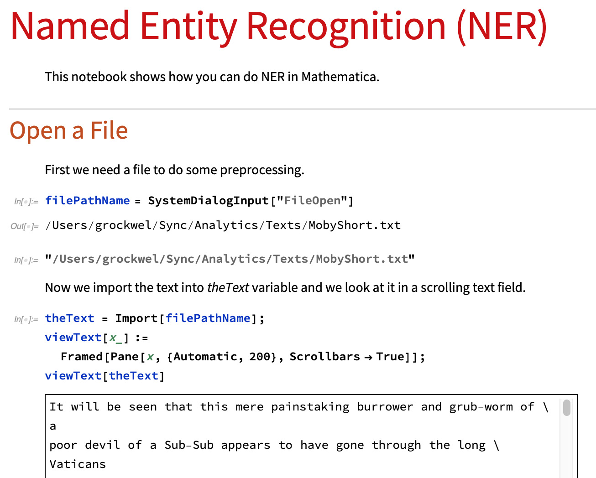
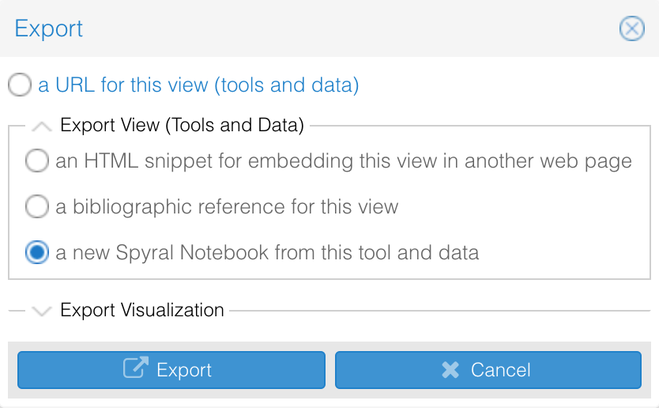
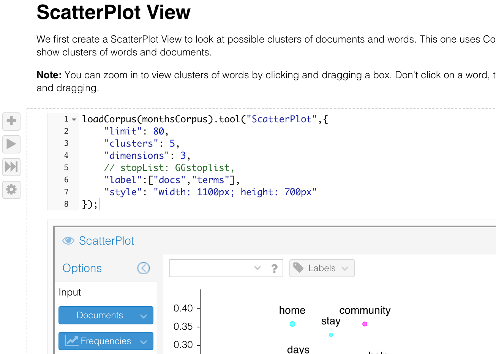
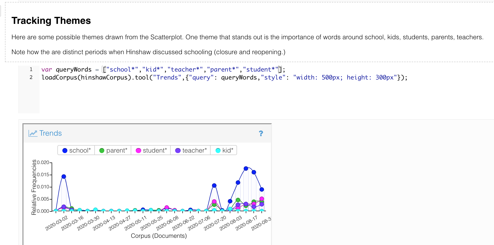
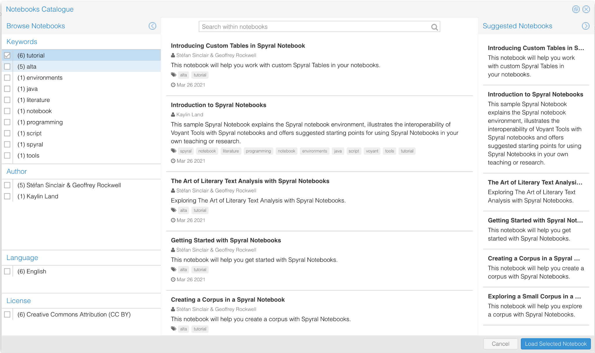

{ }

> Things made up of different elements and produced by the hands of several master craftsmen are often less perfect than those on which only one person has worked. (Descartes 2006, 12)

Research in the humanities has traditionally been thought of as something that is best done alone. Humanists might work together on tools like concordances, but the inherited figure of research is that of the philosopher who sits and meditates alone in a cabin as Descartes tells us he did in the *Discourse on Method* (2006). In art the solitude of meditation is best captured by Rembrandt’s famous “Philosopher in Meditation” (Figure 1) where the thinker is lit by the warm sunlight of heaven while a spiral staircase of thought ascends into the darkness.[^1]

Descartes didn’t think much of collaborative work or that of others in the tradition which is why he isolated himself and rebuilt a philosophy from the *cogito.* By contrast, collaboration has been one of the ways the digital humanities distinguishes itself (Rockwell 2012, 135–154). We tend to think through projects in teams. Our work can be imagined as a dialogue or, more recently, a Zoom call. This paper is about a collaborative tool, Spyral Notebooks, that is designed to support the sort of dialogue we imagine when researchers and students are thinking through text analysis projects. It imagines a different spiral of thought, not the solitary spiral, but the double helix of collaboration. In this paper we introduce Spyral and address both the possibilities and some limitations of the notebook environment. We also provide examples of both tutorial notebooks that can be used for pedagogical purposes as well as examples of Spyral notebooks used in collaborative analysis. Finally, we suggest potential areas for further development for Spyral.

## Notebook Programming

Spyral is a notebook programming environment built on Voyant Tools and extending Voyant Tools.[^2] Voyant Tools is a web-based platform used for analyzing digitized texts. Voyant Tools provides a suite of text analysis tools, including those for visualization and statistical analysis. Spyral notebooks are integrated with Voyant to provide an environment for extending literary text analysis, writing reports, and sharing analysis with other researchers. Notebook environments can be thought of both as extensions of traditional research notebooks and as novel tools that integrate active analysis and presentation of results. Wickman recognizes the notebook environment as a “dynamic rhetorical space within which groups of scientists and other stakeholders can present, discuss, revise, and circulate information” (2017, 12). Spyral is designed to give researchers a collaborative platform for working through textual analysis projects in an intuitive, user-friendly environment.

Spyral was designed in the tradition of “literate programming” where the development environment supports the intertwining of discussion and code so development starts with describing what is being done for others (Knuth 1984, 97–111). This type of programming is particularly beneficial in digital humanities projects in which the analytical code is usually accompanied by textual explanations and in which the textual accompaniments to code and visualizations are just as important as the analysis itself.

{ }

Wolfram Mathematica and now Jupyter notebooks are the best-known examples of literate notebook environments and they are both used widely for data science and scientific computing because they encourage the writing out of the thinking behind analysis.[^3] In Figure 2 above you see a Mathematica notebook. Spyral is unique because it integrates directly with Voyant Tools.

Typically, a notebook is made up of three types of blocks or cells that the user can add in a sequence:

  1.  There are **text cells** where we can have headings (like the title at the top in Figure 2) and unstructured text, much as one would in Word Processor or in a browser editor. Depending on the notebook environment, the text blocks can be simple or quite sophisticated. Mathematica has probably the most sophisticated text editing environment with integrated outlining and the ability to change stylesheets so one can generate slides.

  2.  There are **code cells** where one *inputs* code, be it Python, the Wolfram Language used in Mathematica, or JavaScript used in Spyral. The code cells can be run in sequence or individually run as you debug your code. This also means that users can run the cells they need if they are using a notebook as a gathering of ideas.

  3.  When you run code cells they produce **output**, which can take whatever form your code calls for. In the example in the figure above there is the top of an editable field with scroll bars into which the code places the text (MobyShort.txt) selected. The output could also be a visualization or a table of results that you will save.

This notebook model has become popular in digital humanities text mining for the same reasons it is popular in other fields where data analysis is an important method. A notebook is a way to explain the reasoning behind an experiment that fully documents the experiment. A notebook lets you weave together explanations, code, and results in a fashion that others can use to replicate your results. In effect, it brings together into one spiral two tools important to the digital humanist: the word processor for writing and the programming environment for analyzing data. Intertwined, one can think through writing as coding or coding as writing (see Ramsay and Rockwell 2003).

Notebooks also provide useful learning tools where the tutorial text, example code, and exercises can be woven together and read while running. *The Art of Literary Text Analysis* (2015) is an example textbook written in Jupyter notebooks by Stéfan Sinclair with help from Geoffrey Rockwell. William Turkel has written a fine textbook on *Digital Research Methods in Mathematica* (2020). Both take advantage of the capacity of notebooks to not just show code examples, but also to provide them for interaction and extension.

## Criticisms of Notebook Environments

Recent criticism of notebook environments highlights several areas of concern when using notebooks (see Chattopadhyay et al. 2020 and Mueller 2018). In his blog post “The First Notebook War,” Yihui Xie (2019) provides a useful distinction when considering these criticisms. Xie identifies two different purposes for using notebooks: for both software engineering and data analysis. He argues that notebook environments are better suited to data analysis and that many of the criticisms leveraged against notebook environments are better addressed to notebooks used for software engineering. Spyral notebooks were designed for data analysis primarily for the humanities researcher who works with digital text. Thus, some of the criticism levelled against notebook environments regarding notebooks as products (and transitioning from notebook code to production code) are not applicable in this case. Other criticisms of notebook environments include issues loading and cleaning data, issues with feedback latency and kernel crashes, lack of IDE support, scalability issues and execution issues when working with large amounts of data, versioning and cataloguing issues, security issues, and challenges with sharing and collaborating as well as reproducing notebooks (Chattopadhyay et al. 2020, 1-12). While Spyral notebooks cannot overcome all of these issues, the design of the platform does address some of the most common issues, as discussed below.

## Spyral

{  } 

Spyral Notebook is a web-based notebook environment used primarily for humanities digital text analysis research. The notebooks are designed to work in tandem with Voyant Tools. This design integration makes it easy for users to load and clean their data because Spyral uses the existing data (an uploaded corpus) from Voyant; the user need only load their corpus into Voyant using JavaScript and the data is readily accessible. This also makes it easy to create Spyral notebooks because one can export a Spyral notebook from any Voyant panel. The exported notebook will have the code that then regenerates the panel exported. This way you can create a notebook with significant results and then add documentation (text cells) explaining your process. It means that you can document and share a research project carried out in Voyant with all the thinking-through, code, and results in one place for others to try. As Spyral extends Voyant, the panels are fully functional dynamic Voyant panels. What is different is that they are now embedded in a notebook with documentation instead of being in a single view.

Spyral notebooks are appropriate both for novice coders and for users with JavaScript experience. For those with little to no coding experience, Spyral notebooks can act as a training ground for demonstrating the ways in which code input and output interact. For example, new users can create a new Spyral notebook from Voyant by exporting a visualization into a new notebook. The notebook will contain the code necessary to reproduce the Voyant visualization and users can experiment with editing the code to see how the output changes. Users with limited coding skills can also edit pre-existing tutorial notebooks as a didactic exercise. Editing and adding code cells to Spyral notebooks is intuitive by design.

Another benefit of Spyral notebooks is that they run on the Voyant server and are stored there for public access by default. One of the highest barriers for entry in using notebook environments is the client–server model that most utilize (Johnson 2020, 32–37). In order for users to set up the notebooks, they must first download and install the coding language and interpreter for the notebook in addition to all the dependencies needed for that particular coding language. This is a process that not all humanities researchers are familiar with and has many opportunities for frustration. With Spyral, the user only needs to input a URL into a web-browser. The set-up is thus minimal and Spyral notebooks use JavaScript with linting and suggested syntax, providing more support for writing code.

The downside of an in-browser environment is that you don’t have as powerful an integrated development environment (IDE) as you might have with a purpose-built development application, such as you have with Mathematica. Despite this, the advantages of working off a server through the browser is that it allows the novice user to better understand the platform. Users create notebooks by managing a series of text cells and code cells much as they would in other web authoring environments like WordPress. In Figure 4 you can see the buttons to the left of the code cell that you see when you roll over the area. These buttons let you create a new cell, run code in the cell, run multiple cells, and access settings for the cell. Building up a notebook is as simple as creating cells and filling them with text or code and then running the code cells to get interactive Voyant panels like the ScatterPlot panel visible in Figure 4.

{ }

Spyral Notebook provides powerful collaborative and sharing possibilities. Notebooks can be shared by giving individuals a URL that links to the notebook. When a new user opens the notebook, they do not need to set up anything on their personal machine to view and run the notebook. In order to “fork” the notebook, a new user only needs to save the notebook with a new name and a new URL will be generated. Notebooks are password protected, meaning that no changes can be made to an existing notebook without password sharing. Notebooks in Spyral can also serve as an open publishing tool, making it easy to share not only the results of a digital humanities inquiry but also the code and process behind the project.

{ }

One real example can be seen in Figure 5. Here you can see a published notebook developed for a CIFAR-funded project to look at discourse around COVID-19 in Alberta, Canada.[^4] The larger project involves a large team of medical researchers, digital humanities researchers, and computing scientists. The notebook allows useful configurations of tools, queries, and results to be saved and documented. It provides a commons for team members to search the different corpora with different tools in Voyant. Furthermore, it provides a useful publishing tool for making the results of this inquiry easily accessible.

## Spyral and Social Analytics

Looking again at the “Philosopher in Meditation,” there is a second figure in the lower right tending a fire for heating the room or for preparing food. Rembrandt reminds us that the solitary thinker is not really alone, but is supported by a servant whose care work makes it possible for him to meditate. In “The Carework and Codework of the Digital Humanities,” Lauren Klein (2015) talks about the care work of building and maintaining infrastructure that makes the philosopher’s meditation possible. As she says, digital humanities work such as tool building, which is often framed in masculinized terms, can also be thought of as necessary (feminized) care work. This work, like the work of librarians, is often invisible to those who use it but is an essential element of collaboration.

Spyral is one such tool created with the idea of supporting other practitioners of digital humanities. Spyral notebooks provide essential infrastructure for documenting, augmenting, and sharing digital humanities projects, and we are in the paradoxical situation that if we get the interface of Spyral right it too will recede from view into the corner in support of the work of others. To be social can mean tending the fire.

Spyral was designed by Stéfan Sinclair to support collaborative or social text analysis. Rather than being a tool for solitary meditation, it is a tool that brings text and code into dialogue for (and with) others. It also brings explanation and interaction into dialogue, providing support for a different type of paper where discussion and interactive panels with results can be woven together so readers can replicate your work or try your analysis on their own data.

As mentioned above, in Spyral notebooks are created as an extension of Voyant on the Voyant server. This is another way they can be social. They are by default meant to be accessible by others rather than on your laptop so as to encourage collaboration and adaptation. Currently one of the features in development in Spyral is a catalogue that allows users to view highlighted notebooks created by other users (see Figure 6). The catalogue feature allows users to sort notebooks by keyword and to find notebooks by others that might be of interest. If you want tutorial notebooks and learn by working through examples curated by other notebook authors, you can easily find such tutorials, fork them, and work through them yourself.

{ }

Further, Spyral allows you to build on the notebooks of others. You can run a notebook on your own content, you can fork a notebook to adapt it, and you can import other notebooks into your notebook so you inherit their functionality. In this way, Spyral highlights and elucidates the coding behind Voyant and makes more transparent the ways in which Voyant functions. We hope such an open collaborative design will make it well suited to teaching and learning, one of the more important social configurations of the academy (see Sherratt 2021 and Dombrowski 2020).

Currently we are in the process of developing a series of tutorial notebooks that will allow learners to better understand how to use Spyral for digital text analysis. We are also creating a comprehensive set of JavaScript recipes that will allow users to quickly and efficiently export code designed for common textual analysis tasks. Spyral makes it relatively simple to import single notebook cells into a new notebook. For example, you might choose to import a cell containing the code for uploading your corpus from Voyant and creating a visualization showing the most frequently used terms in the text.

For a comprehensive list of currently available introductory notebooks, see below:

- **[Introduction to Spyral](https://voyant-tools.org/spyral/aboutspyral/https:/voyant-tools.org/spyral/aboutspyral/):** An overview notebook that introduces Spyral notebooks and shows their basic capabilities.

- **[Dialogica Welcome](https://voyant-tools.org/spyral/DialogicaWelcome):**  Provides a more thorough overview of Spyral notebooks and includes interactive exercises to complete.

- **[Art of Literary Text Analysis](https://voyant-tools.org/spyral/homeALTA):** A series of notebooks that introduce digital text analysis skills and also demonstrate how to use Spyral. Series includes:

  * [Getting Started with Spyral Notebooks](https://voyant-tools.org/spyral/startALTA): Introduces core concepts of Spyral notebooks.

  * [Creating a Corpus](https://voyant-tools.org/spyral/createALTA): Shows how to create a corpus with Voyant or programmatically with strings or URLs.

  * [Exploring a Smaller Corpus](https://voyant-tools.org/spyral/smallerALTA): Shows how to work with a smaller corpus using Edgar Allen Poe's “The Gold Bug.”

  * [Introducing Tables](https://voyant-tools.org/spyral/tableALTA): Introduces core concepts of working with custom data and tables.

- JavaScript Recipes: A series of notebooks that provide editable JavaScript code that will allow you to access Spyral Notebook's full functionality (currently in progress).

  *  [Corpus](https://voyant-tools.org/spyral/JSrecipes): Notebook includes code showing how to upload and edit a corpus.

  *  [Notebook](http://voyant-tools.org/spyral/Import): Notebook includes code showing how to input an existing Spyral notebook into a new Spyral notebook.

## Next Steps

The “Philosopher in Meditation” has a third figure that has disappeared with age that you can see in the dark of the spiral staircase in older replications. There, going up the spiral stairs is a ghostly figure facing us that has been obscured by the aging varnish. It shows up in this 19th century engraved reproduction (see Wikipedia 2021).

{ }

This third figure turns to look at us as if waiting for us to follow her. If the painting was meant to be Tobit and Anna, then it could be Anna waiting for their son. Or it could be Philosophy herself inviting us into the consolation of meditation. Perhaps the spiral on which she stands is drawn from the light of the books and sun from the window and also from the artificial fire of technology. The steps are the cells of coding and writing working their way up. Steps we are invited to ascend.

Coming back down, let us conclude by noting that Spyral implements an emerging paradigm for humanists interested in collaborative analytics, that of the shared notebook. Spyral is still in “beta” in that not all features are implemented and the documentation is incomplete, but it is quite usable. In this paper we aimed to demonstrate how Spyral functions both as an interpretive tool and as a collaborative platform. Spyral notebooks serve both as didactic tools and presentational mediums.

Development is now carrying on with support from the LINCS project led by Susan Brown and supported by CFI.[^5] Spyral is being enhanced for researchers who want to use linked open data to enhance their analysis of texts. A second next step supported by Social Sciences and Humanities Research Council (SSHRC) is a speculative design project to prototype how Voyant and Spyral can be used by groups of people together before a datawall or around a touch-table.

## {.spacer}

 

*In memory of Stéfan Sinclair who passed in August 2020 while developing Spyral*

https://csdh-schn.org/stefan-sinclair-in-memoriam-2/

## {.spacer}

## Works Cited

Chattopadhyay, Souti, Ishita Prasad, Austin Z. Henley, Anita Sarma, and Titus Barik. 2020. “What's Wrong with Computational Notebooks? Pain Points, Needs, and Design Opportunities.” In *Proceedings of the 2020 CHI Conference on Human Factors in Computing Systems* (CHI '20). Association for Computing Machinery, New York, NY, 1–12. DOI: [https://doi.org/10.1145/3313831.3376729](https://doi.org/10.1145/3313831.3376729).

Descartes, René. 2006. *A Discourse on the Method of Correctly Conducting One's Reason and Seeking Truth in the Sciences*. Trans. I. Maclean. Oxford: Oxford University Press.

Dombrowski, Quinn. 2020. “Jupyter Notebooks for Digital Humanities.” Last accessed July 15, 2021\. [https://github.com/quinnanya/dh-jupyter](https://github.com/quinnanya/dh-jupyter).

Johnson, Jeremiah W. 2020. “Benefits and Pitfalls of Jupyter Notebooks in the Classroom.” In *Proceedings of the 21st Annual Conference on Information Technology Education* (SIGITE '20). Association for Computing Machinery, New York, NY: 32–37. DOI: [https://doi.org/10.1145/3368308.3415397](https://doi.org/10.1145/3368308.3415397).

Klein, Lauren. 2015. “The Carework and Codework of the Digital Humanities.” Talk delivered at the Digital Antiquarian conference, Worcester, MA, May 29, 2015. Last accessed July 15, 2021. [https://digitalhumanitiesnow.org/2015/06/editors-choice-the-carework-and-codework-of-the-digital-humanities-lauren-klein/](https://digitalhumanitiesnow.org/2015/06/editors-choice-the-carework-and-codework-of-the-digital-humanities-lauren-klein/).

Knuth, Donald E. 1984. “Literate Programming.” *The Computer Journal* 27, no. 2: 97-111.

Mueller, Alexander. 2018. “5 Reasons Why Jupyter Notebooks Suck.” Last modified March 24, 2018\. [https://towardsdatascience.com/5-reasons-why-jupyter-notebooks-suck-4dc201e27086](https://towardsdatascience.com/5-reasons-why-jupyter-notebooks-suck-4dc201e27086).

Ramsay, Stephen, and Geoffrey Rockwell. 2004. “Untitled Number 4: A Brechto-Socratic Dialogue.” Dialogue performed at ACH/ALLC Conference, Athens, GA, May 2003. Last modified March 18, 2004. [http://www.geoffreyrockwell.com/publications/u4.4.pdf](http://www.geoffreyrockwell.com/publications/u4.4.pdf)

Rockwell, Geoffrey. 2012. “Crowdsourcing the Humanities: Social Research and Collaboration.” In *Collaborative Research in the Digital Humanities*, edited by Marilyn Deegan and Willard McCarty, 135-154. Farnham, Surrey, England: Ashgate.

Sinclair, Stefan and Geoffrey Rockwell. 2015. “The Art of Literary Text Analysis.” Last modified January 12, 2018. [https://github.com/sgsinclair/alta/blob/master/ipynb/ArtOfLiteraryTextAnalysis.ipynb](https://github.com/sgsinclair/alta/blob/master/ipynb/ArtOfLiteraryTextAnalysis.ipynb)

Sherratt, Tim. 2021. “GLAM Workbench.” Last accessed July 19, 2021. [https://glam-workbench.net/](https://glam-workbench.net/)

Turkel, William J. 2020. *Digital Research Methods with Mathematica,* 2nd rev. ed. Last modified September 2020. [https://williamjturkel.net/digital-research-methods-with-mathematica/](https://williamjturkel.net/digital-research-methods-with-mathematica/)

Wickman, Chad. 2017. "Learning to 'Share your Science': The Open Notebook as Textual Object and Dynamic Rhetorical Space." In *Science and the Internet: Communicating Knowledge in a Digital Age,* edited by Alan G. Gross and Jonathon Buehl, 11–31. London: Baywood's Technical Communications Series Routledge.

Wikipedia, s.v. “Philosopher in Meditation,” last modified May 13, 2021, 01.50, [https://en.wikipedia.org/wiki/Philosopher_in_Meditation](https://en.wikipedia.org/wiki/Philosopher_in_Meditation)

Xie, Yihui. 2019. “The First Notebook War.” Last modified September 2019. [https://yihui.org/en/2018/09/notebook-war/](https://yihui.org/en/2018/09/notebook-war/)

[^1]: The “Philosopher in Meditation” is in the Musée de Louvre in Paris. Some have recently suggested the painting is not of a philosopher, but rather of blind Tobit and his wife Anna waiting for their son Tobias. In the story the angel Raphael helps Tobias giving him medicine to cure his father’s blindness when he returns (Tobit 11:5-11). Nonetheless, this painting has long been taken to be the paradigmatic image of the philosopher meditating alone which is how we will read it (Wikipedia 2021).

[^2]: Spyral Notebooks can be accessed online at [https://www.voyant-tools.org/spyral](https://www.voyant-tools.org/spyral). Voyant Tools is available at [https://www.voyant-tools.org/](https://www.voyant-tools.org/)

[^3]: Wolfram Mathematica can be accessed at [www.wolfram.com/mathematica](http://www.wolfram.com/mathematica). Jupyter notebooks are available at [www.jupyter.org](http://www.jupyter.org/).

[^4]: See [https://voyant-tools.org/spyral/CovidDiscourse2/](https://voyant-tools.org/spyral/CovidDiscourse2/).

[^5]: See [https://lincsproject.ca](https://lincsproject.ca/).
