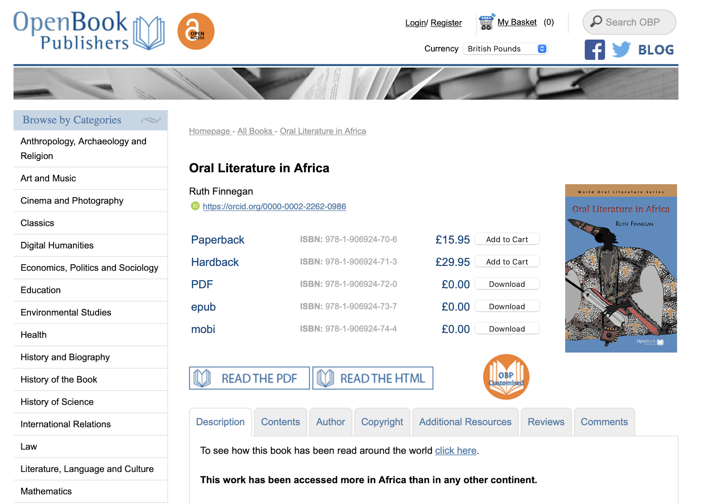
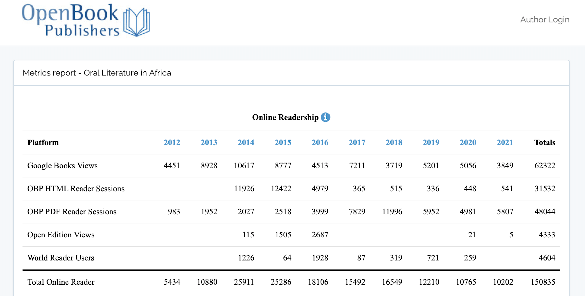
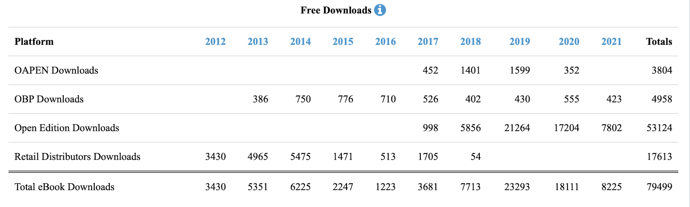
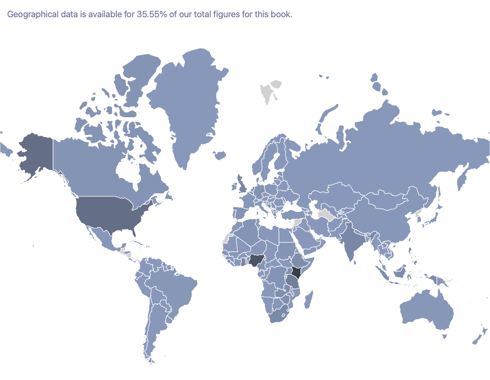

## Introduction

In 2012, a group of academics, myself included, launched the [World Oral Literature series](https://www.openbookpublishers.com/section/30/1): an open access monograph series supported, hosted, and published by the recently founded [Open Book Publishers](https://www.openbookpublishers.com/) based in Cambridge, UK. The series arose out of a scholarly collective called the [World Oral Literature Project](http://www.oralliterature.org/), which I had helped to establish three years earlier (see Turin 2014 for the institutional context).

The World Oral Literature series materialized as a by-product of a number of sobering conversations. Consulting with senior academics serving on the project’s advisory board, I learned that many were frustrated about what they perceived to be the increasingly self-serving nature of much contemporary academic publishing, specifically for-profit, non-university affiliated academic publishers (for a trenchant if somewhat dated critique, see Botton 1998). I also listened to intellectual leaders in Indigenous communities who were incensed about the unaffordability of publications relating to their own cultures and languages. They were rightly indignant that restrictive copyright legislation served to preclude their reuse of published research about their traditions for local community-based revitalization projects (see Gregory 2021 for a recent example).

Reflecting on these critiques, Open Book Publishers and our advisory committee recognized the need for an agile, multimedia series that could respond to the extractivist practices plaguing some corners of humanities and social sciences publishing (Turin 2019). Following an environmental scan of the publishing landscape in anthropology, folklore, linguistics, and information studies, we decided to launch an affordable and accessible monograph series. The focus was on preserving and promoting oral literature in ways that were responsive, ethical, and culturally appropriate.

In this article, I share the story of the purpose and methods of the World Oral Literature series, and reflect on the impact we have had. Since innovations in open access journal publishing have received a lot of welcome attention, in this contribution I have chosen to focus on monograph publishing.

## Taking the “Blue Pill”: Seeing Academic Publishing for What It Is

In the 1999 film, *The Matrix*, the principal character, Neo, becomes aware of inconsistencies in the world around him which reveal life as he knows it to be a lie. The world in which he lives is a simulation, and all of humanity is trapped within a counterfeit reality maintained by a sentient computer program known as the Matrix. At one point in the fast-moving plot, Neo is offered a choice between a blue or a red pill. If he ingests the blue pill, he will immediately forget the shocking reality to which he has been exposed and return to the reassuring (if sham) world he knew before, none the wiser. The other option is to take the red pill: the pill of knowing. This pathway will result in his brutal removal from the simulation and, with it, the emancipation of his mind and body (Wachowski and Wachowski 1999). Needless to say, Neo opts for the red pill.

What am I getting at here? I believe that scholars in the humanities and social sciences operating within the confines of the neoliberal academic system face a similar—albeit less cinematic—choice with regards to their monograph publishing decisions. As the open access movement grows in reach and depth and as our colleagues in library systems continue to do the important work of educating faculty and students about how publishing actually functions, ever greater numbers of scholars are becoming aware of deeply rooted inequities in the access and distribution of primary research. Knowing what we now do, by choosing the blue pill, we revert to business as usual, publishing and perishing as we have always done, buying in to a false ideology and participating in our own delusion. Or we can choose the red pill: a choice to discuss in public spaces the often-menacing reality of for-profit, non-university affiliated academic publishing and strive to work together to build something better. There is much reason for hope, thanks to an explosion in open access scholarship, including journals like this one, and growing awareness among scholars and students of how books and journals are actually made.

Some—although certainly not all—publishers in Europe and North America operate under a model of knowledge production and dissemination which I find to be morally and intellectually bankrupt. These publishers, who are not affiliated with any academic institutions, place high profit margins at the centre of their business model, at the expense of both production quality and the best interests of their readers (Larivière, Haustein, and Mongeon 2015, 11–12). Some have achieved this by monopolizing and cannibalizing the diverse landscape of academic publishing (Tauber and Weingart 2017, 10; Lachenmayer 2019). Production costs are suppressed by exploiting the free or subsidized labour of scholars while profits are kept high by monetizing research that the publishers have had next to no hand in generating.

This tried and tested model is deceptively simple and preys on academic vulnerabilities of vanity, prestige, and impact. Such publishers identify research that has been funded by taxpayers, student enrollment fees, research councils, and non-profit foundations. In most cases, these publishers take the scholarship without paying its primary producers and creators. In some cases, they actually charge scholars in the form of explicit “subventions” or fees to see their work into publication (García et al. 2019, 1435–1436). Next, such publishers subject the writing to some form of lesser or greater peer review, for which the reviewer is usually also not paid (Larivière, Haustein, and Mongeon 2015, 11). Some publishers “compensate” their reviewers with free copies of books—books which have mostly been published in a similarly coercive manner—or offer a short-term free subscription to their products (a “gift” which has been shown to have negligible value to most reviewers, see Copiello 2018).

Having secured rights to and control of the content, these publishers then copy-edit and type-set the manuscript (to varying degrees of professionalism and competence), wrap the research in a cover with an International Standard Book Number, and hawk it through their networks and at conferences, selling it back to the very same scholars, students, and universities who generated it in the first place. Vincent Larivière, Stefanie Haustein, and Philippe Mongeon describe journals published through these practices as “an atypical information good, because publishers neither pay the provider of the primary good—authors of scholarly papers—nor for the quality control—peer review” (2015, 11–12).

At the same time that these publishers squeeze scholars, they have built an elaborate and parallel distribution system in which the academic institutions of which we are part have almost no option but to participate. While many acquisitions budgets are frozen, and in some cases declining in terms of their purchasing power (McKenzie 2020), the hands of university libraries are very often tied. To fulfill their mandate of housing comprehensive collections and ensuring unfettered access to current research for their student and faculty patrons, libraries are subjected to dramatic subscription price increases—as high as 5–10% per year (Tauber and Weingart 2017, 15)—over which they have no control and little recourse. Bundled subscription fees, which are regularly in the hundreds of thousands but can run into the millions of dollars (Bergstrom et al. 2014), intimidate academic libraries into maintaining extensive back catalogues of publications (journals in particular, but also monographs) produced by large publishing houses. It is worth noting that in 2019, the University of California system seized the bull by the horns and acted against this coercion, cancelling its multimillion-dollar subscription contract with academic publishing juggernaut Elsevier (McKenzie 2019). While in March 2021, the University of California system entered into a new publishing [agreement](https://www.universityofcalifornia.edu/news/uc-s-deal-elsevier-what-it-took-what-it-means-why-it-matters) with Elsevier, a number of other institutions have [cancelled](https://bigdeal.sparcopen.org/cancellations) and others are renegotiating. This includes prominent universities like the [Massachusetts Institute of Technology](https://news.mit.edu/2020/guided-by-open-access-principles-mit-ends-elsevier-negotiations-0611) (MIT) and many research institutions in Germany as part of [ProjectDEAL](https://en.wikipedia.org/wiki/Project_DEAL).

The result of this intricate and arguably co-dependent system of scholarly production and consumption is the creation of inelastic demand, defined as a process in which a change in price does not significantly impact demand for that product (Weingart and Taubert 2017, 9–10). Inevitably, in countries like the United States and United Kingdom, the inflated price of publications trickles down to end users such as students whose fees and tuition are put towards offsetting increased costs, and ultimately this upswell in cost is passed on to taxpayers who sustain public universities. The high pricing of some academic journals and scholarly monographs means that these publications “remain largely inaccessible for purchase to all but well-funded academic libraries,” as noted by Jon Saklofske in issue 2 of *Pop!* (2020).

As we wrap our heads around this stark reality, I am reminded of a brilliant lecture given by economic anthropologist [Keith Hart](https://keith-hart.com/), which I had the pleasure of attending in the early 1990s. Professor Hart explained to the audience the simple sleight of hand by which the global banking system works: banks take money from one person, they give it to someone else, and then pretend that both sides have it. It’s magic, pure and simple, but empty magic nonetheless; and we are by now so marinaded in this illusion that it exists as an accepted standard for the global economy. A similar sleight of hand occurs in academic publishing: scholarly institutions must pay publishers to access the very knowledge that their scholars and students produced in the first place, knowledge that they handed over to publishers for free. Much like *The Matrix*, ownership and control remain a (partial) illusion, and scholarly creation and production is wrapped in a cloak of smoke-and-mirrors.

Once we have seen through the illusion, as John Willinsky so convincingly did in *The Access Principle: The Case for Open Access to Research and Scholarship* (2006)—a book most ironically not originally released open access—we are faced with the question of how to proceed with this new understanding. Albeit in a slow-moving and academic way, our choice is not that dissimilar to the one offered to Neo. Do we choose the blue pill or the red pill? Do we accept the inequalities and perversities baked into academic publishing practices and just muddle on, or do we try to break out of this cycle?

## Reorienting Towards Access

One way of avoiding exploitative publishing practices is to participate in some form of open access publishing (for further discussions of open access publishing, see Bulock 2019; Weingart and Taubert 2017). From my perspective, a commitment to Open Access publishing—and open monograph publishing in the humanities and social sciences in particular—is not only a good thing to do, but can work as an ethical reorientation away from broken models of knowledge production and dissemination. While there is no quick fix nor are there one-size-fits-all solutions, open access monograph publishing initiatives often present ways to explore durable, principled, and inclusive practices which better serve the goals of scholars, students, and the general public (for further discussion, see Tennant et al. 2016; Lachenmayer 2019), as outlined in Bernardo Bueno’s article in *Pop!* issue number 2 (2020).

Recognizing the welcome growth of high quality, peer-reviewed, and open access journals serving scholars, students, and communities invested in research on oral traditions, folklore and ethnolinguistics, the World Oral Literature series is an attempt to offer a course correction in monograph publishing in similar disciplinary spaces. The series was established to preserve and promote endangered oral literatures in innovative, ethical, and culturally appropriate ways, thinking creatively about copyright, intellectual property, authorship and authority, language of publication, and multimodality in a manner that more traditional monograph publishers can be hesitant to explore.

All publications in our series are fully open access and are released in a wide range of formats, including HTML and PDF, and securely archived on institutional, non-profit and commercial servers maintained by the authors, publishers, and international consortia. Situated at the intersection of anthropology, folklore, linguistics, and information studies, the series supports an exciting and fast-developing field, but one with few established publishing outlets for monographs, most of which are exorbitantly priced and thus privilege scholars in the Global North. In addition, and most importantly, there is no “pay-to-play” model, and while authors may apply for grants to offset certain costs associated with production, no proposal is turned away for financial reasons.

As series editor, and together with Open Book Publishers leadership, I work closely with each author, offering guidance and support through the publication process. Authors are not remunerated for their work, nor are reviewers, but then again, the press does not assert intellectual property rights and all content is published open access for all, with readers able to purchase affordable hardback and paperback copies through a number of websites in a wide range of countries.

In my capacity as series editor, I work with researchers and staff at Open Book Publishers to locate opportunities for including audio and video recordings in their monographs and edited collections, thus helping to make accessible and visible the richness and contextual meaning of oral narratives in ways that invite critical engagement with questions of representation and re-use. Since its establishment in 2012, the World Oral Literature series has published nine volumes, which together have been read and downloaded more than 300,000 times.

## Ruth Finnegan’s *Oral Literature in Africa*

To illustrate the World Oral Literature series’s commitment to responsive, ethical, and culturally appropriate publishing, I offer a short story about the inaugural publication in our series. Ruth Finnegan’s *Oral Literature in Africa* was first published in 1970 by Oxford University Press and gained immediate international recognition as one of the most important books in the field. At the time, Ruth Finnegan hand-carried a few copies of the book to share with colleagues and universities in Africa. Before long, the book was out of print. Forty years later, we worked with Open Book Publishers to secure the rights and to re-release an updated edition (with multimedia content) so that Finnegan’s ground-breaking research would be available to the next generation of scholars.

Over the past eight years, this fully open access and revised edition of *Oral Literature in Africa* has been accessed by over 200,000 readers in over 188 different countries. There have also been some modest hardcopy sales, all of which are printed on demand and shipped. The key takeaway from this story is this: thanks to the accessibility afforded by open access publishing, *Oral Literature in Africa* has now been accessed and downloaded more in Africa than in any other continent—something unimaginable when it was first published half a century ago. This publication demonstrates how scholarship can flourish when publishing has ethical knowledge dissemination at its centre, as opposed to profit. The goal of the World Oral Literature series is to make publications like *Oral Literature in Africa* more widely available, particularly to the communities whose cultures and languages are the focus, and to explore innovative and culturally appropriate ways of disseminating oral narratives through new forms of networked media.

## Conclusion

For-profit, non-university affiliated academic publishers have created a system of knowledge dissemination which hinges on a form of exploitation of scholars and communities. It is a positive development that scholars are becoming more aware of the publishing processes in which they participate, which brings us back to Willinsky’s original question: What do we do with this new knowledge? Do we select the blue pill or the red pill?

I’ve made my choice. To the extent that I can, and within the constraints of still operating within this interconnected neoliberal enterprise, I strive to no longer participate in structures that sustain extractivist and colonial models of knowledge dissemination. I no longer review manuscripts for publishers that I have identified as participating in such processes, and I decline to write reviews of books that are exorbitantly priced. I address these complex issues in my undergraduate classes and discuss them with graduate students whom I mentor and supervise, and I talk about all of this publicly when given an opportunity.

These decisions frame why we established The World Oral Literature series, offering an alternative for monograph publishing which centres community knowledge and access, and which places scholarly integrity and access front and centre.

## Acknowledgements

This is a short article but one for which many thanks are due. I am grateful to Alyssa Arbuckle and Ray Siemens for their invitation to participate in the inspiring Implementing New Knowledge Environments (INKE) Partnership and to present at the Engaging Open Social Scholarship event in December 2020, for which this paper was originally prepared. I thank Tara Mayer and the students in UBC’s ASTU 460 course entitled ‘No Knowledge is Neutral’ for the opportunity to present these emergent thoughts to the class and for their deep and critical engagement with these questions. Many thanks to Julia Schillo for her help locating references and formatting this contribution for submission, to Ellen Michelle for professional copyediting, to Sara Shneiderman for her incisive editorial eye, and to my colleagues Alessandra Tosi and Rupert Gatti from Open Book Publishers for additional references and suggestions. Finally, I am extremely grateful to the two anonymous peer reviewers who offered generous, substantiative and constructively critical commentary from which I have benefitted a great deal. This contribution has been significantly strengthened through peer review.

## Bibliography

Bergstrom, Theodore C., Paul N. Courant, R. Preston McAfee, and Michael A. Williams. 2014. “Evaluation Big Deal Journal Bundles.” *Proceedings of the National Academy of Sciences Jul 2014* 111 (26): 9425–9430. [https://doi.org/10.1073/pnas.1403006111](https://doi.org/10.1073/pnas.1403006111).

Botton, Alain de. 1998. “What Is Academia for?” *Prospect*, August/September, 1998. [https://www.prospectmagazine.co.uk/magazine/whatisacademiafor](https://www.prospectmagazine.co.uk/magazine/whatisacademiafor).

Bueno, Bernardo. 2020. “Scriptorium: Creating an Open-Access Creative Writing Journal in Brazil.” *Pop! Public. Open. Participatory.* (2). [https://doi.org/10.48404/pop.2020.03](https://doi.org/10.48404/pop.2020.03).

Bulock, Chris. 2019. “Open Dialog: SciELO’s Approach to Open Access Publishing.” *Serial Review* 45 (4): 245–247. [https://doi.org/10.1080/00987913.2019.1690931](https://doi.org/10.1080/00987913.2019.1690931).

Copiello, Sergio. 2018. “On the Money Value of Peer Review.” *Scientometrics* 115: 613–620. [https://doi.org/10.1007/s11192-018-2664-3](https://doi.org/10.1007/s11192-018-2664-3).

García, J. A., Rosa Rodriguez-Sánchez, J. Fdez-Valdivia, and Jorge Chamorro-Padial. 2019. “The Author’s Ignorance on the Publication Fees Is a Source of Power for Publishers.” *Scientometrics* 121: 1435–1445. [https://doi.org/10.1007/s11192-019-03231-8](https://doi.org/10.1007/s11192-019-03231-8).

Gregory, Alice. 2021. “How Did a Self-Taught Linguist Come to Own an Indigenous Language?” *New Yorker*, April 19, 2021. [https://www.newyorker.com/magazine/2021/04/19/how-did-a-self-taught-linguist-come-to-own-an-indigenous-language](https://www.newyorker.com/magazine/2021/04/19/how-did-a-self-taught-linguist-come-to-own-an-indigenous-language).

Lachenmayer, Dana. 2019. “Let It Flow: The Monopolization of Academic Content Providers and How It Threatens the Democratization of Information.” *The Serials Librarian* 75 (1–4): 70–80. [https://doi.org/10.1080/0361526X.2018.1556189](https://doi.org/10.1080/0361526X.2018.1556189).

Larivière, Vincent, Stefanie Haustein, and Philippe Mongeon. 2015. “The Oligopoly of Academic Publishers in the Digital Era.” *PLoS ONE* 10 (6): 1–15. [http://doi.org/10.1371/journal.pone.0127502](http://doi.org/10.1371/journal.pone.0127502).

McKenzie, Lindsay. 2019. “UC Drops Elsevier.” *Inside Higher Ed*, March 1, 2019. [https://www.insidehighered.com/news/2019/03/01/university-california-cancels-deal-elsevier-after-months-negotiations](https://www.insidehighered.com/news/2019/03/01/university-california-cancels-deal-elsevier-after-months-negotiations).

McKenzie, Lindsay. 2020. “Libraries Brace for Budget Cuts.” *Inside Higher Ed*, April 17, 2020. [https://www.insidehighered.com/news/2020/04/17/college-librarians-prepare-looming-budget-cuts-and-journal-subscriptions-could-be](https://www.insidehighered.com/news/2020/04/17/college-librarians-prepare-looming-budget-cuts-and-journal-subscriptions-could-be).

Saklofske, Jon. 2020. “Gaming the Publishing Industry: Exploring Diverse Open Scholarship Models in Digital Games Studies.” *Pop! Public. Open. Participatory.* (2). [https://doi.org/10.48404/pop.2020.13](https://doi.org/10.48404/pop.2020.13).

Tennant, Jonathan P., François Waldner, Damien C. Jacques, Paola Masuzzo, Lauren B. Collister, and Chris. H. J. Hartgerink. 2016. “The Academic, Economic and Societal Impacts of Open Access: An Evidence-Based Review \[Version 1; Peer Review: 4 Approved, 1 Approved with Reservations\].” *F1000Research* 5: 1–46. [https://doi.org/10.12688/f1000research.8460.1](https://doi.org/10.12688/f1000research.8460.1).

Turin, Mark. 2014. “Orality and Technology, or the Bit and the Byte: The Work of the World Oral Literature Project.” *Oral Tradition* 28 (2): 173–186.

Turin, Mark. 2019. “Ownership, Control, Access & Possession in Open Access Humanities Publishing.” *ScholarLed* (blog). October 21, 2019. [https://blog.scholarled.org/ownership-control-access-possession-in-oa-humanities-publishing/](https://blog.scholarled.org/ownership-control-access-possession-in-oa-humanities-publishing/).

Wachowski, Lana, and Lilly Wachowski, dir. 1999. *The Matrix*. Burbank, CA: Warner Bros. Pictures. DVD.

Weingart, Peter, and Niels Taubert, eds. 2017. *The Future of Scholarly Publishing: Open Access and the Economics of Digitisation*. Cape Town: African Minds.

Willinsky, John. 2006. *The Access Principle: The Case for Open Access to Research and Scholarship*. Cambridge, MA: MIT Press.

