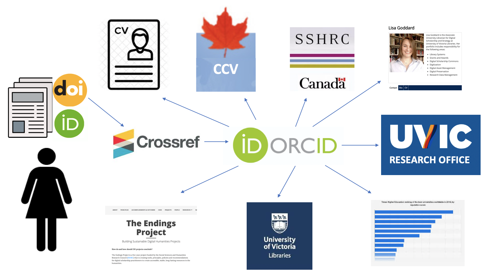
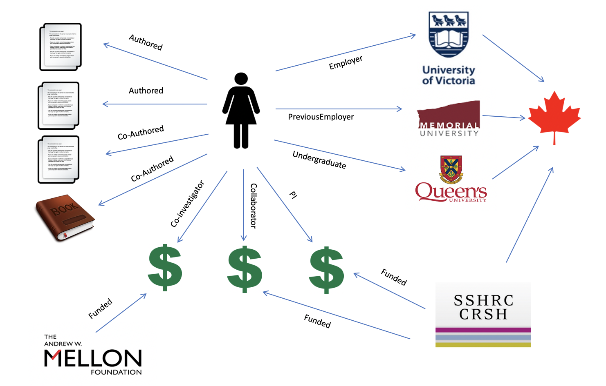
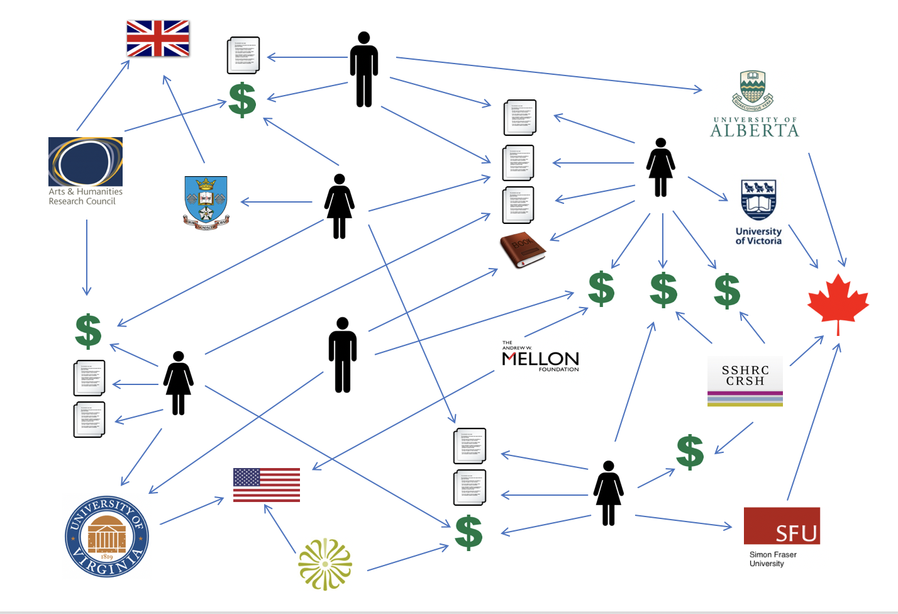

## Introduction

Persistent Identifiers, or PIDs, are emerging as one of the clearest solutions to the problem of information siloes in the research enterprise. In the current situation, university systems, funder systems, and publishing systems are all discrete and disconnected, creating a significant burden of manual work to move records from one platform to another. This burden commonly devolves to researchers, requiring them to dedicate research time and resources to basic data entry tasks, often with the requirement to enter the same information into multiple interfaces. One of the major promises of PIDs is that they can help to reduce researcher administrative burden and reporting tasks by automating the exchange of information that currently relies on manual entry. This paper explores the characteristics and benefits of PIDs, articulates the challenges to implementation, and makes recommendations for expediting the global adoption of PIDs.

## Characteristics of Research Identifiers

There are a number of established and emerging research identifiers, each of which provides a naming and linking system for a specific type of research entity. These entities include researchers, organizations, grants, research projects, and publications. Research identifiers are maintained by Registration Agencies, each of which manages the data for one or more types of entities. Crossref is an organization that manages the DOIs that are assigned to articles, ORCID manages the identifiers that are assigned to researchers, and the Research Organization Registry (ROR) manages the identifiers that are assigned to research organizations. Each of these Registration Agencies is structured and funded in a different way, and each provides unique platforms and services. Despite the distributed way in which research identifiers are created and managed, all persistent research identifiers share a common purpose: to create globally unique HTTP URIs for research entities; to provide machine readable data about those entities; and to maintain the functionality of those URIs in perpetuity.

## Globally Unique Names

During a recent rankings and reputation exercise at the University of Victoria (BC, Canada), librarians were reviewing publication data from a number of different sources to determine the volume and type of publishing activity at the university. We were puzzled that certain known items were not surfacing in our results, and on closer investigation we realized that some of our researcher affiliations were incorrectly linked to Victoria University (Melbourne, Australia). This is an example of the problem of name ambiguity. It is difficult for computers to distinguish between different entities with the same or similar human language names. The Library of Congress Name Authority service lists, for example, more than 1000 authors with the name of “John Smith” (LCNAF 2021). This problem becomes even more pronounced in countries like Korea, where almost half of the population has one of three popular surnames: Kim, Lee, or Park (Sung-jin 2016). One of the most important functions of research identifiers is to provide a “name” for an entity that is globally unique and can be used to easily disambiguate people, organizations, projects, and publications.

Many examples of unique identifiers already exist, including phone numbers, email addresses, social insurance numbers, international standard book numbers, and airport codes. The internet has a built-in system for enforcing unique names by using Uniform Resource Identifiers (URIs), the most common of which are Uniform Resource Locators (URLs) or basic web addresses. Research identifiers follow Tim Berners-Lee’s first principle of linked data to “use URIs as names for things” (Berners-Lee 2006). Because URIs can have infinite combinations of letters and numbers, and can theoretically be of any length (although in practice browsers impose limits), they are well suited for the task of naming every person, place, project, paper, and data set in the global research enterprise.

Most of the URIs that we use on the internet employ the common web protocol HTTP, which turns a string of characters into a clickable link. One enormous benefit of using HTTP URIs as names is that they are supported by all web browsers, across all internet-enabled devices, and are easily actionable by both humans and computers.

## Machine-Readable

The third principle of linked data is “when someone looks up a URI, provide useful information” (Berners-Lee 2006). In this sense, research identifiers are far more than simply unique names for people, places, and things. If you click on the HTTP URI for an identifier, it will provide more information about that entity. In the case of a person it might return information about employment, education, grants, and publications. In the case of an article it might return the journal title, date of publication, authors, and even the full text. In the case of a university it might return information about the location, number of students, programs, or affiliated researchers.

Different identifiers have different metadata schemas, depending on the properties of the type of entity that is described, but all persistent identifier services store some structured metadata that describes the entity in question. When a human user visits using a web browser, the identifier service will return information in an HTML page, but when a machine agent requests information, it can be returned in JSON and other data structures that easily allow computers to parse, transform, and ingest that information. This is the real power of research identifiers: they provide machine-readable and machine-actionable information about the research enterprise.

## Persistent

The final characteristic that is shared by research identifiers is persistence. Persistent identifiers (PIDs) are clickable links that, theoretically, should never break. Of the three characteristics discussed here, persistence is by far the most challenging to achieve. There have been many attempts to quantify the phenomenon of “link rot” on the internet. Across social media platforms about 30% of links are dead within two years of publication (SalahEldeen and Nelson 2012). The lifespan is longer for published material, but a 2013 study in BMC Bioinformatics evaluated links in the scientific literature, finding that the median lifespan of web pages was 9.3 years (Hennessey and Ge 2013). A study conducted at Harvard Law School found that 70% of Harvard academic journals, and 50% of Supreme Court cases contain dead links (Zittrain, Albert, and Lessig 2014). A 2016 study determined that, over 20 years, 98.4% of web links suffer from rot, becoming totally inaccessible to future generations (Oguz and Wallace 2016).

All PID Registration Agencies must have highly redundant storage and hosting infrastructure in order to ensure that services are globally available 24-7. If we imagine using Persistent Identifiers as our authoritative source of information about research entities, then we necessarily have to ensure that those identifiers will continue to resolve indefinitely. Most identifiers will resolve to a set of metadata describing the entity in question (e.g. a researcher), and often that data set will include URI identifiers for related entities (e.g. publications, grants, organizational affiliations). This richly interlinked dataset will allow machines to understand the relationships between research entities and will provide interesting new opportunities for analysis. If the links stop working over time, however, then we will have enormous gaps in the information graph that would not be easy to reconstruct. Once an identifier has been assigned by a Registration Agency, it is imperative that the link will always resolve and will never change. In order to assure persistence, PID providers need to have guaranteed, long-term funding sources to support significant human and computer infrastructure. In most cases that funding must flow from national governments, research organizations, and publishers.

## Benefits to Researchers

One of the most common complaints from academic researchers is related to the significant administrative burden that is imposed by funding agencies, universities, and governments. A US study conducted in 2012, and previously in 2005, consistently found that principal investigators (PIs) of federally sponsored research projects spend, on average, 42 percent of their time on associated administrative tasks (Schneider 2013). Most faculty view their primary jobs as teaching and research, and “administrative tasks, especially compliance-related administrative tasks, are viewed as a diversion from what is, in their view, their important work” (Bozeman and Youtie 2020).

 to many different stakeholders, resulting in a lot of repetitive re-keying.")

PIDs service providers maintain application programming interfaces (APIs) that permit reading from, and writing to, entity records. These APIs can be used to exchange information between different PID providers. When a researcher publishes a paper, for example, they can include their ORCID, which is a unique identifier for researchers, in their author information. The publisher can then push a notification about the article to an author’s ORCID record. At the click of a button the author can import article citation data and a unique digital object identifier (DOI) into their ORCID profile. If an ORCID is submitted to a funding agency during the grant application process, then grants information can similarly be imported into the ORCID record without the need to rekey any of the funding information.

ORCID and other PIDs are not simply connected to one another, however. The APIs also allow developers to build integrations with other research platforms that might include faculty profiles, university research information systems, and CVs. The main promise of PIDs is to reduce researcher burden by automating some of the more repetitive aspects of bureaucratic record keeping. In the UK, JISC has undertaken a cost–benefit analysis to show that the automated transfer of information between different systems, as enabled by PIDS, can lead to major efficiency gains and cost savings. Their study found that by enabling an auto-update of information across research systems, ORCID has created time savings worth more than a million pounds over five years (Brown 2021).

## Benefits to Institutions

Funding agencies and universities also stand to benefit from efficiencies gained by automatic information exchange between systems. Funders have to demonstrate impact to their parent agencies and oversight boards. The global knowledge graph created by the interlinking of PIDs can help funders to much more easily identify the publications, patents, collaborations, and open knowledge resources that are generated through their various granting programs. They can also much more easily see whether researchers have met mandated obligations for open access publishing and open data sharing.

Universities are increasingly attentive to global rankings and reputational surveys, including the Times Higher Education World Reputation Rankings and the QS World University Rankings. University administrators cannot afford to ignore rankings that impact their ability to recruit high-achieving students and faculty members and to initiate collaborations with top-ranking institutions. PIDs infrastructure promises much more accurate and timely reporting for key metrics including the number of publications produced at an institution in a given year, the total number of grants, and the amount of grant funding received.

Beyond the ability to easily produce reports on typical kinds of research metrics, the global knowledge graph produced by PIDs can also facilitate the generation of new kinds of reports, including, for example, a list of all international research collaborations at the university, or a map of all international research projects in which an affiliated faculty member is involved. This knowledge graph will also allow administrators to analyze similar information from other institutions to see how higher-ranking institutions perform on those metrics. Ultimately the knowledge graph will permit a much clearer understanding of global research networks, research impact, and the ways in which knowledge is created in a highly interconnected world.

## Implementation Challenges

Digital Object Identifiers (DOIs) already enjoy significant use and can be considered to be a mature technology. It is common practice for journal publishers to apply Crossref DOIs as unique identifiers and persistent links to published articles. Many academic libraries have begun to use Datacite DOIs in their digital repositories and data repositories, although there are still funding challenges in this space, as well as challenges to develop technical workflows that include minting URIs and registering metadata with Datacite.

ORCIDs are more of a challenge, because they require active participation from researchers to initiate the profile and to provide accurate data about affiliations and publications. The challenge here is that researchers tend to see ORCID as just another profile, and therefore just one more additional administrative burden. The main future promise of ORCID is to reduce administrative overhead for researchers, but until a critical mass of researchers participate it will not be possible for ORCID to grow into that potential. Libraries and research offices are often involved in campus campaigns to register researchers with ORCIDs, but it is likely that we will see much greater adoption when publishers and funding agencies begin to request ORCIDs on article submissions and grant applications. A 2018 European Commission report on next generation research metrics recommended that “the European research system and Open Science Cloud should adopt ORCID as its preferred system of unique identifiers, and an ORCID iD should be mandatory for all applicants and participants” (Wilsdon et al 2017).

Another key challenge is the need to integrate PIDs and their APIs into all of the many different research platforms that exist. If we hope to achieve computer-to-computer exchange of research administration information, then many different systems need to create plugins that enable use of PID APIs to read and write data. Platform providers must see demand from users in order to prioritize these plug-ins for development. We see again the problem that PIDs are really most effective when used by a critical mass of researchers and research organizations, but in order to generate that critical mass we have to be able to show immediate benefits for PID integration.

A final challenge is the unequal way in which PIDs are currently being adopted across the globe. There is significant participation by European research organizations at the national level but also within pan-continental initiatives like the European Open Science Cloud (Hellström et al. 2021). The US, Canada, Australia, and New Zealand are showing leadership in PIDs development, while countries like Japan (JaLC 2021) and China (Wang 2018) are coming on board more slowly. FREYA’s *PID Federation Scoping Study Final Report* concludes that inclusion is a major challenge, with the “dominance of North American and European participants serving to reinforce existing imbalances between global regions” (Brown 2020b). Richer countries will have to foot the bill to allow poorer countries to participate or researchers and organizations in the global south will be entirely invisible within the research graph. The real value will be apparent when PIDs are implemented for the majority of global research entities and when information can be passed transparently between organizations.

## Current State of PIDs in Canada

As of July 2021, Canada has two national PIDs consortia: ORCID-CA (CRKN 2019) and Datacite Canada (CRKN 2020). Both of these groups are coordinated by the Canadian Research Knowledge Network (CRKN). National PIDs consortia are generally established to promote and coordinate the uptake of PIDs across many different national research platforms and organizations. One key purpose of these consortia is to reduce the cost of membership to PID providers like ORCID or Datacite. Most providers will offer discounted prices to organizations that generate a lot of PIDS. The national consortia gather stakeholders into a critical mass in order to improve the negotiating position of all members. These national PIDs consortia also often help to find new funding sources for membership by lobbying governments and other research funders. In New Zealand, for example, the government has agreed to pay for ORCID memberships for all of the major national research organizations (Royal Society Te Apārangi 2021). The Australian Research Data Commons has funded Datacite memberships and DOI minting for research organizations as part of their national research infrastructure strategy (ARDC 2020). Due to efforts by CRKN and Portage, Canada’s digital research infrastructure organization (NDRIO) has agreed to fund Canadian ORCID memberships for the 2021–22 license year (Aspler 2020).

National PIDs consortia are an important means of promoting PIDs and helping to fund their adoption, but many countries also have high level steering committees that are responsible for developing an integrated PIDs strategy. The PIDs steering committees typically draw membership from a broad cross-section of research organizations including funding agencies, government departments, publishers, platform developers, libraries, research administrators, and IT administrators. These committees help to develop strategies for widespread PIDs adoption, identify gaps and opportunities for integration, consider funding options, and develop national policy around the use of PIDs as research infrastructure.

In 2019, JISC released a report titled *Developing a Persistent Identifier Roadmap for Open Access to UK Research*. This report lays out a set of proposed interventions that can help to strengthen the use of PIDs for electronic data interchange with the specific goal of reducing administrative burden for researchers (Brown 2020a, 13). A subsequent report found strong stakeholder support for a UK multi-PID consortium, concluding that “it is important to get questions of persistent identifiers into high level national strategic discussions” and that “it is important to develop governance and sustainability models that allow for long term community engagement” (Brown 2020a, 5). The Australian Research Data Commons (ARDC) was founded to “lead facilitations that work towards a coherent research environment to enable researchers to find, access, contribute to and effectively use services to maximise research quality and impact” (ARDC 2018). To help achieve this objective the ARDC has launched a comprehensive national service for delivering a variety of different research identifiers to publicly funded research agencies (ARDC 2021). The Japan Link Centre is the DOI Registration Agency for Japan, and it issues both Crossref and Datacite DOIs. They are now coordinating with ORCID in order to link DOI registered objects with researchers. Identifiers are a component of their national Open Science research platform, helping move forward the national Science and Technology Innovation Plan (JaLC 2017).

In Canada, the Canadian Persistent Identifier Advisory Committee (CPIDAC) is emerging as the national PIDs steering committee under the direction of CRKN. The committee was formed in 2020, growing out of the ORCID-CA advisory committee. CPIDAC includes representation from Canada’s Tri-Agency funders, the Canadian Association of Research Administrators (CARA), the Canadian University Council of Chief Information Officers (CUCCIO), the Canadian Association of Research Libraries (CARL), Coalition Publi.ca publishers, and research platform providers like Scholar’s Portal, PKP, and Portage. According to the Terms of Reference, “the Canadian Persistent Identifiers Advisory Committee (CPIDAC) will act in the interests of the Canadian scholarly community to provide expertise and advice to the DataCite Canada Consortium Governing Committee and the ORCID‐CA Governing Committee on leveraging maximum benefits through national adoption and use of those persistent identifiers (PIDs)” (CRKN 2021, 1).

## Emerging Types of Research Identifiers

There is no single funding model for PIDs, no single set of technologies, and no single governance model. PID providers are at different stages of maturity and some PIDs, like DOIs, are very widely implemented, while others, like the Research Activity Identifier (RAiD) have only limited use so far. All of the PIDs considered here are designed to be globally available and to serve all people and organizations within the research environment with no bias towards any particular service provider’s business needs or proprietary applications. All of these PIDs organizations are governed by a community of stakeholders, and all provide free access to entity data for unrestricted reuse. The Principles of Open Scholarly Infrastructure provide a set of guidelines that PID organizations are encouraged to follow in order to ensure open membership and open data (Bilder, Lin, and Neylon 2020).

## Digital Object Identifiers (DOIs) for Publications, Data Sets, and Software

DOIs are the most commonly recognized type of persistent research identifier. They are increasingly used as permanent links to published articles and can often be found in article citations. All DOIs have a similar structure:

> [https://doi.org/10.1080/01639374.2014.946573](https://doi.org/10.1080/01639374.2014.946573)

> doi.org: domain name 

> 10.1080: prefix indicates the publisher

> 01639374.2014.946573: suffix identifies the digital object

In most cases PIDs will take you to a record that describes the entity in question, but DOIs are a little different. The DOI database does contain a record of the article metadata, but it also provides redirection services. When I click the DOI above, for example, I am redirected to the full text of the article in question, which is hosted on the Taylor and Francis journal platform. In this way, DOIs act not just as a permanent identifier for an article, but as a persistent link to the full text of that article. This persistent link will only continue to work, however, for as long as the publisher that created the DOI ensures that redirection links are up to date in the DOI database. When a journal migrates to a new platform or changes its URLs for any reason, the DOI record must be updated so that it redirects to the new link. The DOI itself will never change, as it will simply redirect a user to the current location of an article.

DOIs are a great solution for the problem of URIs that change over time, but this approach does depend on journal publishers, repositories, libraries, and other major hosting organization to be responsible for maintaining current link information within the DOI records that they have created. One of the most important things to understand about persistent digital objects is that all technological solutions depend on networks of people to continue to maintain accurate data within those systems.

There are two major organizations that register DOIs: Crossref and Datacite. In both cases, publishers and hosting organizations pay a fee to create DOIs, and this fee structure supports the ongoing maintenance of infrastructure, technical support, and governance. Crossref is one of the oldest PID providers. It began in the early 2000s, and the membership primarily consists of journal publishers. Most major academic publishers are Crossref members, along with many smaller, not-for-profit and society publishers. The Crossref metadata schema is optimized for journal articles, conference proceedings, and other common published formats (Crossref, 2020). Datacite is an organization that primarily provides DOIs for repositories and digital asset management systems. Many libraries, repositories, and academic sharing platforms are Datacite members. The Datacite metadata schema is optimized for research data sets and software (Datacite 2021).

## ORCID Identifiers for Researchers

Commercial publishers have long assigned unique identifiers to their authors for the purposes of disambiguation and reporting. The two most well-known of these are Elsevier’s SCOPUS Author ID (e.g. [https://www.scopus.com/authid/detail.uri?authorId=34980040700](https://www.scopus.com/authid/detail.uri?authorId=34980040700) and the Thompson Reuters ResearcherID (e.g. [http://www.researcherid.com/rid/S-1241-2016](http://www.researcherid.com/rid/S-1241-2016). While these IDs are useful within the context of a specific publisher platform, they do not provide a means of linking all of an author’s work, projects, grants, and other types of information that are outside the direct interest of a given publisher.

ORCID has emerged as the international standard for author identifiers for several reasons: anyone can get an ORCID, researchers can control the information in their ORCID profiles, and ORCID has open APIs that permit integrations with many other research platforms. A researcher’s ORCID profile contains sections for employment, education and qualifications, invited positions and distinctions, membership and service, funding, and works. Researchers can decide how much of this information they wish to share with ORCID, and they can also control the way in which ORCID will share that information with other research platforms. Researcher control of their own ORCID record is one of ORCID’s “core principles” (ORCID 2018).

Once a researcher has an ORCID, then they can provide that identifier as part of their submission information for publications, grant applications, and open repositories. This permits all of a researcher’s work, across many different platforms, to be correctly attributed to them, with no chance of ambiguity. One John Smith ([https://orcid.org/0000-0002-3335-9488](https://orcid.org/0000-0002-3335-9488)) can easily be distinguished from another John Smith ([https://orcid.org/0000-0001-6066-793X](https://orcid.org/0000-0001-6066-793X)).

Any researcher can create an ORCID at no cost, however, maintaining permanent identifiers and records for more than 12 million researchers (ORCID, Statistics, 2021) is a costly endeavour. ORCID is funded through organizational memberships from universities, publishers, government agencies, and research organizations. These agreements allow member organizations to access ORCID’s member API, which permits more sophisticated read–write integrations than the basic public API that is available to all. Some countries have created national consortia to fund ORCID membership and to advocate for the use of research identifiers (ORCID, Consortia, 2021).

## ROR Identifiers for Organizations

The Research Organization Registry (ROR) aims to provide unique linked data identifiers for organizations to help solve the problem of researcher affiliation. Once researchers have been disambiguated through ORCID identifiers, we still have the problem of accurately connecting that researcher to their university or research centre. There exist a number of identifiers for research organizations, including ISNI and Ringgold, but none of these is comprehensive enough to represent the full global network. ROR tries to link all existing organization identifiers into a single record that transcends any particular service provider’s business needs (Madden 2019).

When a researcher’s ORCID profile contains a unique organizational identifier, rather than a text string, it becomes a trivial problem for an algorithm to understand that a given researcher works at the University of Victoria in BC, Canada ([https://ror.org/04s5mat29](https://ror.org/04s5mat29)) rather than Victoria University in Melbourne, Australia ([https://ror.org/04j757h98](https://ror.org/04j757h98)), or the Victoria University of Bangladesh ([https://ror.org/0054vex45](https://ror.org/0054vex45)).

ROR is a relatively new identifier that launched in 2019. DOI providers, Crossref and Datacite, were key drivers of this initiative, along with partners in the California Digital Library and Digital Science. It has so far been funded by the founding members with some community and funder support. ROR is developing a business model that will offer an optional paid service to members who wish to access advanced features (ROR 2019).

## Crossref Grant Identifiers

Research Grants are a key component of research that until recently had no global identifiers. It is very difficult to determine which grants resulted in which publications, collaborations, or open educational resources. This information is of significant interest to funding agencies as they seek to measure impact, but it will also help research teams to track all of their related grants and the outputs for each in order to more easily report results to funders. Grant IDs are also a way for institutions to track all of the awards that have been received by affiliated researchers.

Crossref has recently begun to tackle this problem based on priorities identified by their funder advisory group (Crossref 2020). The work so far has been led by large research funders including Wellcome and the Medical Research Council in the UK, and the National Institutes of Health in the US (Kiley, Frentrop, and Hendricks 2018). Grant IDs would include a prefix that identifies the related funding agency, along with a unique id for each grant that can repurpose the internal grant identifiers that already exist in most funding agencies.

## Research Activity Identifier (RAiD) for Research Projects

The Research Activity Identifier (RAiD) provides a unique persistent identifier for research projects. The RAiD metadata schema allows researchers to connect information about a research project with information about related funders, organizations, collaborators, publications, and data sets. RAiD is one of the newest global research identifiers. It was developed by the Australian Data Life Cycle Framework Project, and it has so far seen significant adoption in Australia and New Zealand (RAiD 2021).

## Connecting PIDs

There are currently a number of established and emerging PIDs that represent many of the key entities that together comprise the global research ecosystem. Each of these PIDs provides a unique identifier for an entity, a record of information about the entity in question, and an API that allows computers to query and exchange information. The benefit of PIDs is most apparent when they are interlinked with one another. This means that the ORCID record associated with a researcher will also contain RORs for institutional affiliations, DOIs for publications, Grant IDs for the grants on which that person is a collaborator or investigator, and RAIDs to connect them with the different research projects of which they have been a part.

This interlinking of identifiers will allow automated processes to connect information across systems as well. The metadata record associated with the DOI for a given publication will include ORCID identifiers for each of the authors. The author ORCID profile provides a ROR for their institutional affiliation, and the ROR record contains information about the location of that institution. Drawing on this graph of information, it would be possible to write a query to return the titles of all journals that contained at least one article written by an Australian researcher in 2020. Although no single system contains all of the needed information elements to answer that query, automated processes can traverse the linked data graph to collect the information from across platforms.

## PIDS and the FAIR Principles

The FAIR guiding principles for scientific data management and stewardship are a set of guidelines that help to improve the findability, accessibility, interoperability, and reuse of digital assets (Wilkinson et al 2016). PIDs are exemplary implementations of FAIR data in their own right, but they also help to provide FAIR access to research entities like articles and datasets.

All of the PID providers discussed in this article adhere to the FAIR principles. Each provider offers findability via a search interface that allows people or machines to look up identifiers for any given entity ([https://ror.org/search](https://ror.org/search) or [https://search.crossref.org/](https://search.crossref.org/)). The linked data graph also offers enhanced findability via the linked paths that can be followed from one record to the next. PID data is easily accessed by humans and machines using the ubiquitous HTTP protocol and via open APIs. Global PID providers have policies that ensure that the data in their records is open and available for use without restriction and that the data is returned in open formats, like JSON, that can be used by humans and machines alike. The data is deliberately designed to be easily accessed and reused across many different research systems. Beyond the fact that PIDs expose a lot of FAIR data in their own systems, they are also a means of ensuring that articles, data sets, and other research outputs are also findable and accessible. DOIs, for example, provide permanent links to scholarly articles, presentations, data sets, conference proceedings, and many other types of research outputs.

## Conclusion and Recommendations

Persistent Identifiers show a great deal of promise for overcoming information siloes in the research landscape and for creating a much more richly interconnected graph of information that can permit automated exchange of information about researchers, projects, publications, research institutions, grants, and funders. PIDs like DOI and ORCID have relatively mature technologies and business models, while others, like ROR and RAiD, are emergent. In order to reap the full potential benefit of PIDs, they must be adopted and used by all of the organizations that form the global research enterprise, including researchers, publishers, universities, and funders.

In order to drive the adoption of ORCID, it is essential to improve researcher awareness of the benefits of PIDs to help reduce administrative burden. The educational component of this work can be supported by national steering groups like the Australian Research Data Commons and the Canadian Persistent Identifiers Advisory Committee. Academic libraries are core members of these steering groups, and they play an important role in educating researchers. ORCID mandates from publishers and funders, as proposed by the European Commission’s Directorate-General for Research and Innovation, are also a key driver for ORCID adoption by researchers.

Like all research infrastructure, PID infrastructure comes with significant cost, so it is critical to find long-term funding models to develop and sustain the necessary technical platforms and human expertise. While academic publishers bear most of the cost of Crossref DOIs, government funding can help to defray the national costs of other PID memberships as we have seen in New Zealand and Australia. In order to produce a truly global knowledge graph, rich countries must also help to fund and support the development of PIDs infrastructure in less wealthy countries. Finally, there is much work to be done to develop PID integrations in research information and publishing systems, so that these platforms can exchange information seamlessly without manual intervention. Commercial vendors of these systems will prioritize these features when sufficient demand exists from client institutions, so universities and research organizations must also understand the value proposition and work to integrate PIDs into all aspects of their record keeping. Realistically, we are at least a decade away from the fairly seamless automated interchange of research information, even among wealthy countries, but PIDs offer a technical roadmap for achieving this goal, which can ultimately reduce administrative burden at all levels of the global research enterprise.

## Works Cited

Aspler, John. 2021. “Persistent Identifiers in Canada: ORCID-CA and DataCite Canada - White Paper.” December 2021. Ottawa: Canadian Research Knowledge Network [https://engagedri.ca/assets/documents/whitepapers/PIDs-White-Paper-Final.pdf](https://engagedri.ca/assets/documents/whitepapers/PIDs-White-Paper-Final.pdf)

Australian Research Data Commons (ARDC). 2018. “Identifier Services: Connecting Objects to Important Context.” Accessed May 20, 2021. [https://ardc.edu.au/services/identifier/](https://ardc.edu.au/services/identifier/)

———. 2020. “DOI Technical Changes: Transition to DataCite DOI services.” May 15 2020. Accessed May 20, 2021. [https://documentation.ardc.edu.au/display/DOC/DOI+Technical+Changes:+Transition+to+DataCite+DOI+services](https://documentation.ardc.edu.au/display/DOC/DOI+Technical+Changes:+Transition+to+DataCite+DOI+services)

———. 2021. “About Us.” Accessed May 20, 2021. [https://ardc.edu.au/about_us/](https://ardc.edu.au/about_us/)

Bilder, Geoffrey, Jennifer Lin, and Cameron Neylon. 2020. “The Principles of Open Scholarly Infrastructure.” Accessed May 20, 2021. [https://doi.org/10.24343/C34W2H](https://doi.org/10.24343/C34W2H)

Brown, Josh. 2020. “Developing a Persistent Identifier Roadmap for Open Access to UK Research.” London: Joint Information Steering Committee (JISC). April 2020. [https://repository.jisc.ac.uk/7840/2/PID_roadmap_for_open_access_to_UK_research.pdf](https://repository.jisc.ac.uk/7840/2/PID_roadmap_for_open_access_to_UK_research.pdf)

———. 2020. “PID Federation Scoping Study: Final Report.” FREYA Project. September 30, 2020. Brussels: European Commission. [http://doi.org/10.5281/zenodo.4059557](http://doi.org/10.5281/zenodo.4059557)

———. 2021. “Mapping the UK’s Path to a PIDS-Optimized Future.” *PIDS in Practice Webinar Series*. Ottawa: Canadian Research Knowledge Network. ([https://vimeo.com/531458561](https://vimeo.com/531458561)

Berners-Lee, Tim. 2006. “Linked Data.” W3C Design Note. July 27 2006. Accessed May 17, 2021. [https://www.w3.org/DesignIssues/LinkedData](https://www.w3.org/DesignIssues/LinkedData)

Bozeman, Barry and Jan Youtie. 2020. “Robotic Bureaucracy: Administrative Burden and Red Tape in University Research.” *Public Admin Review* 80: 157–162. [https://doi.org/10.1111/puar.13105](https://doi.org/10.1111/puar.13105)

Canadian Research Knowledge Network (CRKN). 2019. “Welcome to ORCID-CA: The ORCID Canada Consortium.” Accessed May 17, 2021. [https://www.crkn-rcdr.ca/en/orcid-ca-home](https://www.crkn-rcdr.ca/en/orcid-ca-home)

———. 2020. “DataCite Canada Consortium.” Accessed May 17, 2021. [https://www.crkn-rcdr.ca/en/datacite-canada-consortium](https://www.crkn-rcdr.ca/en/datacite-canada-consortium)

———. 2021. “Terms of Reference for the Canadian Persistent Identifiers (PID) Advisory Committee (CPIDAC).” April 2021. [https://www.crkn-rcdr.ca/sites/crkn/files/2021-04/CPIDAC_ToR%20-%20EN.pdf](https://www.crkn-rcdr.ca/sites/crkn/files/2021-04/CPIDAC_ToR%20-%20EN.pdf)

Crossref. 2020. “Crossref Metadata Deposit Schema 4.4.2.” April 2020. Accessed May 15, 2021. [https://www.crossref.org/education/content-registration/crossrefs-metadata-deposit-schema/metadata-deposit-schema-4-4-2/](https://www.crossref.org/education/content-registration/crossrefs-metadata-deposit-schema/metadata-deposit-schema-4-4-2/)

———. 2020. “Registering Research Grants.” Accessed May 17, 2021. [https://www.crossref.org/community/grants/](https://www.crossref.org/community/grants/)

DataCite Metadata Working Group. 2021. “DataCite Metadata Schema Documentation for the Publication and Citation of Research Data and Other Research Outputs. Version 4.4.” London: DataCite. [https://doi.org/10.14454/3w3z-sa82](https://doi.org/10.14454/3w3z-sa82)

Kiley, Robert, Nina Frentrop, and Ginny Hendricks. 2018. “Wellcome Explains the Benefits of Developing an Open and Global Grant Identifier.” Accessed May 20, 2021. [https://www.crossref.org/blog/wellcome-explains-the-benefits-of-developing-an-open-and-global-grant-identifier/](https://www.crossref.org/blog/wellcome-explains-the-benefits-of-developing-an-open-and-global-grant-identifier/)

Hellström, Maggie, André Heughebaert, Rachael Kotarski, Paolo Manghi, Brian Matthews, Raphael Ritz, and Mario Valle. 2020. “Second draft Persistent Identifier (PID) Policy for the European Open Science Cloud (EOSC) (Ver 2.0).” Brussels: EOSC. [http://doi.org/10.5281/zenodo.3780423](http://doi.org/10.5281/zenodo.3780423)

Hennessey, Jason and Steven Xijing Ge. 2013. “A Cross Disciplinary Study of Link Decay and the Effectiveness of Mitigation Techniques.” *BMC Bioinformatics* 14, no.##  S5. [https://doi.org/10.1186/1471-2105-14-S14-S5](https://doi.org/10.1186/1471-2105-14-S14-S5)

Japan Link Centre (JaLC). 2017. “Japan Link Center Strategy 2017-2022: Connecting Japan, Lasting Access.” Tokyo: Japan Science and Technology Agency. [https://japanlinkcenter.org/top/doc/JaLC_strategy2017en.pdf](https://japanlinkcenter.org/top/doc/JaLC_strategy2017en.pdf)

———. 2021. “Japan Link Center supports permanent linking to academic information by DOI.” Accessed May 20, 2021. [https://japanlinkcenter.org/top/english.html](https://japanlinkcenter.org/top/english.html)

Library of Congress. 2021. “Library of Congress Name Authority File.” Accessed May 15, 2021. [https://id.loc.gov/authorities/names.html](https://id.loc.gov/authorities/names.html)

Madden, Frances. 2019. “New Types of Persistent Identifiers.” *The PID Forum*. November 2019. [https://www.pidforum.org/t/new-types-of-persistent-identifiers/743](https://www.pidforum.org/t/new-types-of-persistent-identifiers/743)

Oguz, Faith, and Wallace Koehler. 2016. “URL Decay at Year 20: A Research Note.” *Journal of the Association for Information Science and Technology* 67, no. 2 (June): 477–479. [http://dx.doi.org/10.1002/asi.23561](http://dx.doi.org/10.1002/asi.23561)

ORCID. 2018. “You are in Control of your ORCID Record.” Accessed May 15, 2021. [https://support.orcid.org/hc/en-us/articles/360006972433-You-are-in-control-of-your-ORCID-record](https://support.orcid.org/hc/en-us/articles/360006972433-You-are-in-control-of-your-ORCID-record)

———. 2021. “ORCID Consortia Members.” Accessed May 15, 2021. [https://orcid.org/consortia](https://orcid.org/consortia)

———. 2021. “ORCID Statistics.” Accessed May 15, 2021. [https://orcid.org/statistics](https://orcid.org/statistics)

Research Activity Identifier (RAiD). 2021. “RAiD is a Persistent IDentifier for Research Projects.” Accessed May 15, 2021. [https://www.raid.org.au/](https://www.raid.org.au/)

Research Organization Registry (ROR). 2019. “Governance.” Accessed May 20, 2021. [https://ror.org/governance/](https://ror.org/governance/)

Royal Society Te Apārangi. 2021. “ORCID in New Zealand FAQ.” Accessed May 15, 2021. [https://www.royalsociety.org.nz/orcid-in-new-zealand/new-zealand-orcid-consortium/orcid-in-nz-faq/](https://www.royalsociety.org.nz/orcid-in-new-zealand/new-zealand-orcid-consortium/orcid-in-nz-faq/)

SalahEldeen, Hany, and Michael Nelson. 2012. “Losing My Revolution: How Many Resources Shared on Social Media Have Been Lost?” In: *Theory and Practice of Digital Libraries. Lecture Notes in Computer Science* 7489. Berlin: Springer. [https://doi.org/10.1007/978-3-642-33290-6_14](https://doi.org/10.1007/978-3-642-33290-6_14)

Schneider, Sandra. 2014. “Results of the 2012 Faculty Workload Survey.” Washington DC: Federal Demonstration Partnership. [https://sites.nationalacademies.org/cs/groups/pgasite/documents/webpage/pga_087667.pdf](https://sites.nationalacademies.org/cs/groups/pgasite/documents/webpage/pga_087667.pdf)

Sung-jin, Choi. 2016. “Kim, Lee, Park Remain Three Most Common Surnames.” *The Korea Times*, Sept 18, 2016. [https://www.koreatimes.co.kr/www/news/nation/2016/09/116_214152.html](https://www.koreatimes.co.kr/www/news/nation/2016/09/116_214152.html)

Wang, Weilang, Lvxiang Deng, Bin You, Ping Zhang, and Yifeng Chen. 2018. “Digital Object Identifier and its Use in Core Chinese Academic Journals: A Chinese Perspective.” *Learned Publishing* 31, (November): 149–154. [https://doi.org/10.1002/leap.1137](https://doi.org/10.1002/leap.1137)

Wilkinson, Mark, Michel Dumontier, Jan Aalbersberg, Gabrielle Appleton, Myles Axton, Arie Baak, Niklas Blomberg *et al.* 2016. “The FAIR Guiding Principles for Scientific Data Management and Stewardship.” *Scientific Data* 3,##  no. 160018. [https://doi.org/10.1038/sdata.2016.18](https://doi.org/10.1038/sdata.2016.18)

Wilsdon, James, Judit Bar-Ilan, Robert Frodeman, Elizabet Lex, Isabella Peters, and Paul Wouters. 2017. “Next-generation Metrics: Responsible Metrics and Evaluation for Open Science.” Brussels: European Commission. [https://doi.org/10.2777/337729](https://doi.org/10.2777/337729)

Zittrain, Jonathan, Kendra Albert, and Lawrence Lessig. 2014. “Perma: Scoping and Addressing the Problem of Link and Reference Rot in Legal Citations.” *Legal Information Management* 14, no. 2 (June): 88–99. [https://doi.org/10.1017/S1472669614000255](https://doi.org/10.1017/S1472669614000255)

