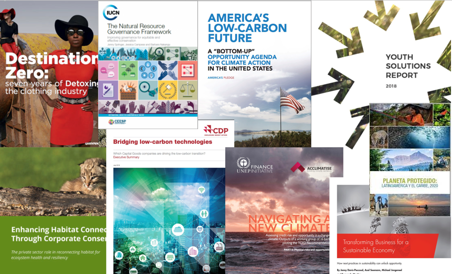
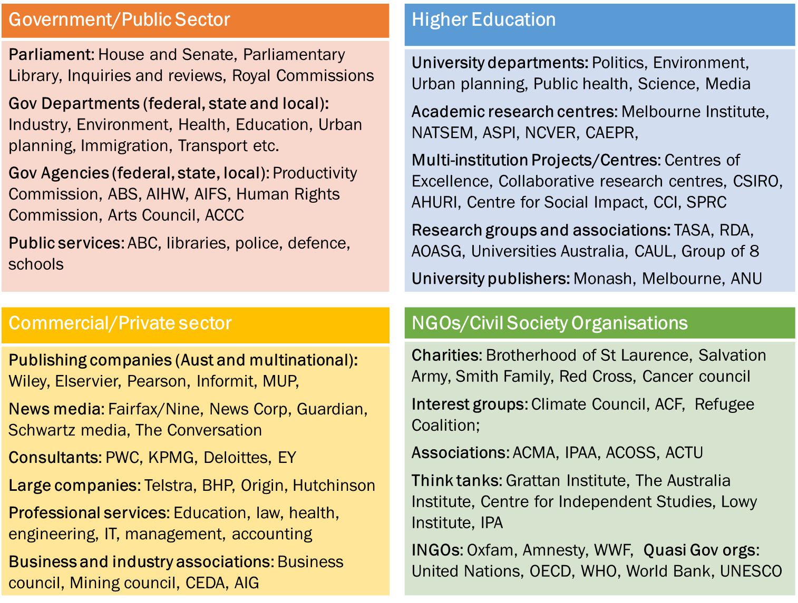
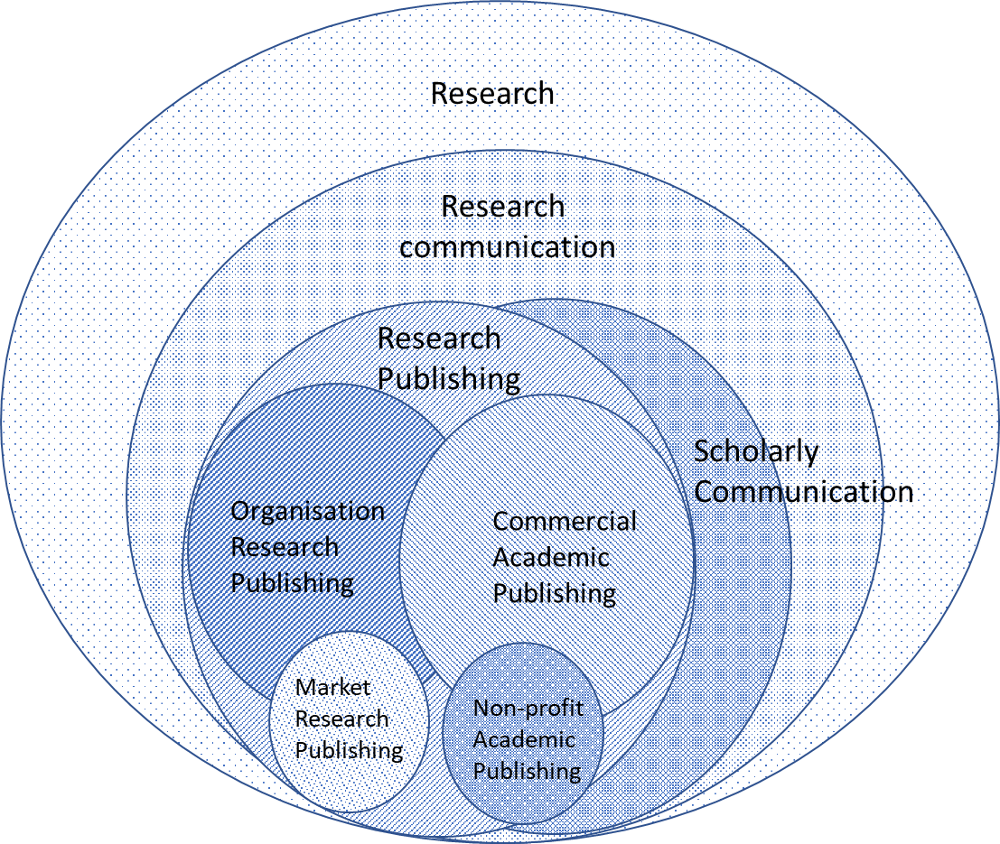

---

Research publishing involves the production, use, and management of research in a variety of genres and formats by commercial and non-profit academic publishers, and by many other organizations in government, civil society, university, and industry sectors. Although often considered primarily in terms of academic journals and books, many other genres, including research reports, conference papers, policy briefs, discussion papers, literature reviews, data sets, and visualisations, are regularly produced as to disseminate research findings. Research reports and papers produced by diverse organizations outside the formal publishing system play a critical role in research and development (R&D), innovation, and public policy, yet they are often overlooked (MacDonald et al. 2016). This is reflected in the terms used to describe them, such as “grey literature,” “unpublished literature,” or “non-traditional research outputs.” Peer-reviewed academic journals and, to a lesser extent, books produced by commercial academic publishers have come to dominate scholarly communication to the point where other genres are excluded or ignored in both analysis and practice. This is partly due to the lack of adequate terminology to describe various publishing practices. In this paper I provide an overview of the diverse genres and producers involved in publishing research and suggest new terminology that may allow a holistic, systems-oriented approach to analysing research publishing, which takes into account the spectrum of formal and informal, commercial and non-commercial publishing economies.

Academic publishing today is a prolific global industry with around 10,000 journal publishers globally, producing over 42,000 scholarly journals (Johnson et al. 2018, p. 25). The science and technology publishing market alone was valued at US$25 billion in 2018 (Johnson et al. 2018). The commercial academic publishing industry is deeply embedded in the higher education system as the main vehicle for the dissemination of academic research via peer-reviewed academic journals and books (Fyfe et al. 2017; Larivière et al. 2015). Many studies in scholarly communication have provided important insights into the formal academic publishing industry and the potential of non-commercial academic publishing and infrastructure to disrupt current models and increase open access to academic outputs, including data and other aspects of the scholarly record (Arbuckle et al. 2014; Borgman 2007; Borgman 2008; Houghton & Sheehan 2006; Montgomery et al. 2018; Piwowar et al. 2018; Tennant et al. 2016).

The dominance of commercial academic publishing and peer-reviewed academic journals has led various groups to campaign for greater diversity in scholarly communication. The term bibliodiversity has been adopted recently by various scholars and research groups to raise awareness of the need for diverse publishing strategies, business models, and infrastructure within the research communication system. In 2017 a group of researchers at Jussieu university in France published a *Call for open science and bibliodiversity* with eight demands including more variety and innovation in publishing models and writing practices (Jussieu 2017). In April 2020 there was another call from the Confederation of Open Access Repositories (COAR) to *Foster bibliodiversity in scholarly communication* (Shearer et al. 2020). They argue that “diversity is an essential characteristic of an optimal scholarly communications system”, yet rather than diversifying, academic publishing has become increasingly a monoculture, dominated by academic journals and controlled by multinational publishing companies (Shearer et al. 2020). They call for greater diversity in form and genre and for investing in the community infrastructure required for long-term public access and use of research resources.

While I fully support these calls, in this article I argue that there is far greater diversity already occurring in research communication; however, the dominance of the formal academic publishing industry has obscured the non-commercial and informal publishing activities of organizations as research publishers. To address this research, publishing needs to be understood holistically as a diverse, multicentric, multisector, and multigenre media economy, involving a range of actors, producing, using, and managing research-based knowledge across a spectrum of formal and informal, commercial and non-commercial practices. This diverse publishing system has been developed in tandem with other institutions such as government, higher education, civil society, and industry, and both reflects and produces the complex policymaking environment and knowledge economy of the digital age (Cairney et al. 2019; Dearman et al. 2018). Organization research publishing needs to be recognized as a key part of the wider research communication system in order to be managed effectively and ensure the system as a whole is equitable, efficient, credible, and sustainable as a knowledge commons (Hess & Ostrom 2007).

## Understanding Multisector Publishing

Alongside the expansion of commercial publishing to industrial levels over the last 500 years, there has been continuous development of non-commercial, non-market, and informal publishing practices. Governments, civil society organizations, and industries have used a range of technologies from the printing press, typewriters, and photocopiers to computers and the internet to communicate their research and ideas, share technical innovations, argue positions, and support their mission. Digital technologies have enabled new media forms and diverse experiments in social production by the community (Benkler 2006; Flew 2014; Hartley et al. 2013; Lievrouw & Livingstone 2006; Lobato & Thomas 2015). These approaches move beyond commercial economies of research publishing to take into account the informal, non-profit, non-commercial modes of communication and media practices, and the affordances of various digital technologies that have enabled so much low-cost experimentation (Lobato & Thomas 2015). In the 21^st^ century digital technologies have enabled new, low cost ways to publish, disseminate, discover, use, curate, and manage research, and these innovations have significantly increased the amount and diversity of research publications available and the range of producing organizations involved across the formal and informal publishing economy (Lobato 2013). As Lobato (2013) points out, the study of informal economic activity is four decades old but has not been extensively applied to media industries despite the proliferation of unregulated production with digital technologies.

In the digital age diversity is not just a matter of commercial versus non-commercial business models or Open Access versus subscription databases. Diversity is a characteristic of almost every aspect of organization-based research publishing. Organizations engaged in publishing activities are based in all sectors of the R&D system—government, business, civil society, and higher education—and they produce and disseminate a wide range of resources designed for niche or special interest groups and actors as much as for a general audience. Research users are based in all sectors of society, working in a variety of roles, and require research publications on a wide range of topics, from diverse sources and perspectives and exploiting a variety of research methods, presentation styles, and levels of complexity. Even collection and management are more diverse than is often recognized, involving national libraries and archives, university libraries, and institutional repositories, and a variety of local, national, and international research databases and infrastructure run by research groups, civil society organizations, government agencies, and private companies. In addition, producers, users, and collecting services are all working in a context of rapidly changing digital media content, platforms, and technologies, which are transforming many aspects of the research publishing circuit.

The proliferation in research publishing is a response to the huge investment in research and development occurring around the world. According to UNESCO figures, global spending on R&D reached a record high of almost US$ 1.7 trillion in 2019 (UIS 2020). Average expenditure on research and development as a percentage of gross domestic product (GDP) was 2.4% globally in 2018 (OECD 2018). The Australian Bureau of Statistics (ABS) reports on R&D categorized into four sectors and in the 2017-18 period, business spent over AU$17 billion, higher education AU$11 billion, government AU$3 billion and the private non-profit sector over AU$1 billion on R&D (ABS 2019). From this investment in research we can expect to see some level of research communication and knowledge transfer within each sector, as research publications, but also through datasets and other formats, training and education, technologies and processes.

Drilling down beyond the sector level, what kinds of organizations and companies are involved in producing research publications in Australia? Figure 1 maps the various types of organizations engaged in publishing across the R&D system in Australia with examples to give a sense of the scale and diversity of participants. I take a broad definition of organisations based on ABS classifications to cover legal entities that may be public, private, or not-for-profit. Although this model shows the variety of organizations involved, it is important to note that it also simplifies the landscape, leaving out many hybrid institutions and collaborative centres and networks working across multiple sectors that are often significant research publishers.

{ }

As Figure 1 shows, within each sector there are diverse categories of organization ranging from small charities to global consulting firms, think tanks to government agencies. How best to describe the outputs of this complex evidence ecosystem? This requires new language for defining and classifying research publishing. Publications produced by organizations not considered to be publishers are often referred to as unpublished, non-published, or grey literature (Farace and Schopfel 2010; Mahood et al 2014). Even reports from the World Health Organisation (WHO) or UNESCO may be described this way. This language may have been suitable prior to the internet, but it makes little sense today when the internet provides a global publishing platform for any kind of media producer. Without appropriate terminology for this diverse publishing ecosystem, it is overlooked and often not managed effectively and efficiently with appropriate standards and infrastructure to ensure resources are discoverable and accessible. Therefore, we need to review our understanding of what publishing means and clarify the terms used in order to provide a model for the system as a whole.

## Beyond Published, Unpublished and Grey Literature: A New Typology for Research Publishing

To publish carries the broad meaning of “to make information available to the public” (Cambridge 2020); however, it is also often defined as a market-based activity, whereby to publish is “to make information available to people, especially in a book, magazine, or newspaper, or to produce and sell a book, magazine, or newspaper” (Cambridge 2020). The conflation of publishing with market-based trade in the second definition has made it difficult to distinguish between the act of making something public and the business of selling publications. As a result, content produced, published, and distributed for free in the public arena by governments and organizations is often referred to as “unpublished” because it is not produced by a commercial publisher. It is not uncommon to see references in books and journals to “unpublished literature” when referring to documents that are public and technically published (see for example, Gough et al. 2016; Higgins et al. 2020; Hopewell et al. 2006; Mahood et al. 2013). Thus there is a great deal of confusion, especially in academic literature, about what counts as a publication and what it means to be published. In the digital era where content can be available to the world in an instant, we need to adopt a broad definition of publishing as the act of making information available to the public in various formats and genres using any type of market or non-market business model, distribution channel, or platform.

Another key term used to describe informal publishing practices is grey literature, which is used in disciplines such as library science and information management to describe a range of publication types and sources produced and distributed outside of commercial publishing channels (Farace & Schopfel 2010, p. 1). Grey literature has been adopted as a term across various disciplines as a collective noun for publications that are not available for purchase or acquisition through commercial publishers and often lack “bibliographic control,” standard descriptions used in publishing and libraries for managing publications (Adams et al. 2016; Feather & Sturges 2003; Garousi et al. 2019). Grey literature is generally distinguished from more formal publications such as books and journal articles on the one hand and private or ephemeral publications on the other. These are sometimes described as white literature and black literature, respectively (see Farace and Schopfel 2010, p. 36; Garousi 2019). Although sometimes they are reversed—making the terminology even more confusing. This approach is illustrated in , which shows that a wide range of formats and genres may end up grouped under the term grey literature.

| Formal commercial publications (white/black) | Informal organization publications (grey) | Unpublished personal, archival and ephemera (white/black)     
|--------------------------------------------------------------------|
| Books                 | Annual reports       | Records             |
| Book chapters         | Blogs                | Emails & letters    |
| Journals              | Briefings & guides   | Personal notes      |
| Journal articles      | Conference papers    | Minutes             |
| Magazines             | Datasets             | Conversations       |
| Newspapers            | Discussion papers    | Ephemera            |
|                       | Evaluations          |                     |
|                       | Pamphlets            |                     |
|                       | Reports              |                     |
|                       | Submissions          |                     |
|                       | Working papers       |                     |

Table 1. Publication classification based on the grey literature approach

While grey literature can be useful as a collective term, it also has a number of problems associated with it. The term is poorly defined and often used in conflicting ways—sometimes to refer to very specific types of publications, such as reports from think tanks—but at other times to include everything, even books and journal articles (Paez 2017). The Greynet website lists 161 formats that can be considered grey literature, including articles, reports, policy documents, legislation, databases, and software (Greynet 2020). A tweet and a WHO report may both be produced outside of commercial publishing channels, but is it really useful to call them both grey literature? This has practical implications for how research publications are used and managed, due to confusion about their status and value as research “literature” (Baxter & Hilbrecht 2019). Finally, as a term, grey literature is opaque and obscure, the semantic resonance conveying negative connotations of something shadowy or even illegal. The use of a colour scheme is also highly problematic. Is it still helpful today to use descriptors such as white and grey literature to analyze research publishing practices and business models?

I have used the term grey literature extensively in my own work, on the Grey Literature Strategies project, and in various publications (Lawrence 2010; 2012; Lawrence et al. 2014; 2015; 2018). However, I have long found it unsatisfactory and am now convinced that we need new terminology to describe different research publishing models and practices. Many authors seem to avoid the term grey literature, using a range of alternative terms such as policy reports, report literature, reports and papers, professional literature, industry reports, unpublished literature, non-academic literature, “research outside the academy,” or simply evidence (Borjesson 2019).

I would argue that while useful in certain contexts, none of these terms can be used as general terms if we want to take a holistic approach to the research publishing system. Therefore, I have developed my own terminology, which also takes into account the other models of research publishing as they exist in relation to each other. I categorize research publishing into four types or models: commercial academic publishing (CAP), non-profit academic publishing (NAP), organization-based research publishing (ORP), and commercial market-research publishing (CMP). This typology is shown in Table 2 with examples of participants, sectors, and formats.

<table cellspacing="0" cellpadding="0" class="t1">
  <tbody>
    <tr>
      <th valign="top" class="td1">
        
<b>Research publishing category</b>

      </th>
      <th valign="top" class="td1">
        
<b>Subcategories</b>

      </th>
      <th valign="top" class="td1">
        
<b>Main formats/genres produced</b>

      </th>
    </tr>
    <tr>
      <td valign="top" class="td1">
        
Commercial academic publishing (CAP)

      </td>
      <td valign="top" class="td1">
        
Multinational companies: RELX, Wiley, Springer, Wolters Kluwer

        
 

        
SMEs: Sage, Emerald

        
NFPs: Ithaka Harbors, JSTOR, Informit

        
Uni Presses: OUP, Cambridge, MUP, CSIRO

        
Scholarly societies: IEEE, Chemical society

      </td>
      <td valign="top" class="td1">
        
Academic journals and monographs

        
Research data and records

        
Research databases

        
Research infrastructure

      </td>
    </tr>
    <tr>
      <td valign="top" class="td1">
        
Non-profit academic publishing (NAP)

      </td>
      <td valign="top" class="td1">
        
Foundations: Wellcome trust, JISC

        
Education: University presses: ANU press

        
University projects: Open Knowledge Project,

        
 

        
Government agencies: NIH

      </td>
      <td valign="top" class="td1">
        
Academic journals, Monographs

        
Preprints and postprints

        
Research data and records

        
Research databases

        
Research infrastructure

      </td>
    </tr>
    <tr>
      <td valign="top" class="td1">
        
Organization research publishing (ORP)

      </td>
      <td valign="top" class="td1">
        
Government: AIHW, AIC, Inquiries etc

        
INGOs: UNESCO, IPCC WHO,

        
 

        
NGO: Think tanks, charities, associations, scholarly societies

        
Education: Academic research centres

        
Commercial: Consultants, research companies

      </td>
      <td valign="top" class="td1">
        
Research reports,

        
evaluations, briefings, discussion papers, working papers, technical reports, white papers, etc.

        
 

        
Research data and records

        
Research databases

        
Research infrastructure

      </td>
    </tr>
    <tr>
      <td valign="top" class="td1">
        
Commercial market-research publishing (CMP)

      </td>
      <td valign="top" class="td1">
        
Companies: Ibis world, Ganttner, Forrester

      </td>
      <td valign="top" class="td1">
        
Market research reports,

        
 

        
Industry reports

        
Research databases

      </td>
    </tr>
  </tbody>
</table>

Table 2. A new typology for research publishing

CAP involves the production of research publications, primarily academic journals and monographs, trade non-fiction, and professional publications for financial gain. It features major multinational companies as well as small and medium enterprises (SMEs), scholarly societies and some university presses.

NAP is primarily focused on the social production (Benkler 2006) and dissemination of academic journals and monographs, and some other related knowledge products such as preprints or post-prints (versions of a journal article), usually without a direct financial objective or profit-motive. Other terms used to describe this model include community-owned, scholar-led, community-based, peer-based, crowdsourced, and researcher-led. It is strongly associated with various knowledge-democratizing movements within scholarly communication such as open access, open science, open knowledge, open educational resources (OER), and open data (see Montgomery et al. 2018; Neylon et al. 2019; Tennant et al. 2019; Willinsky 2000).

Organization research publishing (ORP), my alternative term for grey literature, involves in-house publishing undertaken by organizations in government, education, civil society, and business, outside of commercial publishing companies. Organization-based research publishing is often supported by public funds through grants and commissioned services, as well as private and community sources such as foundations or memberships, or produced as an ancillary activity to support other aims of an organization. It is often produced and distributed as a non-market good, available for free although still subject to copyright.

The publishing of market intelligence products and services or market research publishing (MRP) is a specialist publishing enterprise usually undertaken as a commercial business with a distinct business model and distribution system. While in some respects commercial market research looks like organization research publishing, market research reports are generally sold commercially, either by the publishing organization or a third party, often at very high prices. Therefore, they are a distinct category. MRP represents an important specialist market of research publications of considerable importance in public policy and industry.

Figure 2 illustrates how these overlapping elements relate to each other and combine to constitute the research communication system.

{ }

The distinctions between these categories can be blurry, and there are many overlaps, hybrids, and anomalies that do not fit easily into this typology, and practices that fall under more than one heading. The WHO, for example, is an international NGO that publishes a huge range of materials in-house—its online repository, IRIS, lists over 15,000 items, including reports, technical documents, bulletins, guidelines, and factsheets—it has a dedicated data platform, and nine peer-reviewed academic journals that are fully indexed in commercial academic databases. Using the research publishing terminology outlined here, we can say that WHO operates as an organization-based research publisher, a non-profit academic publisher, and also has work published via commercial academic publishers. While overlaps and border crossings are inevitable—and welcome—I believe that these categories are more useful than referring to grey, black, or white literature for describing and understanding the different ways publications are produced and circulate in society. I hope that this approach might provide a more systematic way to describe the bibliodiversity that exists and then move towards new ways to effectively manage this diversity in the public interest.

## Conclusion

To maximize the benefits of the research publishing system and foster bibliodiversity, we need new terminology that provides a more accurate model of the formal and informal research publishing economy and recognizes that it is a diverse, multisector media ecosystem. Moving beyond terms such as grey literature allows discussion of the role of diverse organizations and genres in the research communication system and to further investigate and understand how and why they are produced, and what evaluation and management standards and policies are required to ensure they are credible, discoverable, and effectively organized and useable. By recognizing the diversity of research sources, genres and content, and the various needs and contexts of research users, we will be better able to redesign the research publishing system in ways that ensure it is optimised in the public interest.

## References

ABS. 2019. “Gross Expenditure on R&D (GERD).” Statistics. Canberra, Australia: Australian Bureau of Statistics. [https://www.abs.gov.au/AUSSTATS/abs@.nsf/Latestproducts/8104.0Main%20Features22017-18?opendocument&tabname=Summary&prodno=8104.0&issue=2017-18](https://www.abs.gov.au/AUSSTATS/abs@.nsf/Latestproducts/8104.0Main%20Features22017-18?opendocument&tabname=Summary&prodno=8104.0&issue=2017-18).

Adams, Richard J., Palie Smart, and Anne Sigismund Huff. 2017. “Shades of Grey: Guidelines for Working with the Grey Literature in Systematic Reviews for Management and Organizational Studies.” *International Journal of Management Reviews* 19 (4): 432–54. [https://doi.org/10.1111/ijmr.12102](https://doi.org/10.1111/ijmr.12102).

Arbuckle, Alyssa, Nina Belojevic, Matthew Hiebert, and Ray Siemens. 2014. “Social Knowledge Creation: Three Annotated Bibliographies.” *Scholarly and Research Communication* 5 (2). [https://src-online.ca/index.php/src/article/view/150](https://src-online.ca/index.php/src/article/view/150).

Baxter, David, and Margo Hilbrecht. 2019. “From ‘Grey Literature’ to ‘Specialized Resources’: Rethinking Terminology to Enhance Grey Literature Access and Use.” Hanover, Germany: 21st International conference on grey literature. [http://greyguide.isti.cnr.it/attachments/category/51/GL21_Baxter_and_Hilbrecht.pdf](http://greyguide.isti.cnr.it/attachments/category/51/GL21_Baxter_and_Hilbrecht.pdf).

Benkler, Yochai. 2006. *The Wealth of Networks: How Social Production Transforms Markets and Freedom*. New Haven: Yale University Press.

Borgman, Christine L. 2007. *Scholarship in the Digital Age: Information, Infrastructure, and the Internet*. Cambridge, MA: MIT Press.

———. 2008. “Data, Disciplines, and Scholarly Publishing.” *Learned Publishing* 21 (1): 29–38. [https://doi.org/10.1087/095315108X254476](https://doi.org/10.1087/095315108X254476).

Borjesson, Lisa. 2019. *Research Outside the Academy: Professional Knowledge-Making in the Digital Age*. London: Palgrave Macmillan.

Cairney, Paul, Tanya Heikkila, and Matthew Wood. 2019. *Making Policy in a Complex World*. Cambridge, UK: Cambridge University Press. [https://doi.org/10.1017/9781108679053](https://doi.org/10.1017/9781108679053).

Dearman, Philip, Cathy Greenfield, and Peter Williams. 2018. *Media and the Government of Populations: Communication, Technology, Power*. London: Palgrave Macmillan. [https://doi.org/10.1057/978-1-137-34773-2](https://doi.org/10.1057/978-1-137-34773-2).

Farace, Dominic J, and Joachim Schöpfel. 2010. *Grey Literature in Library and Information Studies*. Berlin: Walter de Gruyter.

Feather, John, and Rodney Paul Sturges. 2003. *International Encyclopedia of Information and Library Science*. 2nd ed. London: Routledge.

Flew, Terry. 2014. *New Media*. 4th ed. Oxford, UK: Oxford University Press.

Fyfe, Aileen. 2020. “The Production, Circulation, Consumption and Ownership of Scientific Knowledge: Historical Perspectives.” Working Paper. Create Centre, University of Glasgow. https://www.create.ac.uk/blog/2020/06/09/new-working-paper-the-production-circulation-consumption-and-ownership-of-scientific-knowledge-historical-perspectives/. [https://doi.org/10.5281/zenodo.3859493](https://doi.org/10.5281/zenodo.3859493).

Fyfe, Aileen, Kelly Coate, Stephen Curry, Stuart Lawson, Noah Moxham, and Camilla Mørk Røstvik. 2017. “Untangling Academic Publishing: A History of the Relationship between Commercial Interests, Academic Prestige and the Circulation of Research.” Zenodo. [https://doi.org/10.5281/zenodo.546100](https://doi.org/10.5281/zenodo.546100).

Garousi, V., M. Felderer, and M. Mäntylä. 2019. “Guidelines for Including the Grey Literature and Conducting Multivocal Literature Reviews in Software Engineering.” *Information and Software Technology*. [https://doi.org/10.1016/j.infsof.2018.09.006](https://doi.org/10.1016/j.infsof.2018.09.006).

Gough, David, Sandy Oliver, and James Thomas, eds. 2016. *Introduction to Systematic Reviews*. 2nd ed. London: SAGE Publications.

Greynet. 2020. “Document Types in Grey Literature.” GreyNet. [http://www.greynet.org/greysourceindex/documenttypes.html](http://www.greynet.org/greysourceindex/documenttypes.html).

Hartley, John, Jean Burgess, and Axel Bruns, eds. 2013. *A Companion to New Media Dynamics*. Chichester: Wiley-Blackwell.

Hess, Charlotte, and Elinor Ostrom, eds. 2007. *Understanding Knowledge as a Commons: From Theory to Practice*. Cambridge, MA: MIT Press.

Higgins, Julie PT, Sally Green, J. Thomas, J. Chander, and M. Cumpstom, eds. 2020. *Cochrane Handbook for Systematic Reviews of Interventions*. 6.1. The Cochrane Collaboration. [http://www.training.cochrane.org/handbook](http://www.training.cochrane.org/handbook).

Hopewell, Sally, Mike Clarke, and Sue Mallett. 2006. “Grey Literature and Systematic Reviews.” In *Publication Bias in Meta-Analysis*, 49–72. London, UK: John Wiley & Sons. [https://doi.org/10.1002/0470870168.ch4](https://doi.org/10.1002/0470870168.ch4).

Houghton, John, and Peter Sheehan. 2006. “The Economic Impact of Enhanced Access to Research Findings.” Melbourne: Centre for Strategic Economic Studies, Victoria University. [https://apo.org.au/node/65254](https://apo.org.au/node/65254).

Johnson, Rob, Anthony Watkinson, and Michael Mabe. 2018. “STM Report 2018.” Report. STM: International Association of Scientific, Technical and Medical Publishers. [https://www.stm-assoc.org/about-the-industry/stm-report-2015-2/](https://www.stm-assoc.org/about-the-industry/stm-report-2015-2/).

Jussieu. 2017. “Jussieu Call for Open Science and Bibliodiversity.” Jussieu University. [https://jussieucall.org/jussieu-call/](https://jussieucall.org/jussieu-call/).

Larivière, Vincent, Stefanie Haustein, and Philippe Mongeon. 2015. “The Oligopoly of Academic Publishers in the Digital Era.” *PLOS ONE* 10 (6). [https://doi.org/10.1371/journal.pone.0127502](https://doi.org/10.1371/journal.pone.0127502).

Lawrence, Amanda. 2010. “A Bridge over Grey Waters: Collecting and Preserving Public Policy Research.” *3CMedia* 6. [https://www.cbaa.org.au/article/bridge-over-grey-waters-collecting-and-preserving-public-policy-research](https://www.cbaa.org.au/article/bridge-over-grey-waters-collecting-and-preserving-public-policy-research).

———. 2012. “Electronic Documents in a Print World.” *Media International Australia* 143. [https://doi.org/10.1177/1329878X1214300114](https://doi.org/10.1177/1329878X1214300114).

Lawrence, Amanda, John Houghton, Julian Thomas, and Paul Weldon. 2014. “Where Is the Evidence: Realising the Value of Grey Literature for Public Policy and Practice.” Swinburne Institute for Social Research. [https://doi.org/10.4225/50/5580B1E02DAF9](https://doi.org/10.4225/50/5580B1E02DAF9).

———. 2018. “Influence Seekers: The Production of Grey Literature for Policy and Practice.” *Information Services and Use* 37 (January): 389–403. [https://doi.org/10.3233/ISU-170857](https://doi.org/10.3233/ISU-170857).

Lawrence, Amanda, Julian Thomas, John Houghton, and Paul Weldon. 2015. “Collecting the Evidence: Improving Access to Grey Literature and Data for Public Policy and Practice.” *Australian Academic and Research Libraries Journal*. [https://doi.org/10.1080/00048623.2015.1081712](https://doi.org/10.1080/00048623.2015.1081712).

Lievrouw, Leah A., and Sonia Livingstone, eds. 2006. *Handbook of New Media: Social Shaping and Social Consequences - Fully Revised Student Edition*. London, UK: SAGE Publications. [http://eprints.lse.ac.uk/21502/](http://eprints.lse.ac.uk/21502/).

Lobato, Ramon, and Julian Thomas. 2015. *The Informal Media Economy*. Cambridge, UK: Polity Press.

Macdonald, Bertrum H., Suzuette S. Soomai, Elizabeth M. De Santo, and Peter G. Wells, eds. 2016. *Science, Information, and Policy Interface for Effective Coastal and Ocean Management*. New York: Routledge. [https://doi.org/10.1201/b21483](https://doi.org/10.1201/b21483).

Mahood, Quenby, Dwayne Van Eerd, and Emma Irvin. 2014. “Searching for Grey Literature for Systematic Reviews: Challenges and Benefits.” *Research Synthesis Methods* 5 (3): 221–34. [https://doi.org/10.1002/jrsm.1106](https://doi.org/10.1002/jrsm.1106).

Montgomery, Lucy, John Hartley, Cameron Neylon, Malcolm Gillies, Eve Gray, Carsten Herrmann-Pillath, Chun-Kai (Karl) Huang, et al. 2018. *Open Knowledge Institutions*. Cambridge, MA: MIT Press. [https://wip.mitpress.mit.edu/oki](https://wip.mitpress.mit.edu/oki).

Neylon, Cameron, Rene Belsø, Magchiel Bijsterbosch, Bas Cordewener, Jérôme Foncel, Sascha Friesike, Aileen Fyfe, et al. 2019. *Open Scholarship and the Need for Collective Action*. Zenodo. [https://doi.org/10.5281/zenodo.3454688](https://doi.org/10.5281/zenodo.3454688).

OECD. 2018. “Gross Domestic Spending on R&D.” Organisation for Economic Cooperation and Development. [https://doi.org/10.1787/d8b068b4-en](https://doi.org/10.1787/d8b068b4-en).

Oliver, Kathryn, Simon Innvar, Theo Lorenc, Jenny Woodman, and James Thomas. 2014. “A Systematic Review of Barriers to and Facilitators of the Use of Evidence by Policymakers.” *BMC Health Services Research* 14 (1). [https://doi.org/10.1186/1472-6963-14-2](https://doi.org/10.1186/1472-6963-14-2).

Paez, Arsenio. 2017. “Grey Literature: An Important Resource in Systematic Reviews.” *Journal of Evidence-Based Medicine* 10 (3). [https://doi.org/10.1111/jebm.12265](https://doi.org/10.1111/jebm.12265).

Piwowar, Heather, Jason Priem, Vincent Larivière, Juan Pablo Alperin, Lisa Matthias, Bree Norlander, Ashley Farley, Jevin West, and Stefanie Haustein. 2018. “The State of OA: A Large-Scale Analysis of the Prevalence and Impact of Open Access Articles.” *PeerJ* 6 (February): e4375. [https://doi.org/10.7717/peerj.4375](https://doi.org/10.7717/peerj.4375).

Shearer, Kathleen, Leslie Chan, Iryna Kuchma, and Pierre Mounier. 2020. “Fostering Bibliodiversity in Scholarly Communications: A Call for Action.” Zenodo. [https://doi.org/10.5281/zenodo.3752923](https://doi.org/10.5281/zenodo.3752923).

Tennant, Jonathan P., Harry Crane, Tom Crick, Jacinto Davila, Asura Enkhbayar, Johanna Havemann, Bianca Kramer, et al. 2019. “Ten Hot Topics around Scholarly Publishing.” *Publications* 7 (2): 34. [https://doi.org/10.3390/publications7020034](https://doi.org/10.3390/publications7020034).

Tennant, Jonathan P., François Waldner, Damien C. Jacques, Paola Masuzzo, Lauren B. Collister, and Chris. H. J. Hartgerink. 2016. “The Academic, Economic and Societal Impacts of Open Access: An Evidence-Based Review.” *F1000Research* 5 (September): 632. [https://doi.org/10.12688/f1000research.8460.3](https://doi.org/10.12688/f1000research.8460.3).

UIS. 2020. ‘Global Investments in R&D’. UNESCO Institute for Statistics. [http://uis.unesco.org/apps/visualisations/research-and-development-spending/](http://uis.unesco.org/apps/visualisations/research-and-development-spending/).

Willinsky, John. 2000. *If Only We Knew: Increasing the Public Value of Social Science Research*. New York: Routledge.

