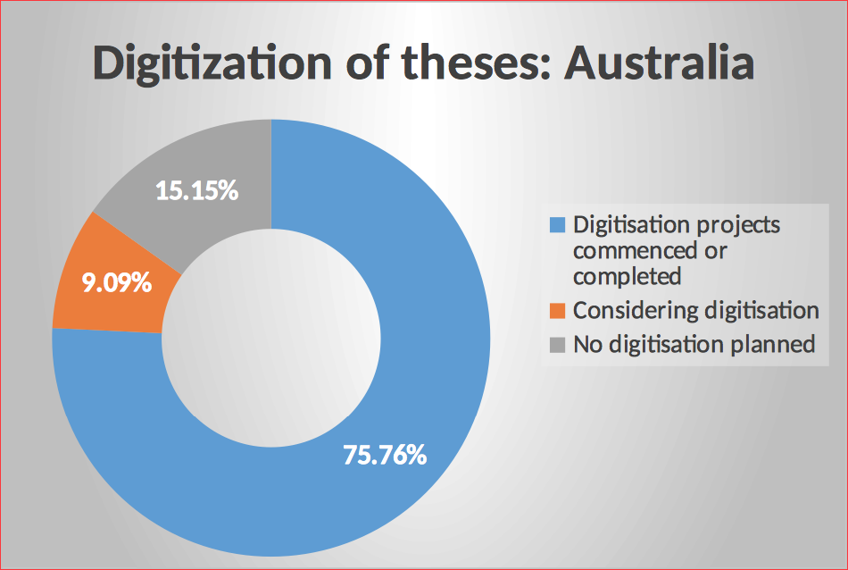
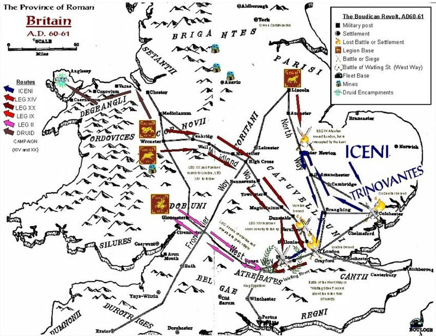
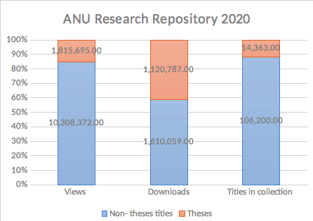
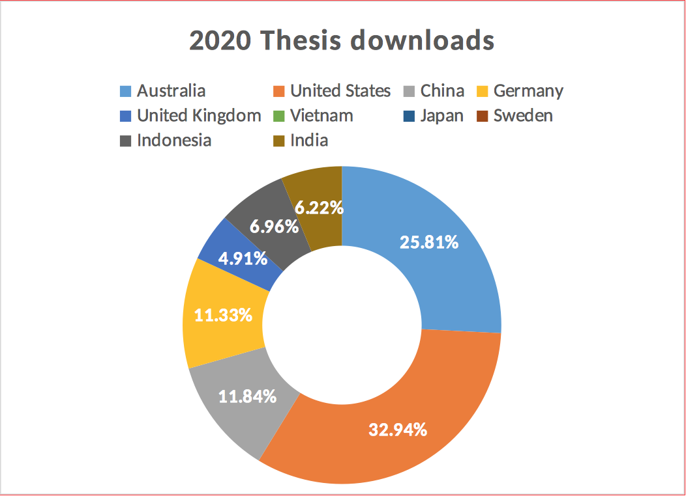
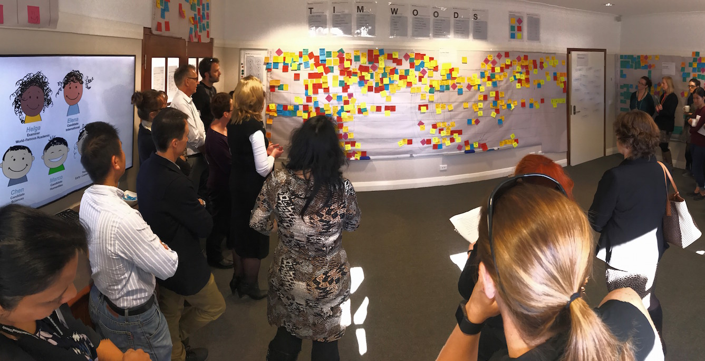

## Introduction

Universities have a vital role in contributing to the knowledge of communities and individuals. While the history of universities in western civilization traces to the Middle Ages (Hunt 2008), the concept of a knowledge product in the form of a thesis is a nineteenth-century development. Doctorates (PhDs or Doctors of Philosophy) were introduced in Great Britain in 1917 and have since become ‘‘academic passport with international reciprocity’’ (Noble 1994, 120).

The nature of the PhD and production of the thesis has been a topic of international discourse. As the diversity of PhDs has increased, for example with thesis by publication and industry programs, debate has focused on the nature of the PhD, the needs of stakeholders, effect on employment, and the nature of PhD research in the economy (well summarized in Park 2007). Overall the significant increase in expectations of employers and students is framed within changing expectations of the transmission of knowledge (McCarthy and Wienk 2019). Traditional boundaries around research and theses are merging with industry requirements.

The pinnacle in the PhD journey is the creation of an original contribution to knowledge. This is, however, a focused journey: “A PhD is a stepping stone into a research career. All you need to do is to demonstrate your capacity for independent, critical thinking. That’s all you need to do. A PhD is three years of solid work, not a Nobel Prize” (Mullins and Kiley 2002, 386).

A characteristic of the research outputs of doctoral and master’s degrees by research students has been the final work, most commonly a thesis of considerable length and depth. While the results of the research may have been disseminated by conference papers, journal articles, and other products, theses are generally the full exposition with much greater detail. In the humanities and social sciences a monograph may be a more widely available and accessible version of the research, although it is not generally produced until many years after the original thesis.

The established practice for dissemination of theses has been for a very small number of copies to be made after examination and revision, with one deposited in the university library as the copy for the scholarly record. As a consequence of this, these remarkable components of scholarly knowledge have had limited readership and impact. On average the readership of each thesis has been limited to those with knowledge of the storage and access conditions of libraries, most often other PhD students. This is, however, a time of great change in the scholarly communication ecosystem due to the digital environment and open access. The transformation provides an opportunity to increase access to and readership of theses in new and innovative ways.

This article takes the metaphor of Queen Boadicea (pronounced as bow·duh·see·uh) and her leadership in a series of battles that contributed to the expulsion of the Romans from Britain (Hingley and Unwin 2006). As a cultural icon, she represents the rallying of people to overthrow the yoke of tyranny. Her military campaign was a protest against the destruction brought by the Romans including the rape of her daughters after the death of her husband, King Prasutagus, who had sought to protect his family through forming an alliance with the Romans. It was also a protest against the slavery imposed on the Celts by the Romans. The rebellion characterized the importance of the freedom of the people and the need for personal liberty. Open scholarship is fundamentally a concept that aims to provide scholars with the freedom and responsibility for their research outputs, with the dissemination role of libraries creating a stage for the new battle. As Boadicea emerges from the London fog in ethereal battle, so theses had come to their time to emerge from the dark shelves of libraries and emerge into the new scholarly world.

"){ }

## Communication of Research: An Evolution

Throughout history the recording and communication of ideas has evolved to extend knowledge to many communities. The printing press revolutionized access, creating copies that could be made available through libraries across the globe. The digital revolution has brought a philosophy of universal access with online availability of recorded knowledge at the fingertips of those with internet access.

While the value of access to knowledge through published and unpublished works is widely acknowledged, not all transformations to recording, print, and digital technology have been welcomed. Socrates records the concern of Plato that the writing of knowledge will cause harm (Fowler 1925 vol. 9, 274 e).

Theses have been digitized consistent with legislation and university policies. For those countries with fair use legislation, copies can be made available consistent with the general provisions of copyright. For those in countries with fair dealing (exception) legislation, there are often specific clauses in the copyright legislation allowing for copying of theses. In Australia, section 51 of the Copyright Act 1968 allows libraries and archives to reproduce and communicate unpublished works including theses. Subclause (2) specifically refers to theses and provides for reproduction without infringement of the act.

The transition to open access theses has been the subject of considerable debate. The complexities of impact on policy and careers has caused graduate anxiety (Cirasella and Thistlethwaite 2017). Libraries have undertaken communication programs to seek to ameliorate concerns.

The revolution in communication, together with digitization activities consistent with copyright legislation, has had a major impact on access to theses. Many are openly available through university repositories. Many are also available via paywall through services such as ProQuest Digital Theses.

## Theses: Online and Reaching New Audiences

Digital environments are a characteristic of modern scholarly publishing and communication. The majority of scholarly publishers producing journals and monographs do so in digital form accessible through the internet. COVID-19 and the move to stronger digital education has strengthened the value of this transformation. Australian university library collection use indicates the extent of this shift. In 2020, 98.6% of total collection use was of material in digital formats. Almost 100% of journal use was of online resources (25,330,448 digital uses compared to 681 print uses), with 97.1% of monographs readership was of online formats (17,572,319 digital uses compared to 538,375 loans of physical items) (Council of Australian University Librarians 2021). Theses are an essential part of this digital environment.

A 2018 survey of Australian and New Zealand universities found that the digital revolution was extensive (Missingham 2018). All respondents indicated that theses must be deposited in digital form with their university library as recorded in table 1:

|  Country        | Respondents with mandatory digital deposit  |
|---------------------------------------------------------------| 
| Australia        | 100%  |
| New Zealand      | 100%  |

Table 1. Digital deposit of theses 2018<a href="#fn:1" class="footnote-ref">1</a>

Theses are increasingly being made available in digital form through digitization projects. In Australia clause S 51 (2) of the Copyright Act 1968 allows the libraries to copy and communicate theses including in digital form:

> If the manuscript, or a reproduction, of an unpublished thesis or other similar literary work is kept in a library of a university or other similar institution, or in an archives, the copyright in the thesis or other work is not infringed by the making or communication of a reproduction of the thesis or other work by or on behalf of the officer in charge of the library or archives if the reproduction is supplied (whether by communication or otherwise) to a person who satisfies an authorized officer of the library or archives that he or she requires the reproduction for the purposes of research or study. (Copyright Act 1968)

The majority of universities have commenced retrospective digitization of theses, see chart 1. Some, such as Edith Cowan University and the Australian National University, have digitized all of the theses of their university.

The move to digital theses and open access has been part of a strong movement within Australia. There has been no opposition from communities although concerns have been discussed with academics over the past decades.

## Open Access and Theses

What is open access? The call for open access publications emerged from discussions on the need to return a public benefit from the investment in research and the concerns of librarians due to the high increases in the subscription charges for publications without increased value or costs.

The first major statement defining open access was from the Budapest Open Access Initiative:

> permitting any users to read, download, copy, distribute, print, search, or link to the full texts of these articles, crawl them for indexing, pass them as data to software, or use them for any other lawful purpose, without financial, legal, or technical barriers. (BOAI 2002)

In summary, the proposition to make knowledge products including books and journals available without a paywall has reached a level of significant maturity with a range of implementation measures including “ready and publish” licences where libraries pay for the open access and initiatives where funders require that research outputs from grants are made openly accessible (for example Plan S 2020, Australian Research Council 2017, National Health and Medical Research Council 2017)

Changing the behaviour of the actors within the scholarly information system is not without challenge. Researchers’ reactions have varied across disciplines, as have the opportunities to meet the interests of communities, funders, librarians, and universities (Pinfield et al 2020).

While all Australian universities are committed to make theses openly accessible in digital form, it is still in the early days. The reality of open access for theses is that there is a high variability of theses that are openly available (see chart 2). The major factors limiting open access are the degree to which there has been retrospective digitization of theses and the processes within university libraries where some are using old processes that do not allow open access efficiently. The chart records the percentage of theses in each university that are openly available in digital form. The gap, or percentage that are not open, are theses which are only available in print. Some theses are digitized and not openly available (this is a very small proportion).

")

The more research-intensive universities tend to have a lower proportion of theses that are available openly, primarily due to availability of resources for digitization projects.

 percentage of theses openly accessible.")

Taking the metaphor of Queen Boadicea, the road to change is complex and progress has been highly varied meeting opposition along the journey. Theses have been a significant resource within library collections in the days of print, to a degree the fundamental flagstones of research on a path that has been little trod. With the transformation of the scholarly ecosystem to digital and open access, making these resources visible has arguably enabled the establishment of a foothold on the battleground of scholarship.

## Impact

Opening access to theses has revealed an extraordinary thirst for this deep knowledge, well beyond that of the open access copies of works published by traditional publishers.

Digital theses are made available through institutional repositories in universities in Australia. The repositories contain a wide range of research outputs including open access copies of journal articles, book chapters, and conference papers. Use of the repositories is significant—there were 9,599,550 downloads from institutional repositories in Australia in 2020 (Council of Australian University Librarians 2021). The particular demand for theses is exemplified by the case study of the Australian National University repository.

The comparison of readership of theses before and after digitization and open access at the Australian National University is telling. The average reading of theses before digitization was low: 0 per year. The average readership grew after digital access was enabled. Full digitization resulted in a significant increase in use—the entire collection experienced an average of 239 downloads per thesis in 2019. Proportionally, the number of theses in the research collection is small, but the impact is enormous. Theses represent approximately 12% of the collection (Australian National University 2021); however, more than 40% of the files downloaded from the repository are theses, demonstrating that there is a significant appetite for deep research content. This is illustrated in chart 4.

Digital access also results in significant international reach (chart 5).

Statistics from 2020 also revealed the humanities and social science theses were more significantly read than science theses as demonstrated in Table 3.

| Item Name | File | Downloads | 
|-----------------------------------|
| "A great deal of sickness": Introduced diseases among the Aboriginal people of colonial Southeast Australia | [02Whole_Dowling.pdf](https://openresearch-repository.anu.edu.au/handle/1885/7529) | 14898 |
| The size, structure and life cycle of family households in the Philippines | [b19468209_Abejo_Socorro_D.pdf](https://openresearch-repository.anu.edu.au/handle/1885/123506) | 9510 |
| "A great deal of sickness": Introduced diseases among the Aboriginal people of colonial Southeast Australia | [01Front_Dowling.pdf](https://openresearch-repository.anu.edu.au/handle/1885/7529) (duplication due to old process of uploads) | 8406 |
| The role of maritime power in the wake of the Gulf War 1990-1991 | b18190790-[Stevens_D.pdf](https://openresearch-repository.anu.edu.au/handle/1885/144325) | 8371 |
| Social interaction and academic performance | [b12221715_Sheppard_Terence_Alan.pdf](https://openresearch-repository.anu.edu.au/handle/1885/132361) | 7801 |
| A colonial dilemma : British policy and the colonial economy of Tanganyika 1918-1938 | [b16566531_Neal_Stephen.pdf](https://openresearch-repository.anu.edu.au/handle/1885/112143) | 7346 |
| A study of the socio-economic elite in Philippine politics and government, 1946-1963 | [b12926863_Simbulan_Dante_C.pdf](https://openresearch-repository.anu.edu.au/handle/1885/112055) | 6984 |
| Marriage in Sri Lanka : a century of change | [b18262156_Caldwell_Bruce.pdf](https://openresearch-repository.anu.edu.au/handle/1885/123190) | 6552 |
| Regime failure and the political legitimacy of governments in Ghana : the case of the Acheampong regime, 1972-1979 | [b11238306_Tsamenyi_M.pdf](https://openresearch-repository.anu.edu.au/handle/1885/126279) | 5504 |
| The coconut industry in Sri Lanka : an analysis of government intervention measures | [b12240035_De_Silva_H_W_S.pdf](https://openresearch-repository.anu.edu.au/handle/1885/131963) | 5152 | 

 
Table 2. Downloads of theses in the ANU repository in 2020 – top 10 downloaded theses.

There has been a significant change to the impact of theses in terms of increased citations. Studies of Scopus and Web of Knowledge have explored the nature of citation of theses (Bangani 2018, Gargouri et al 2010, Ferreras-Fernández et al 2016). These studies have found an increased readership of theses is resulting in an acknowledgement of their contribution to scholarly knowledge through citations. For a world transfixed by measures of impact—such as the Australian Excellence in Research for Australia (Australian Research Council 2019) and UK Research Excellence Framework (UK REF 2020)—establishing greater impact and engagement are critical outcomes that have an impact on the recognition of researchers and institutions.

## Radical Change

A true transformation of the thesis into an actively engaged research output contributing to a world-wide ecosystem gives the opportunity to rethink both the value of the thesis and how university processes can more effectively result in openly accessible theses. The complexities of processes within universities are legendary and have at times contributed to delays in the deposit of theses. At the Australian National University, a mapping of customer journey identified many roadblocks and disconnected systems.

A major project to improve PhD students’ progress has resulted in an integrated workflow that ensures students are able to clearly work through their research journey. The resulting system also ensures that the thesis is automatically deposited in the repository. A detailed video outlines the rapid improvement event held to scope the project (Australian National University 2017). Rethinking the nature of thesis production and dissemination provides a concrete way to better join the thesis to the scholarly landscape.

While universities use a range of processes to create openly accessible theses, rethinking the student journey can produce insights that lead to improvements in the whole of the PhD lifecycle.

## Barriers to Joining the Battle

 and her daughters, Captains Walk, Brecon (Thomas 2018)")

The road to the open fields of new scholarly communication is complex with researchers raising concerns about the impact on future publishing, economics, and the control of knowledge. This part of the journey has seen difficult battles where research has been vital to removing the fog around many issues.

Regarding the impact of open access of theses on future publishing, historians have been the most vocal opponents (for example reports by Straumshein 2014 and Wulf and Denbo 2019). Concerns that open access of theses could affect future publishing, particularly of monographs, have been, for the most part, debunked through publisher surveys finding that open access theses were not an impediment to publishing with most scholarly publishers (Ramirez et al 2013, McMillan et al 2011).

There is overall debate on the costs and benefits of scholarly publishing. While this is a hot topic in the open access community, studies have emerged that demonstrate the costs borne by publishers and authors (such as Smart, Watkinson, Dunham and Fitzgerald 2016 and King 2008) can be identified. There are a variety of open access models. For some, primarily green open access no fees need to be paid by authors. For others, such as gold, authors must make a payment to cover the costs of publishing. Funders allow research grants to cover such cost and require open access of research outputs. There are thus different requirements for authors depending on the open access model of the publication or publisher.

A study of academics at the Australian National University has addressed the myth that scholars will make significant economic gain in general from their publications (Missingham 2016). Perhaps surprisingly, there were many discussions in the university with academics who identified advice given to PhD students that open access publishing of their thesis would reduce future income from publishing. The survey found that academics are significant contributors to scholarly publishing. The average academic is an author of 2–5 articles per year with additional book chapters and books depending on the discipline. In total, academics pay for a number of costs for publishing—on average less than $2,500 to cover costs such as copy editing, image fees, index, and design). Some book authors (approximately 20%) receive a royalty or advance for a book (approximately 72% of these receive under $1,000). Payments from government schemes such as the educational lending and public lending rights are low:

-   94.3% of authors receive $0 for books,

-   3.4% of authors receive between $1 and $1,000 for books, and

-   98.9% of authors of journal articles and other publications receive $0.

Signficantly the income received by academic authors is very low, regardless of the format of publication (chart 6).

[ANU payment received by authors](chart6.png "Chart 6. Australian National University academics: payment received by authors")

In summary, research has identified that making theses available via open access does not prevent future publishing with scholarly publishers and that income from publishing for academics is very low. Scholars retain control of their knowledge through being able to obtain embargoes should there be commercial requirements, such as a patent, or should there be sensitivities about data, for example if there is content that needs to be restricted for Indigenous cultural rights issues. For theses, the concept of pay-to-publish is significant as authors may receive some revenue from subscription services such as ProQuest Digital Theses and a major concern about open access publishing of theses is that it will reduce future revenue.

## Conclusion

Theses are the distinctive products of deep research activity. The knowledge encapsulated in theses are remarkable elements of the scholarly ecosystem. Traditionally, this knowledge has been made accessible through library collections. Access to theses when they were in print was very low, no doubt because of the complexities of discovery through library catalogues and interlibrary loan systems.

In the digital age discovery and process barriers can be lowered compared to the days when mater was held on the shelves of libraries accessible if a reader visited the library and occasional through complex inter-library lending arrangements. Theses now can be available at the click of a button to readers all over the world. Open access has brought a revolution that has enabled easier access to collections with repositories revealed as treasure houses of knowledge, particularly theses which have, as Australians say, “punched above their weight.” The nature of knowledge dissemination has rapidly expanded to reveal a vast audience including students, industry, government, and community members. Open access is now evolving to provide even greater opportunities as the concept evolves to include data, patents, notebooks, and more (for example see Jensenius 2020). This will likely have an impact on the future information processes of PhD students.

As the visibility and readership of theses increases, so does the need to understand the digital environment to achieve the greatest dissemination of research. Work on optimization of discovery through discovery services such as Google Scholar has been a focus for those managing the repositories in which theses are curated. Richer data and data analysis enables greater insight into the influence of theses on scholarship and the wider community. As this develops, the significance of work in the humanities and social sciences is likely to become even clearer. However, much remains to be discovered in relation to the contribution that theses make to our culture and communities.

The road for the revolution in access to and the influence of theses has seen many battles—in particular, to comprehend the value of digital discovery, open access, and the importance of knowledge that is not restricted by being held by traditional publishers with paywalls preventing community access. Boadicea’s battles were similarly complex and fraught with challenges. For Boadicea there were many battles on the route to Londinium (London) through Viroconium (Wroxeter in Shropshire), on the Roman Road now known as Watling Street that were important milestones in defeating the Roman invasion. For theses, these battles have included debates on copyright, challenges in digitization and adoption of open access. While many more battles and years were required to repulse the Romans, the cultural memory of Boadicea recalls the importance of recognizing achievements within the larger framework of a war. For theses universal access is yet to be reached, but many battles along the pathway have been won.

To conclude, history records Boadicea’s words to her army as:

> You have learned by actual experiences how different freedom is from slavery. Hence, although some among you may previously, through ignorance of which was better, have been deceived by the alluring promises of the Romans, yet now that you have tried both, you have learned how great a mistake you made in preferring an imported despotism to your ancestral mode of life and you have come to realise how much better is poverty with no master than wealth with slavery (Cary and Foster 1925, 85)

Liberating theses from their ancestral home in library vaults promises similarly to overcome ignorance, together with the opportunity through open access, to enable communities to benefit overcoming the boundaries of paywalls. While significant work remains occur to digitise and make all theses accessible, particular in large research libraries, the battle has commenced although the war, like that of Boadicea, has yet to be won.

</i> (Sharp 1983)")

## References

Anon. (n.d.). *The province map of Roma Britain A.D. 60-61: The Boudican revolt.* S.l.: S.n. [https://boudiccaunchained.weebly.com/uploads/2/3/4/1/23414562/1318351.jpg?850](https://boudiccaunchained.weebly.com/uploads/2/3/4/1/23414562/1318351.jpg?850)

Anon. 1907. Postcard of *Thomas Thornycroft's 'Boadicea and Her Daughters’.* London: s.n.. [https://www.historytoday.com/sites/default/files/00_main_0.jpg](https://www.historytoday.com/sites/default/files/00_main_0.jpg)

Australia. Laws. 2021. *Copyright Act 1968*. Canberra: Commonwealth Government. Version registered 28/Jan/2021 [https://www.legislation.gov.au/Series/C1968A00063](https://www.legislation.gov.au/Series/C1968A00063)

Australian National University. 2017. *Review of the HDR thesis exams and submission rapid improvement event 1-4 May 2017*. Canberra: ANU. [https://www.youtube.com/watch?v=N-AgnjU4C28&feature=youtu.be](https://www.youtube.com/watch?v=N-AgnjU4C28&feature=youtu.be)

———. 2021. *Statistics for ANU Research.* Canberra: ANU. [https://openresearch-repository.anu.edu.au/handle/1885/1/statistics](https://openresearch-repository.anu.edu.au/handle/1885/1/statistics)

Australian Research Council. 2017. *ARC Open Access Policy.* Version 2017.1. Canberra: ARC. [https://www.arc.gov.au/policies-strategies/policy/arc-open-access-policy-version-20171](https://www.arc.gov.au/policies-strategies/policy/arc-open-access-policy-version-20171)

———. 2019. *Excellence in Research for Australia.* Canberra: ARC. [https://www.arc.gov.au/excellence-research-australia](https://www.arc.gov.au/excellence-research-australia)

Bangani, Siviwe. 2018. “The Impact of Electronic Theses and Dissertations: A Study of the Institutional Repository of a University in South Africa.” *Scientometrics*. 115(1): 131–51. [doi:10.1007/s11192-018-2657-2](https://doi.org/10.1007/s11192-018-2657-2)

BOAI. 2002. *Budapest Open Access Initiative.* Budapest: BOAI. [https://www.budapestopenaccessinitiative.org/read](https://www.budapestopenaccessinitiative.org/read).

Cary, Earnest and Herbert B. Foster (Translators) (1925). *Dio Cassius Roman History.* Volume LXII. London Harvard University Press.

Cirasella, Jill and Polly Thistlethwaite. 2017. Open Access and the Graduate Author: A Dissertation Anxiety Manual. In Smith, Kevin L., and Katharine A. Dickson, K. A. (Eds.). (2017). *Open Access and the Future of Scholarly Communication: Implementation*. Lanham, MD, Rowman & Littlefield.

Council of Australian University Librarians. 2021. *Statistics.* Canberra: CAUL. [https://statistics.caul.edu.au/index.php](https://statistics.caul.edu.au/index.php)

Ferreras-Fernández, Tránsito, García-Peñalvo, Francisco, Merlo-Vega, José A., and Helena Martín-Rodero (2016), "Providing Open Access to PhD Theses: Visibility and Citation Benefits". *Program: Electronic Library and Information Systems*, 50 (4): 399–416. [https://doi.org/10.1108/PROG-04-2016-0039](https://doi.org/10.1108/PROG-04-2016-0039)

Fowler, Hariold N. (trans). 1925. *Plato. Plato in Twelve Volumes*. Cambridge, MA, Harvard University Press.

Gargouri, Yassine, Hajjem, Chawki, Larivière, Vincent, Gingras, Yves, Carr, Les, Brody, Tom and Stevan Harnad. 2010. “Self-selected or Mandated, Open Access Increases Citation Impact for Higher Quality Research”. *PLoS ONE,* 5(10):e13636. [https://doi.org/10.1371/journal.pone.0013636](https://doi.org/10.1371/journal.pone.0013636)

Hingley, Richard and Christina Unwin. 2006. *Boudica: Iron Age Warrior Queen*. London: Bloomsbury Publishing PLC.

Hunt Janin. 2008. *The University in Medieval Life, 1179–1499*. Jefferson NC: McFarland & Company, Inc.

Jensenius , Alexander Refsum. 2020. “Why is Open Research Better Research?” S.l.: The Author. [https://www.arj.no/2020/08/27/open-research/](https://www.arj.no/2020/08/27/open-research/)

King, Donald W. and Frances M. Alvarado-Albertorio. 2008. “Pricing and Other Means of Charging for Scholarly Journals: A Literature Review and Commentary”. *Learned Publishing*, 21: 248–272. [doi:10.1087/095315108X356680](https://doi.org/10.1087/095315108X356680)

Maron, Nancy L., Mulhern, Christine, Rossman, Daniel and Kimberly Schmelzinge. 2016. *The Costs of Publishing Monographs: Toward a Transparent Methodology*. New York, IthakaS+R. [https://sr.ithaka.org/publications/the-costs-of-publishing-monographs/](https://sr.ithaka.org/publications/the-costs-of-publishing-monographs/)

McCarthy, Paul X. and Maaike Wienk. 2019. *Advancing Australia’s Knowledge Economy: Who Are the Top PhD Employers?* Melbourne: Australian Mathematical Sciences Institute & CSIRO Data61 Australian Mathematical Sciences Institute. [https://amsi.org.au/wp-content/uploads/2019/04/advancing_australias_knowledge_economy.pdf](https://amsi.org.au/wp-content/uploads/2019/04/advancing_australias_knowledge_economy.pdf)

McMillan, Gail, Ramirez, Marisa L., Dalton, Joan, Read, Max and Nancy H. Seamans. 2011 “An Investigation of ETDs as Prior Publications: Findings from the 2011 NDLTD Publishers ’ Survey”. Paper presented at the 14th International Symposium on Electronic Theses and Dissertations, Cape Town, South Africa. S.l.: NLDT conference. [https://vtechworks.lib.vt.edu/handle/10919/11338](https://vtechworks.lib.vt.edu/handle/10919/11338)

Missingham, Roxanne. 2016. “eTextbooks: Open and Growing”. Public lecture at Edith Cowan University for Open Access week. [https://www.slideshare.net/roxannemissingham/etextbooks-ecu](https://www.slideshare.net/roxannemissingham/etextbooks-ecu)

———. 2018. “EDTs – Undergoing Transformation – The Butterfly Emerges”. Keynote presentation to *International EDT conference.* Taipei, Taiwan: EDT conference.

Mullins, Gerry and Margaret Kiley. (2002). “It’s a PhD, not a Nobel Prize’: How Experienced Examiners Assess Research Theses*.” Studies in Higher Education*, 27 (4): 369–386.

National Health and Medical Research Council. 2017. *Open Access Policy*. Canberra: NHMRC. [https://www.nhmrc.gov.au/file/15242/download?token=rgNjnh0B](https://www.nhmrc.gov.au/file/15242/download?token=rgNjnh0B)

Noble, Keith Allan. 1994. *Changing Doctoral Degrees: An International Perspective.* Buckingham: SRHE and Open University Press.

Park, Chris. 2007. *Redefining the Doctorate*. London: Higher Education Academy. [https://eprints.lancs.ac.uk/id/eprint/435/1/RedefiningTheDoctorate.pdf](https://eprints.lancs.ac.uk/id/eprint/435/1/RedefiningTheDoctorate.pdf)

Pinfield, Stephen, Simon Wakeling, David Bawden, and Lyn Robinson. (2020) *Open Access in Theory and Practice: the Theory-Practice Relationship and Openness.* Milton Park, Abingdon, Oxon; New York, NY: Routledge. [https://library.oapen.org/handle/20.500.12657/39922](https://library.oapen.org/handle/20.500.12657/39922)

Plan S. 2020. *Making Full and Immediate Open Access a Reality.* Strasbourg, France: Plan S. [https://www.coalition-s.org/](https://www.coalition-s.org/)

Ramirez, Marisa L., Joan T. Dalton, Gail McMillan, Max Read, and Nancy H. Seamans. 2013. “Do Open Access Electronic Theses and Dissertations Diminish Publishing Opportunities in the Social Sciences and Humanities? Findings from a 2011 Survey of Academic Publishers”. *College & Research Libraries,* 74(4): 368–380. [https://crl.acrl.org/index.php/crl/article/view/16317](https://crl.acrl.org/index.php/crl/article/view/16317)

Sharp, William. 1983. *Boadicea Haranguing the Britons (called Boudicca (Boadicea))*. Line engraving after John Opie. [https://www.npg.org.uk/collections/search/portrait/mw56792/Boadicea-Haranguing-the-Britons-called-Boudicca-Boadicea](https://www.npg.org.uk/collections/search/portrait/mw56792/Boadicea-Haranguing-the-Britons-called-Boudicca-Boadicea)

Smart, Scott, Charles Watkinson, Gary Dunham, and Nicholas Fitzgerald. 2016. “Determining the Financial Cost of Scholarly Book Publishing”. *Journal of electronic publishing Economics of Publishing special issue*. 19 (1). [https://quod.lib.umich.edu/j/jep/3336451.0019.102?view=text;rgn=main](https://quod.lib.umich.edu/j/jep/3336451.0019.102?view=text;rgn=main)

Straumshein, Carl. 2014. “Arguments Over Open Access”. *Inside Higher Ed*. [https://www.insidehighered.com/news/2014/01/06/historians-clash-over-open-access-movement](https://www.insidehighered.com/news/2014/01/06/historians-clash-over-open-access-movement)

Thomas, John. 2018. *Statue of Boadicea (Boudica) and her daughters, Captains Walk, Brecon.* Image taken by 14GTR. S.l.: Wikimedia. 
[https://en.wikipedia.org/wiki/File:Boadicea,_Brecon,_by_John_Thomas.jpg](https://en.wikipedia.org/wiki/File:Boadicea,_Brecon,_by_John_Thomas.jpg)

UK Research Excellence Framework. 2020. *REF 2021.* London: REF. [https://www.ref.ac.uk/](https://www.ref.ac.uk/)

Wulf, Karin and Seth Denbo. 2019. “A Brief History of History Responding to Open Access”. *The Scholarly Kitchen.* [https://scholarlykitchen.sspnet.org/2019/02/13/a-brief-history-of-history-responding-to-open-access/](https://scholarlykitchen.sspnet.org/2019/02/13/a-brief-history-of-history-responding-to-open-access/)

[^1]: Only one university required hardcopy and digital deposit.

