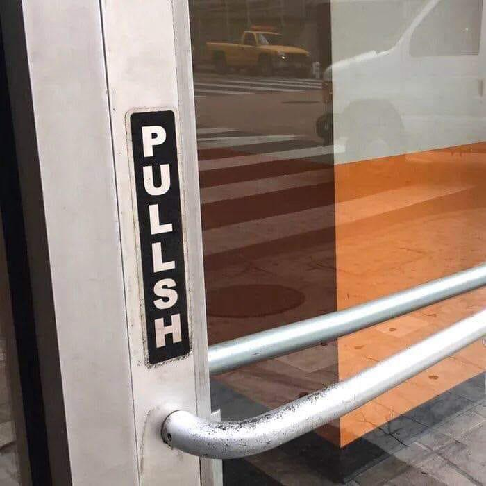
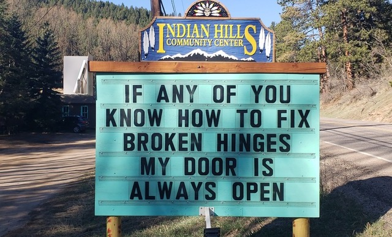

> *Todo es puerta.   
>  todo es puente.    
>  Everything is a door.   
>  everything is a bridge*.   
> – Octavio Paz, *Noche en claro,* trans by John M. Fein (2014, 51)

## {.foo}

The global COVID-19 pandemic has, without a doubt, reshaped our perception of the value of closure and openness. Here in Naarm (Melbourne), the city that locked down the longest, citizens gingerly emerged from enforced curfews and travel restrictions, eyes still blinking, into a state of what was helpfully described as “clopen” (Briggs 2021).

The word “clopen” has meant different things at different times and in different contexts, but it is typically a reference to the overlapping of openings and closings, a state of both/neither open and/nor closed. In the field of topology, for example, the existence of “clopen sets” concedes that being closed does not necessarily imply a set is not open. In this discipline, the definition of clopen rests on the idea that closure is not the opposite of openness, a conceptually testing perspective that has inspired its own *Downfall* parody (Benjatastic 2010).

In the retail sector (and also security, nursing, construction, and hospitality), “clopening” describes the onerous practice in which precariously employed workers are required to close stores late at night and then be available to open them first thing the next morning. In this definition, the combination word “clopen” is a reminder of the exploitative labour involved in the maintenance of both openings and closings—and its role in profiting those focused solely on efficiency rather than the human cost of door keeping.

These various approaches to the definition of clopen and clopening, ranging from public health policy to mathematics to labour relations, might also inform how we re-evaluate our approach to the relationship between openness and closure in scholarship. We can see across these different contexts how:

1.  there are social risks to both being either fully open and/or closed,

2.  closure and openness are not mutually exclusive or opposite states,

3.  there are uneven social consequences and overlooked human costs to managing processes of opening and closing, and

4.  existing systems (technical, political, moral) for regulating acts of opening and closing serve to bolster privileged commercial, individual, institutional and social beneficiaries.

With these thoughts in mind, I want to take this opportunity to consider scholarship in a clopen world as well as how a clopen approach to scholarship might inform different perspectives on the assumed and largely unequestioned value of open scholarship itself.

From a clopen perspective, open scholarship and open data are best understood, not in terms of the attributes of the data or scholarship itself, but rather in terms of contingent processes of opening and closing. Open scholarship in this sense would be scholarship that *creates the conditions* for openness: that enables researchers to be open to whatever they are not, that opens them to being challenged, to consider their own capacity for openness, and, most importantly, to be open to change. All of which rests on, but rarely acknowledges, a reciprocal attendance to manifold impediments and acts of suppression. Checklists of attributes that measure and define how open scholarship is or should be are especially unhelpful and play to a competitive, neo-liberal culture of comparative metrics. Innovation start-ups, universities, research funding agencies, pay-walling publishers, open science initiatives like the FAIR (findable, accessible, interoperable, and reusable) consortium and so on, use the language of openness, but, in reality, they reiterate longstanding closures and proprietary regimes (Levin and Leonelli 2017, Fox et al 2021).

The FAIR principles are an interesting case in point. These widely lauded principles describe data management practices that systematically enhance the reusability of digital information by both machines and humans (Wilkinson et al 2016). In this sense, the FAIR principles are not really ends in themselves but describe the means by which open science can be achieved (Boeckhout et al 2018). The acronym FAIR—which unfurls as findable, accessible, interoperable and reusable—strongly suggests these specific ambitions are also intended to flag a social promise. A promise they cannot possibly keep. And nor should they.

In English languages, the word “fair” is commonly used as a synonym for concepts such as right or reasonable or just (“fair go” and “fair play” for example) and has long been used to bind “moral communities.” In her intriguing account of the political complexity of the word, Anna Wierzbicka notes, “fairness implies that there are certain rules known to and recognized as good by all those who are willing to do things with one another” (Wierzbicka 2006). For Wierzbicka, “fairness” emerges historically from the shift towards a conception of ethics as a “procedural morality” based on “reason” and “social cooperation.” But the word fairness conveys much more than the convergence of goodness and morality. It adds into the mix the politics of whiteness as well (Domonoske 2014). I write this as someone whose current place of residence boasts a national anthem unashamedly titled, “Advance Australia Fair” in which all projected meanings of the word (white moral goodness) are acutely brought to bear.

Given their social aspirations (aspiration itself a word that gestures at respiratory clopenings, and for that matter also inspiration), it is curious that the FAIR principles themselves rest on the idea that research data has a life detached from its social circumstances. Indeed, the precise point of the FAIR principles is to enshrine and ensure the credence that data might float frictionlessly between different research environments as *the* defining feature of “openness.” Herein lies the inherent unfairness of FAIR. FAIR treats data and information as if it is loosed from its context and is therefore purely exploitable, “fair game” as it were. By extension, data researchers are painted as if frolicking in limitless Edenic fields without any sign of the disciplinary, institutional, social and financial fences that actually define contemporary scholarship (Bahlai 2019). These idyllic depictions fail to recognize that the FAIR principles are not universal (even though they might claim to be) and were initially rendered to fit the epistemological and ontological assumptions of a specific research community and landscape (Dodds 2020).

A disposition to clopenness on the other hand, can dis-close the ways academic infrastructures of scholarship, as iterations of patriarchy/capitalism/neo-liberalism/colonialism, apply an “openness penalty” that works to obstruct new players (for example, under-represented scholars) from entering and participating (Fox et al 2021). Clopenness can reveal how unfettered data sharing policies are premised on a singular view of the virtues of openness and do not necessarily benefit all research participants in an equitable manner and can undermine the rights of Indigenous communities to control traditional knowledge and social resources including data (McCartney 2022; Christen 2012).

Re-appraising the value of open scholarship itself opens many questions about the specific beneficiaries, architects, agents, locations, and contexts in which openness is defined, interpreted, and enacted including longstanding perceptions of how research is conducted and valued (Levin and Leonelli 2017). Proposing openness as the “solution” to, or erasure of, closure without attention to the non-binary, without queerying everyday assumptions about the uniform value of openness (as a synonym for fairness or freedom), diminishes relational understandings of what information infrastructure is and might be for diverse, variable, and inclusive communities.

## Clopen—a door both half open and half closed

> Metaphor exists – and relies upon – the complex, emotionally resonant, arresting connections we make. These linkages, between ourselves and the world, require a degree of primary experience, as well as sensitivity to the nature and details of that experience. (Altfeld and Diggs 2019)

Open scholarship gestures rhetorically towards but is not the same as an open mind, an open book, an open door (oh if I just had a dollar for every beckoning of “open access” on every academic publishing “portal”). And yet these optimistic metaphors give license to—in a sense simultaneously “open up” and frame—the way we conceive, design, and practice open scholarship. In what ways, then, can a counter-intuitive approach to the material, conceptual, experiential, and emotional dimensions of doors also reveal something about the way we might reimagine open scholarship?

George Simmel, in a 1909 essay comparing bridges and doors, argues that whereas a bridge symbolizes the human capacity for interconnection, a door both separates and connects, and these two capacities are themselves inseparable (Kaern 1994). A door is a method of closing off the outside and in this way, closure is always the condition of any opening or openness. To be open a door must have the potential to be closed:

> With respect to the relation “separateness-unification” the bridge emphasizes the latter, and it makes obvious the distance between its resting points, and makes it measureable. By so doing, it also overcomes this distance at the same time. The door, however, in a stricter and more obvious manner demonstrates that the acts of separating and relating are but two sides of the same act... The door cancels the separation of the inside from the outside because it constitutes a link between the space of the human and everything which is outside of it. Exactly because the door can be opened, its being shut gives a feeling of being shut out, that is stronger than the feeling emanating from just a solid wall. (Simmel in Kaern 1994, 409)

For Simmel, the door emphasizes an indivisible dual action or function—it both separates and connects, it limits, and, at the same time, it tantalizes with offers of freedom and the possibility of undirected movement. This relational quality is equally symbolic and functional. Simmel also recognizes the power of aesthetic architectures and the way the material structure of doors afford different conceptual frameworks, social relationships, and acts to manage and maintain authority:

> The door is the line of demarcation where the limited and the limitless meet, but not in the dead geometrical form of merely a partition wall, but rather as the permanent possibility of continuous alternation.\
> The bridge as the line between two points, strictly prescribes safety and direction. From the door, however, life flows out of the limitedness of the isolated being-by-yourself, and it flows into the unlimited number of directions in which paths can lead. (Simmel in Kaern 1994, 410)

In Simmel’s reckoning, bridges and doors serve to highlight different versions of an architecture of relation. The bridge, for Simmel, is always open to connection, the door, however, is a point and process of interchange. Both are an exchange between separation and connection but with a different emphasis. Doors are directional and demarcate the ownership and social limits of space. They relegate who is entering and who is exiting. Some doors are designed primarily to repel, others to entice. We might also wish to think about who designs and positions the door, who holds the key, who stands outside or shelters behind or is locked in, who is fleeing from and who is forward-facing at the threshold. How are acts of opening and closing specifically executed—do the slammed doors of scholarship open automatically for some but demand a crowbar from others? Finally, it must be said that Simmel’s proposition that doors differentiate the delineated space of the “isolated being-by-yourself” from a limitless “outside” evokes the binary (gendered, racial, colonial, and more) construction of the unspecified other as socio-symbolically distant from a defined self.

There exists commentary on the way the philosophy and technology of bridges has influenced the conception and building of scholarly information infrastructure, understood as engineering the conditions for the possibility of connection at conceptual, political, and social levels (Verhoeven 2015). Doors, on the other hand, hang on a framework that provides the possibility for the mutual, inextricable dependence of opening and closing. Whereas for Gaston Bachelard a door is, by definition, always “half open” (Bachelard 1969, 222) and for Emmanuel Levinas the door is the threshold that opens one to the other in an act of hospitality (Levinas 1961), Simmel comes closest to what I want to propose as a “clopen” critique of open infrastructure for understanding and redressing scholarly divisions and divisiveness. Simmel’s observation of doors stresses the defining, constant, and laborious work of opening/closing, “the permanent possibility of continuous alternation.” I want this idea of the clopen nature of the door to emphasize how scholarly research infrastructure might better admit the contingent relation between openness and closure—a relationship in which the setting and design and signage of each threshold serves to mark out simplistic hierarchical binaries of in and out groups.

Simmel’s counter-intuitive account of doors evokes many “open” questions. What if the demarcation that the door regulates is meaningful or visible only to a select few? What if there is no significant difference between the spaces or worlds defined and delimited by various doors? What if, on exiting or entering, nothing appears to have changed and all there is in the end is the constant performance of a revolving threshold? These questions invite reflection on the ways an infrastructure of open scholarship might be already experienced by some scholars as “clopen,” as an elaborate continuance of acts of defensive, proscriptive door-keeping that promise just enough openness to disguise an underlying resistance to genuine change.

## Conclusion

In my misguided youth, when I wanted to attend an event but did not possess the cultural cachet to warrant an invitation or enough cash to cover the door price, I had a useful ploy to conjure access. I would take a deep breath, muster all my available chutzpah, and boldly walk in through the door backwards—giving the appearance that I was leaving while in fact making my entrance.

The vocabulary for describing open scholarship is often vague. Complaints about the way open data, open science, and open research are conflated with, for example, data sharing, which is itself an imprecise term, have led to calls for more diligence in the terminology around open scholarship and more context-specific nuance in policy frameworks (Pasquetto, Sands, and Borgman, 2015). It is also possible to argue that we can unlock our language and our thinking around “closure” in scholarship as well. Working in a clopen world warrants an open mind about closure. Some acts of closure might also be understood as acts of opening. Regulating the publications of white, cis, straight men, for example, could be viewed as liberating for equity-seeking groups. Acknowledging the extent of human and non-human energy it takes to jam open the doors of scholarship suggests that acts of closing can also be viewed as observant acts of care (Research Data Alliance International Indigenous Data Sovereignty Interest Group 2019).

The point I am making, however, is that openings are also always closures and recognizing this is to recognize that the capacity for openness in open scholarship is unevenly distributed and its value and impact is unevenly weighted across the spectrum of participants and stakeholders. As Levin and Leonelli (2017) succinctly note: “What researchers choose to open, how, and with whom is a highly situated matter that depends on the goals, preferences, constraints, and institutional settings of the researchers involved.” Given the wildly varying ways in which openness is claimed and performed, there is a concurrent need to negotiate the evaluation of its applicability and value by recognizing the dynamic, context-specific, and scaled circumstances of the symbiotic relationship between both opening and closing. If scholarship is anything like a door, it is a breakthrough that gives glimpse to the material and conceptual ways openness and closure are always adjoined, embroiled, and interdependent.

To understand clopenness within our own embodied experience, to think metaphorically in order to resuscitate “the link between ourselves and the world” (Atfeld and Diggs 2019), is to see how inspiration, the life force of scholarship, is physiologically animated by intricate, involuntary processes of contraction in which an “interplay of complementary movements of inhibition, elevation, approximation and deflection make it possible to breath” (Cappello 2011). With every individual inhalation we open (and close) ourselves to the atmosphere we occupy. Each breath we take is a metonymy for the vitality it sustains, an experience of intimate openings and closings that wave at meta-narratives about human existence and expiry.

At this most existential level, attention to clopenness insists that scholarship is always a negotiation of matters of life and death and that projects and ideas and publications – like people – do not prevail forever. To think otherwise is to perpetuate an androcentric arrogance which proposes that humans alone can defy evolutionary history and endure and that other species are entirely dispensable. Instead, clopenness stretches the perceptual push/pull between the finished/unfinished, forever open/always precarious nature of so much contemporary research. To think of scholarship from a clopen perspective is to think with humility and to see scholarship as temporary and context-cultivated rather than consigning it to the unsustainable energy consumption of limitless servers and service.

The clopen doors of scholarship precede the intellectual communities they articulate, delineate, relegate, and filter. Universally open doors are an admirable aspiration but inadequately appreciate the conceptual, social, political, and institutional role of closure in the work of open scholarly infrastructure. To put this plainly: a fully open (or a fully closed) scholarship would be a world without doors. An unhinged world.

## References

Altfeld, Heather and Rebecca Diggs. 2019. “Sweetness and Strangeness.” *Aeon*, [https://aeon.co/essays/metaphors-grow-the-mind-and-feed-the-soul-dont-lose-them](https://aeon.co/essays/metaphors-grow-the-mind-and-feed-the-soul-dont-lose-them).

Bachelard, Gaston. 1969. *The Poetics of Space*, Boston: Beacon Press.

Bahlai, Christie, Lewis. J. Bartlett, Kevin R. Burgio, Auriel M. Fournier, Carl N. Keiser, Timothée Poisot, and Kaitlin S. Whitney. 2019. “Open Science Isn’t Always Open to All Scientists.” *American Scientist*, 107 (2): 78–82. [https://doi.org/10.1511/2019.107.2.78](https://doi.org/10.1511/2019.107.2.78).

Benjatastic. "Hitler Learns Topology,"" *YouTube*, uploaded Feb 1, 2010, [https://www.youtube.com/watch?v=SyD4p8_y8Kw](https://www.youtube.com/watch?v=SyD4p8_y8Kw).

Boeckhout, Martin, Gerhard A. Zielhuis, and Annelien L. Bredenoord. 2018. “The FAIR Guiding Principles for Data Stewardship: Fair Enough?” *European Journal of Human Genetics* 26 (7): 931-936. [https://doi.org/10.1038/s41431-018-0160-0](https://doi.org/10.1038/s41431-018-0160-0).

Boulton, Geoffrey, Philip Campbell, Brian Collins, Peter Elias, Wendy Hall, Graeme Laurie, Onora O’Neill, Michael Rawlins, Janet Thornton, Patrick Vallance, and Mark Walport. 2012. “Science as an Open Enterprise*.*” *Royal Society*. [https://royalsociety.org/policy/projects/science-public-enterprise/report/](https://royalsociety.org/policy/projects/science-public-enterprise/report/).

Briggs, Casey. 2021. “State-by-state COVID vaccination rates show a growing gap on the path to opening up”, *ABC News*, Fri 27 Aug 2021, [https://www.abc.net.au/news/2021-08-27/covid-vaccine-rates-state-by-state/100410718](https://www.abc.net.au/news/2021-08-27/covid-vaccine-rates-state-by-state/100410718).

Capello, Mary. 2011. *Swallow: Foreign bodies, their ingestion, inspiration, and the curious doctor who extracted them*. New York: The New Press.

Christen, Kimberly. 2012. “Does Information Really Want to be Free? Indigenous Knowledge Systems and the Question of Openness.” *International Journal of Communication*, 6: 2870–2893. [https://ijoc.org/index.php/ijoc/article/view/1618](https://ijoc.org/index.php/ijoc/article/view/1618).

Dodds, Leigh. 2020. “FAIR, Fairer, Fairest?” *Lost Boy Blog*. [https://blog.ldodds.com/2020/07/30/fair-fairer-fairest/](https://blog.ldodds.com/2020/07/30/fair-fairer-fairest/).

Domonoske, Camile. 2014. “Mirror, Mirror: Does 'Fairest' Mean Most Beautiful Or Most White?” *Code Switch*. [https://www.npr.org/sections/codeswitch/2014/05/16/313154674/mirror-mirror-does-fairest-mean-most-beautiful-or-most-white](https://www.npr.org/sections/codeswitch/2014/05/16/313154674/mirror-mirror-does-fairest-mean-most-beautiful-or-most-white).

Fein, John M. 2014. *Toward Octavio Paz: A Reading of His Major Poems, 1957–1976*. United States: University Press of Kentucky.

Fox, Jesse, Katy E. Pearce, Adrienne L. Massanari, Julius Matthew Riles, Lukasz Szulc, Yerina S. Ranjit, Filippo Trevisan, Cheryll Ruth R. Soriano, Jessica Vitak, Payal Arora, Sun Joo (Grace) Ahn, Meryl Alper, Andrew Gambino, Carmen Gonzalez, Teresa Lynch, Lillie D. Williamson, and Amy L. Gonzales. 2021. “Open Science, Closed Doors? Countering Marginalization through an Agenda for Ethical, Inclusive Research in Communication.” *Journal of Communication*, 71 (5): 764–784. [https://doi.org/10.1093/joc/jqab029](https://doi.org/10.1093/joc/jqab029).

Kaern, Michael. 1994. “Georg Simmel’s The Bridge and the Door.” *Qualitative Sociology* 17 (4): 397–413.

Levin, Nadine and Leonelli Sabina. 2017. “How Does One ‘Open’ Science? Questions of Value in Biological Research.” *Science, Technology, and Human Values*, 42 (2): 280–305. [https://doi.org/10.1177/0162243916672071](https://doi.org/10.1177/0162243916672071).

Levinas, Emmanuel. 1961. *Totality and Infinity: An Essay on Exteriority*. Pittsburgh: Duquesne University Press.

McCartney, Anne M., Jane Anderson, Libby Liggins, Maui L. Hudson, Matthew Z. Anderson, Ben TeAika, Janis Geary, Robert Cook-Deegan, Hardip R. Patel and Adam M. Phillippy. 2022. “Balancing Openness with Indigenous Data Sovereignty: An Opportunity to Leave No one Behind in the Journey to Sequence All of Life.” *Proceedings of the National Academy of Sciences* 119 (4). [https://doi.org/10.1073/pnas.2115860119](https://doi.org/10.1073/pnas.2115860119).

Pasquetto, Irene V., Ashley E. Sands, and Christine L. Borgman. 2015. “Exploring Openness in Data and Science: What is ‘Open,’ to Whom, When, and Why?” *Proceedings of the Association for Information Science and Technology*, 52 (1): 1–2. [https://doi.org/10.1002/pra2.2015.1450520100141](https://doi.org/10.1002/pra2.2015.1450520100141).

Research Data Alliance International Indigenous Data Sovereignty Interest Group. 2019. “CARE Principles for Indigenous Data Governance.” *The Global Indigenous Data Alliance*. [https://www.gida-global.org/care](https://www.gida-global.org/care).

Thibodeau, Paul H and Boroditsky, Lera. 2011. “Metaphors We Think With: The Role of Metaphor in Reasoning”. *PLOS ONE* 6 (2). [https://doi.org/10.1371/journal.pone.0016782](https://doi.org/10.1371/journal.pone.0016782).

Verhoeven, Deb. 2016. “As Luck Would Have It: Serendipity and Solace in Digital Research Infrastructure.” *Feminist Media Histories* 2 (1): 7–28. [https://doi.org/10.1525/fmh.2016.2.1.7](https://doi.org/10.1525/fmh.2016.2.1.7)

Wierzbicka, Anna. 2006. *English: Meaning and Culture.* Oxford: Oxford University Press.

Wilkinson, Mark, Dumontier, Michel, Aalbersberg, IJsbrand et al. The FAIR Guiding Principles for scientific data management and stewardship. *Sci Data* 3, 160018 (2016). [https://doi.org/10.1038/sdata.2016.18](https://doi.org/10.1038/sdata.2016.18).

 

